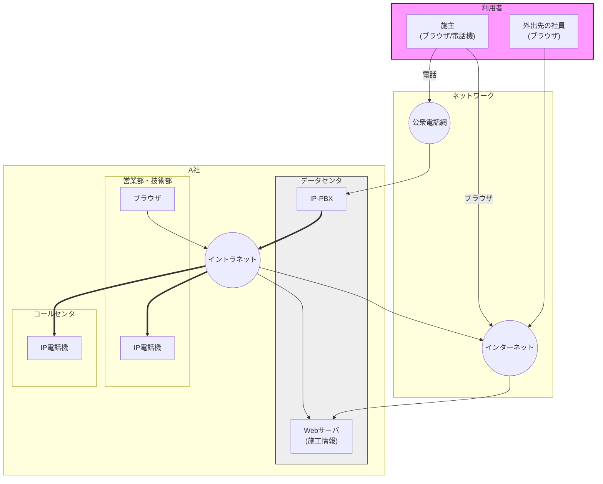
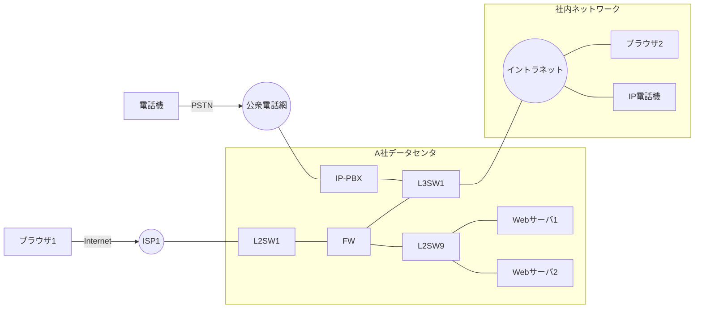
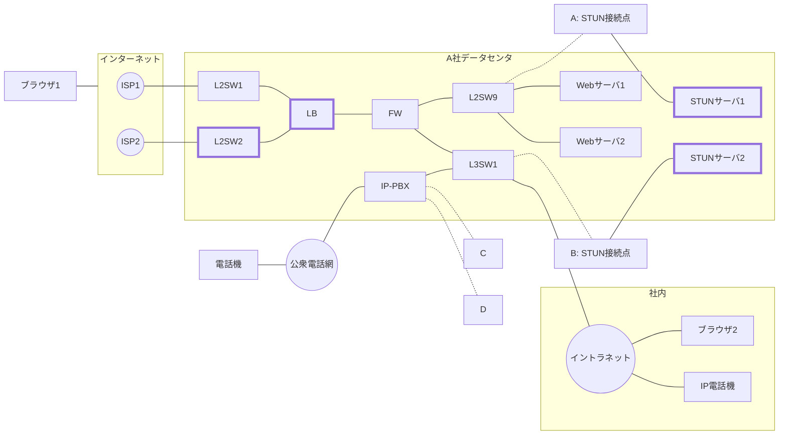
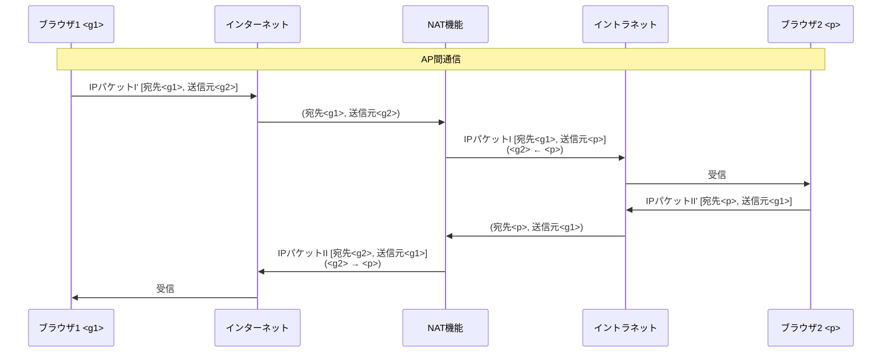
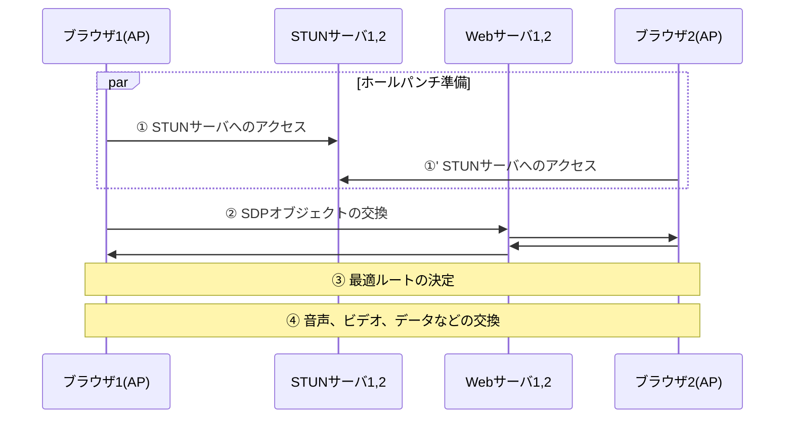
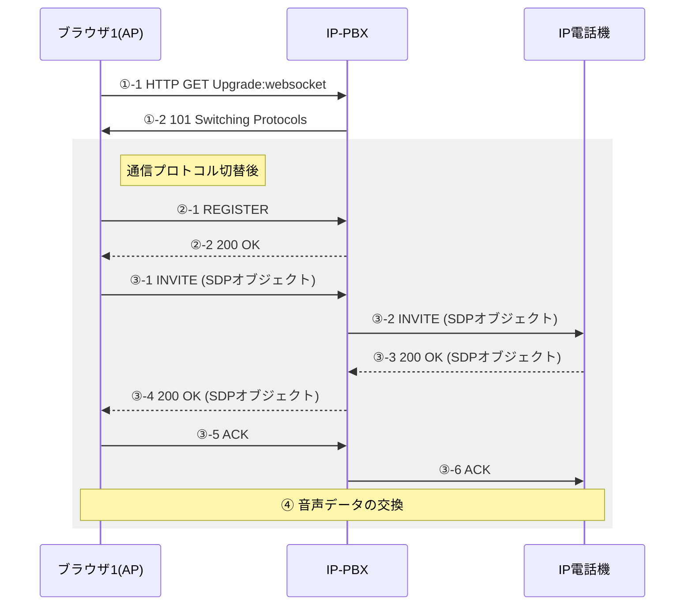
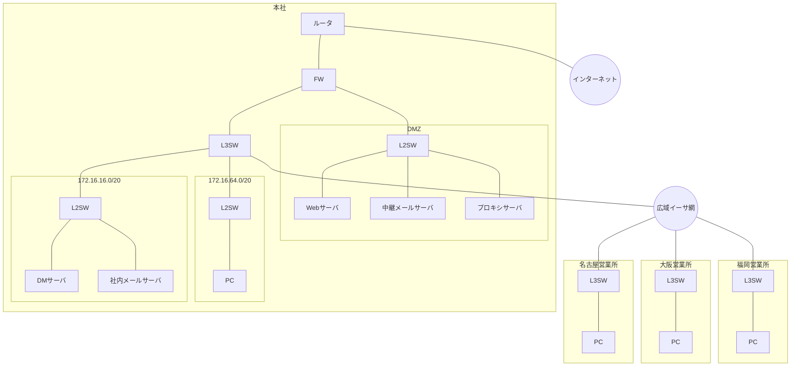
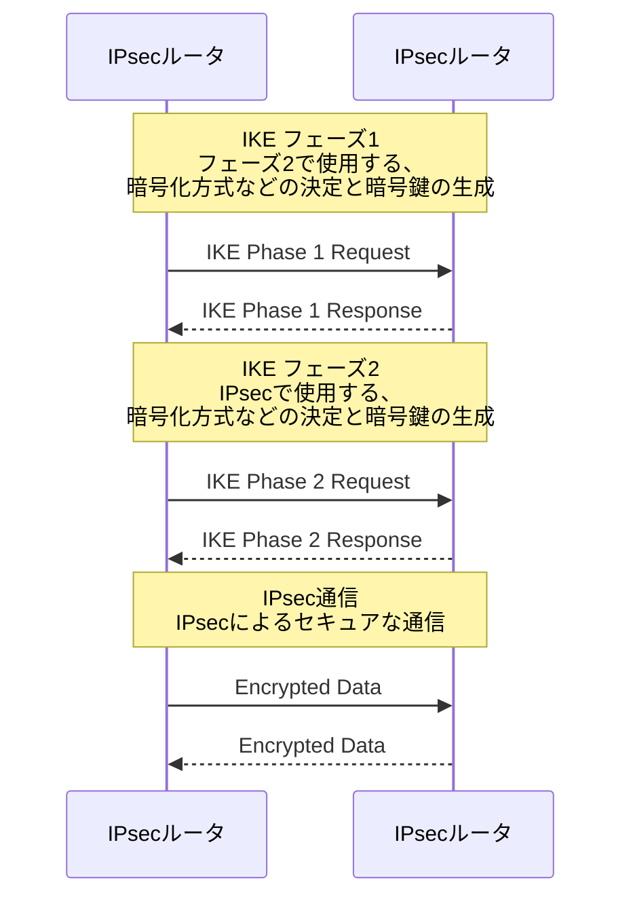
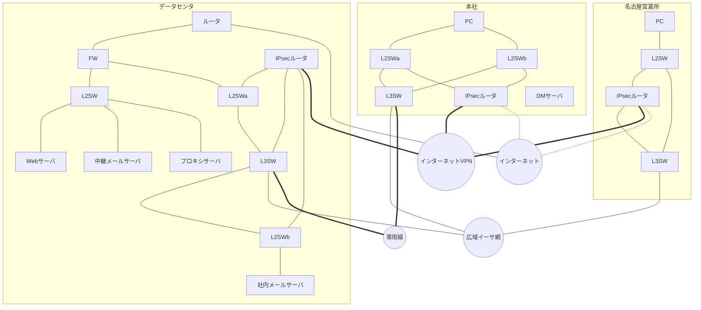

## 問1 ネットワークシステムの拡張に関する記述

工務店のA社は、全国規模で住宅や店舗の施工を請け負っている。施主への情報提供に力を入れており、次の三つの機能をもつ情報システムを稼働させている。

* **施工情報管理**: 外出先又は社内にいるA社の社員や施主が、タブレット端末やPCで動作するWebブラウザを使って、A社データセンタのWebサーバが管理する施工情報にHTTPSプロトコルでアクセスする（以下、Webブラウザと、Webブラウザが動作しているタブレット端末やPCを、どちらもブラウザという）。
* **コールセンタ**: 施主からの問合せ電話を、データセンタのIP-PBXを使って、A社コールセンタのオペレータが受け付け、必要に応じて営業部や技術部へ転送する。
* **インターネットアクセス**: A社の社員が、社内からブラウザを使ってインターネットにアクセスする。

### 図1 A社の現行情報システムの概要

情報システム部は、現在、施主との情報連携を強化するために、ブラウザを活用した情報システムの機能拡張に取り組んでいる。

### 情報システムの機能拡張の構想

* **マルチホーミング**: 今後、社外との通信が更に重要になるので、データセンタとインターネットとの接続を二重化する。
* **ブラウザを使ったビデオ電話**: 施主とA社の社員がブラウザを使って、施工状況などを動画で確認できるようにする。このビデオ電話はブラウザ上で動作するアプリケーション（以下、APという）をA社のWebサーバからダウンロードし、AP間の通信によって実現する。
* **ブラウザを使った音声電話**: 施主や外出先のA社の社員がブラウザを使って、社内のA社の社員と音声電話ができるようにする。この電話機能にもビデオ電話と同じAPを使う。IP-PBXを介した、社外のブラウザ上で動作するAPと社内のIP電話機との通信によって実現する。

### 現行ネットワーク構成

A社の現行ネットワーク構成を図2に、図2中のスイッチに定義された現行IPアドレス空間を表1に示す。

#### 図2 A社の現行ネットワーク構成 (抜粋)

#### 表1 図2中のスイッチに定義された現行IPアドレス空間

| スイッチ | VLAN名 | IPアドレス空間 | 用途 |
|---|---|---|---|
| L2SW1 | vlan1 | ip1/29 (ip1はグローバルIPアドレス) | ISP1接続 |
| L2SW9 | vlan9 | 10.0.9.0/24 | DMZ |
|  | vlan8 | 10.0.8.0/24 | FW接続 |
| L3SW1 | vlan7 | 10.0.7.0/24 | IP-PBX接続 |
|  | vlan6 | 10.0.6.0/24 | イントラネット接続 |

### B君が調査した、A社の現行ネットワークシステムの仕様

* 図2中のブラウザ1がWebサーバ1とWebサーバ2へアクセスする際に、FWのNAT機能が宛先IPアドレスを変換する。変換前と変換後の宛先IPアドレスは、それぞれ表1中のIPアドレス空間 [ ア ] と [ イ ] に属し、変換前と変換後のIPアドレスの組合せは1:1に固定されている（以下、宛先NATという）。
* 図2中のブラウザ2がインターネットへアクセスする際に、FWのNAT機能が送信元IPアドレスと [ ウ ] の両方をそれぞれ動的に変換する（以下、送信元NAPTという）。変換後のIPアドレス用に二つのグローバルIPアドレスが割り当てられている。
* FWのフィルタリング定義は、図1に示す情報システムの通信だけを許可している。
* FWには、A社のドメイン権限をもったDNS機能がある。
* 2台のWebサーバは、FWのDNSラウンドロビン機能を使って負荷分散しており、3台以上の構成へもスケールアウトができる。スケールアウトの際には、DNS機能に関する設定変更など、FWに複数の設定変更が必要となる。

### マルチホーミング

B君は、二つのISPサービス (ISP1, ISP2) を同時に利用するマルチホーミングの構成を考えた。この構成では、A社が負荷分散の仕組みを用意する必要がある。調査したところ、マルチホーミング用の負荷分散装置（以下、LBという）があり、この装置は、負荷分散機能の他に、DNS機能、NAT機能をもつことが分かった。

#### 図3 A社の新ネットワーク構成 (抜粋)

#### 表2 図3中のスイッチに定義された新IPアドレス空間

| スイッチ | VLAN名 | IPアドレス空間 | 用途 |
|---|---|---|---|
| L2SW1 | vlan1 | ip1/29 (ip1はグローバルIPアドレス) | ISP1接続 |
| L2SW2 | vlan2 | ip2/29 (ip2はグローバルIPアドレス) | ISP2接続 |
| L2SW9 | vlan9 | 10.0.9.0/24 | DMZ |
|  | vlan8 | 10.0.8.0/24 | FW接続 |
| L3SW1 | vlan7 | 10.0.7.0/24 | IP-PBX接続 |
|  | vlan6 | 10.0.6.0/24 | イントラネット接続 |

#### LBを使ったマルチホーミングの概要

* インターネット向けのDNS機能をFWからLBへ移し、ISP2を経由してもそのDNS機能を提供できるように、ドメイン登録業者に定義の追加を依頼する。
* LBのDNSラウンドロビン機能を使い、インターネットからA社内への通信の負荷分散を行う。現行のWebサーバ用のグローバルIPアドレスに、新たなグローバルIPアドレスを加え、DNSクエリに対してそれらが交互に返るようにする。
* A社内からインターネットへの通信は、ISP1とISP2への接続ポートに対して負荷分散を行う。その際、ISPへ送信するIPパケットの送信元IPアドレスは、送信先のISPから貸与されたグローバルIPアドレスに変換されるので、FWのNAT機能をLBへ移して一元化する。
* LBは、通信の行きと戻りを同じISP経由にする。
* LBからISP1のルータ及びISP2のルータへそれぞれ定期的にping確認を行い、ISPの障害を検知した場合には、正常なISPだけを利用する。

### ブラウザを使ったビデオ電話の通信

情報システム部は、WebRTC (Web Real-Time Communication) に準拠したAPを導入する予定である。

WebRTCを使ったビデオ電話では、APをダウンロードしたブラウザ間で直接通信（以下、AP間通信という）を行う。

#### 図4 NAT機能が介在する場合のAP間通信の例

* `<g1>`, `<g2>`: グローバルIPアドレス
* `
`: プライベートIPアドレス

A社が導入するAPは、NAT機能によって変換されたIPアドレスを、STUNサーバから得る仕様となっている。

STUNクライアントは、Bindingレスポンス中のデータから、自分とSTUNサーバ間のNAT機能の有無を知り、NAT機能が介在する場合には、そのデータからNAT機能が変換した自分のIPアドレスを得る。

#### 図5 AP間通信の概要

図4のAP間通信は、このようにして確立した最適ルートを使っている。

また、片方のISPが障害の場合にも利用できるように、STUNサーバのインタフェース（図3中のA, B）を、図3中の適切なスイッチに接続することにした。

次に、B君は、A社のマルチホーミング運用によって、図5中の通信がISP1とISP2に負荷分散されるかどうかを検討した。そして、図5から、データ量が多い④に用いられるISPは、[ 工 ] が [ オ ] をアクセスするときのLBの振分け結果によって決まることを確認し、負荷分散が行われると判断した。

### ブラウザを使った音声電話の通信

ブラウザを使った音声電話の通信では、社外のブラウザ上で動作するAPがIP-PBXを介して社内のIP電話機と通信を行う。

#### 図6 社外のAPから社内のIP電話機への通信の概要

#### 図6中の通信の概要

* APは、通信プロトコル [ カ ] を使ってIP-PBXへアクセスし、①-1と①-2によって、通信プロトコルを [ キ ] に切り替え、切り替えた通信プロトコル上でSIPプロトコルに基づくシグナリングを行う。
* IP-PBXは、2組のB2BUA (Back-to-Back User Agent) として動作する。インターネット側の二つのUA (User Agent) には、それぞれグローバルIPアドレスを割り当てる。
* IP-PBXはSession Border Controllerとして動作し、グローバルIPアドレスとプライベートIPアドレスを変換する。
* IP-PBXのLANインタフェース（図3中のC, D）を追加し、図3中の適切なスイッチと接続する。
* 図6中の通信の前に、[ ク ] のFQDNに関する [ ケ ] クエリが、APから [ コ ] へ発行されることによって、図6中のAPとIP-PBX間の通信はISP1とISP2に負荷分散される。

### 移行計画

B君が作成したネットワークの移行計画案（図7）は、2段階の切替え（切替1、切替2）で行う。

#### 切替1: LB, L2SW2の設置とISP2の接続、FWの設定変更。サービス停止時間は2時間。

* Webサーバ1とWebサーバ2に関する四つのAレコードを設定。
* APが名前解決しなければならないFQDNに関するAレコードを設定。
* 機器の変更は、あらかじめ2通りの定義ファイルをもたせておき、定義ファイルを指定した再起動によって行う。
* 約1時間、一部の利用者に3種類の通信を発生させて、動作の正常性を確認する。
* ドメイン登録業者に依頼する定義変更に関しては、情報システム部が正常性を確認する。

#### 切替2: STUNサーバの設置、IP-PBXのI/F追加、FWのフィルタリング変更。

* FWのフィルタリング変更は、新たなネットワーク構成の通信に関して変更する。

---

## 問2 WAN回線の冗長化設計に関する記述

Y社は、従業員400名の医療機器販売会社で、東京本社の他に名古屋、大阪、福岡に営業所がある。

### 図1 現在のY社のネットワーク構成

**注記**: 網掛け部分（DMZ内のサーバ、社内メールサーバ）は、データセンタに移設する予定の機器。

### 新ネットワークの要件

* インターネットVPNを新たに導入してWAN回線を冗長化。
* 本社のDMサーバ以外のサーバを、Z社のデータセンタに移設する。IPアドレスの変更はなし。

### インターネットVPNの構築技術の検討

#### (1) IPsec ルータ

* **SA (Security Association)**: 合意された内容。
* **SPI (Security Parameters Index)**: SAの識別キー。 [ ア ] ビットの整数値。
* **SP (Security Policy)**: パケットに施す処理（PROTECT, BYPASS, DISCARD）。
* **[ イ ]**: SPを選択するキー。IPアドレス、プロトコル、ポート番号などが利用される。

#### (2) IPsec の通信手順

* フェーズ1にはメインモードと [ ウ ] モードがある。

#### (3) トンネリング技術の調査

J君は、Y社で検討中のIPsecルータは、OSPFの通常の設定では、リンクステート情報の交換パケットをカプセル化できないため、GREまたはL2TPを併用することを検討した。

##### 図3 IPパケットがGREでカプセル化されたときのパケット形式

| 項目名 | IPヘッダ1 | GREヘッダ | IPヘッダ2 | TCP/UDPヘッダ | データ |
|---|---|---|---|---|---|
| バイト数 | 20 | 4 | 20 | 20 | [ あ ] |
| 内容 |  |  | ← | 元のIPパケット | → |

図4中のPC及びサーバのイーサネットインタフェースのMTUサイズを適切な値に変更することによって、パケットの [ オ ] を防げる。

##### 図5 L2TPでカプセル化されたときのパケット形式

| 項目名 | IPヘッダ1 | UDPヘッダ | L2TPヘッダ | PPPヘッダ | IPヘッダ2 | TCP/UDPヘッダ | データ |
|---|---|---|---|---|---|---|---|
| バイト数 | 20 | 8 | 16 | 2 | 20 | 20 | [ い ] |
| 内容 |  |  |  | ← | 元のPPPフレーム | → |  |

J君は、GREを利用することにして、GRE over IPsecを稼働させる方法について検討した。通信モードは、トランスポートモードを選択する。

##### 図7 GRE over IPsec のパケット形式

| 項目名 | IPヘッダ1 | ESPヘッダ | GREヘッダ | IPヘッダ2 | TCP/UDPヘッダ | データ | ESPトレーラ | ESP認証データ |
|---|---|---|---|---|---|---|---|---|
| バイト数 | 20 | 8 | 4 | 20 | 20 | 可変 | 不定 | 不定 |

### WANの設計

J君が設計したWAN回線の構成を図9に示す。

#### 図9 J君が設計したWAN回線の構成（概念図）

#### OSPFコスト設定（図9より抜粋）

* **本社/名古屋**: IPsecルータ-L2SW間=10, L3SW-L2SW間=10, IPsecルータ-L3SW間=10, L3SW-広域イーサ=50, IPsecトンネル=(220), 本社L3SW-専用線=200
* **データセンタ**: IPsecルータ-L3SW間=10, L3SW-専用線=200, IPsecトンネル=(220)

#### 表3 PCからサーバへのアクセス経路の一覧 (抜粋)

| 障害箇所 | 送信元 | 宛先 | 経路 |
|---|---|---|---|
| なし | 本社のPC | データセンタのサーバ | PC→専用線→データセンタ→サーバ |
|  |  | インターネット | PC→専用線→データセンタ→プロキシサーバ→インターネット |
|  |  | DMサーバ | PC→DMサーバ |
| なし | 営業所のPC | データセンタのサーバ | PC→インターネットVPN→データセンタ→サーバ |
|  |  | インターネット | PC→インターネットVPN→データセンタ→プロキシサーバ→インターネット |
|  |  | DMサーバ | PC→広域イーサ網→本社→DMサーバ |
| 名古屋営業所の インターネットVPN接続 | 名古屋営業所のPC | データセンタのサーバ | [ う ] →データセンタ→サーバ |
|  |  | インターネット | [ う ] →データセンタ→プロキシサーバ→インターネット |
|  |  | DMサーバ | 変更なし |
| 名古屋営業所の 広域イーサ網接続 | 名古屋営業所のPC | データセンタのサーバ | 変更なし |
|  |  | インターネット | 変更なし |
|  |  | DMサーバ | PC→ [ え ] →本社→DMサーバ |
