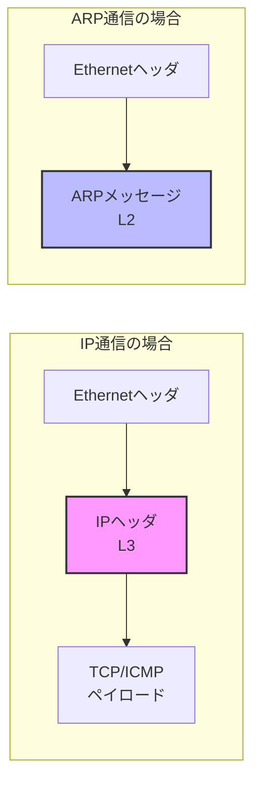

import { MermaidBox } from '../../../components/MermaidBox';
import Quiz from '../../../components/Quiz';

ネットワーク技術の世界には、**「OSI参照モデル（教科書的な理想）」と「TCP/IPモデル（現場の現実）」** という2つの側面があります。

「ARPの立ち位置」は、まさにこの2つのギャップを象徴するトピックです。

## 1. ARPの技術的解剖：なぜ「レイヤー2」なのか

「IPアドレス（L3情報）を扱うのに、なぜレイヤー2（データリンク層）なのか？」

この問いへの答えは、パケットの **カプセル化（包み方）** を見ると一目瞭然です。

### パケット構造の比較

通常のインターネット通信（HTTPやICMP）と、ARPのパケット構造は根本的に異なります。

<MermaidBox client:visible>

</MermaidBox>

- **IP通信**: イーサネットの中に「IPという乗り物」があり、その中にデータが乗ります。
- **ARP通信**: イーサネットの中に直接ARPメッセージが乗ります。**IPヘッダが存在しません。**

### L2とされる決定的な理由

| 判定基準 | 理由 |
|:---|:---|
| カプセル化 | IPヘッダを持たず、Ethernetフレームのペイロードとして直接収容される。 |
| 識別子 | Ethernetヘッダのタイプ値が `0x0806` (ARP) であり、`0x0800` (IPv4) ではない。 |
| 到達範囲 | **ブロードキャストドメイン（ルーター）を超えられない。** 隣接機器との会話専用。 |

ARPは「IPアドレス」という **データ（文字列）を中身に持っていますが、プロトコルとしての挙動は完全にL2の制約を受けています。**

あくまで「L2の配送システムを使って、L3の住所録（ARPテーブル）を作るための裏方」です。

<Quiz client:visible question="ARPがレイヤー2に分類される最も決定的な理由は何でしょう？">
ARPはIPヘッダを持たず、Ethernetフレームのペイロードとして直接収容されるためです。
Ethernetヘッダのタイプ値も `0x0806` (ARP) であり、IPv4 (`0x0800`) ではありません。
また、ブロードキャストドメインを超えられないという点も、L2の特性を示しています。
</Quiz>

## 2. ネットワーク界の「必要悪」：クロスレイヤー処理

階層モデルの基本原則は「下層は上層の中身に関知しない（カプセル化の隠蔽）」ですが、TCP/IPは効率化のためにこのルールを頻繁に破ります。これを **クロスレイヤー（階層またぎ）** と呼びます。

ARPだけが例外ではありません。以下に代表的な「行儀の悪い」プロトコルを整理します。

| プロトコル / 機能 | 何をしているか（違反内容） | 目的・メリット |
|:---|:---|:---|
| **ARP** | L2プロトコルが、ペイロード内のL3アドレスを読んで動作する。 | 相手の物理的な居場所（MAC）を知るため。 |
| **IGMPスヌーピング** | L2スイッチが、パケット内のL3（IGMP）を盗み見る。 | マルチキャストを全員に送ると帯域がパンクするため、必要なポートだけに絞る。 |
| **NAT / ALG** | L3ルーターが、L7（FTP/SIP等のデータ部）を書き換える。 | データ部（手紙の本文）にIPが書かれる仕様のアプリを、NAT環境下で動かすため。 |
| **IPv6 NDP** | L3（ICMPv6）を使って、L2（MAC解決）の仕事をする。 | ARPを廃止し、近隣探索の機能をICMPに統合したため。 |

これらは「行儀は悪いが、実用上必須」な機能として実装されています。

<Quiz client:visible question="L2スイッチがIGMPパケットの中身を覗き見る「IGMPスヌーピング」は何のために行われるでしょう？">
マルチキャストトラフィックを効率的に配送するためです。 
IGMPスヌーピングがなければ、マルチキャストは全ポートに送信され帯域を圧迫してしまいます。
L3情報を覗き見ることで、必要なポートだけにマルチキャストを転送できます。
</Quiz>

## 3. 「もしも」の世界：OSI参照モデルの正解ルート

もしTCP/IPのような「現場猫」的な解決策ではなく、厳格なOSI参照モデルが採用されていたら、ARPのような「覗き見」はどう解決されるはずだったのでしょうか。

### OSIが描いた理想の解決策

OSIでは、階層間の独立性を保つために以下の手法が設計されていました。

#### 1. 引数（プリミティブ）による伝達

パケットを勝手に開けるのではなく、上司（L3）が部下（L2）に仕事を頼む際、必要な情報をすべて「メモ（引数）」として渡します。

> L3：「このデータを送って。宛先MACはこれだから（引数）」
> L2：「了解（中身は見ずに送るだけ）」

#### 2. 階層化アドレス（埋め込み）

L3アドレスの一部にMACアドレスを最初から含めてしまいます（NSAPアドレスなど）。
これなら、問い合わせ（ARP）をする必要すらなく、宛先アドレスを見るだけで物理的な送付先がわかります。

#### 3. 管理面（Management Plane）

各層が直接会話するのではなく、全層を貫く「管理データベース」経由で情報を共有します。

しかし、これらは **「実装が複雑で重い」「設定が面倒」** という致命的な欠点がありました。

## 4. 結論：なぜ「TCP/IP」が勝ったのか

歴史的な結論として、私たちは **「厳密さ」よりも「手軽さ」** を選びました。

### "Rough Consensus and Running Code"

インターネット技術の標準化団体IETFのこの理念（大まかな合意と、実際に動くコード）がすべてを物語っています。

- **プラグ＆プレイの実現**:
  ARPがなりふり構わず「誰かー！」と叫んでくれるおかげで、私たちはLANケーブルを挿すだけで、設定なしに通信を開始できます。OSIの厳格な管理方式では、こうはいかなかったでしょう。

- **パフォーマンスと延命**:
  NATのような強引なレイヤー違反のおかげで、枯渇したIPv4アドレスを節約し、インターネットの寿命を延ばすことができました。

<Quiz client:visible question="IETFの理念『Rough Consensus and Running Code』とはどういう意味でしょう？">
「大まかな合意と、実際に動くコード」という意味です。 
完璧な仕様を目指すよりも、実用的に動くものを優先するTCP/IPの設計思想を表しています。
この理念により、OSIモデルの厳密さよりもTCP/IPの実用性が選ばれました。
</Quiz>

## まとめ

- ARPは構造上 **「レイヤー2」だが、役割はL2とL3の「接着剤」** である。
- TCP/IPネットワークは、ARPに限らず、効率のために **「階層の壁」を意図的に壊して動いている**。
- それは「理論的な美しさ（OSI）」を犠牲にして手に入れた、 **「圧倒的な実用性と拡張性（TCP/IP）」** の結果である。

:::tip[試験対策ポイント]
「基本原則を知った上で、現実のためにどうルールを破っているか」を理解することこそが、ネットワークスペシャリストとしての深い理解につながります。
:::
