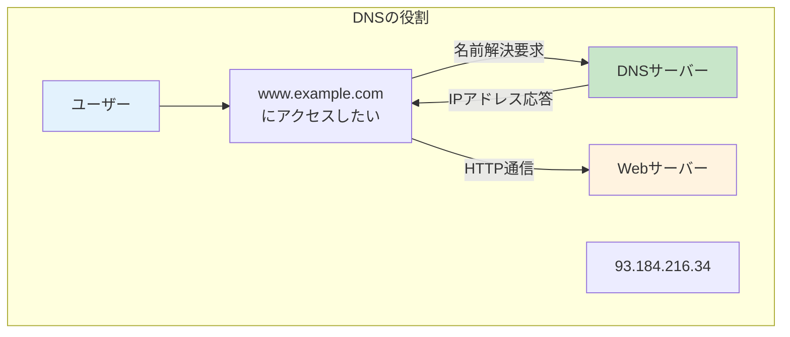
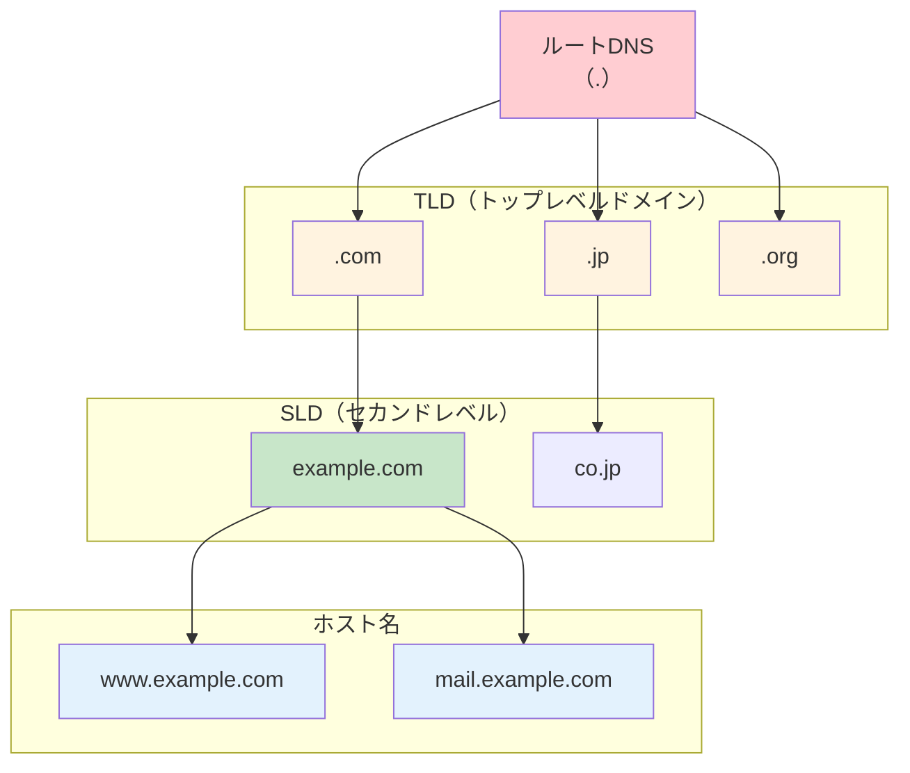
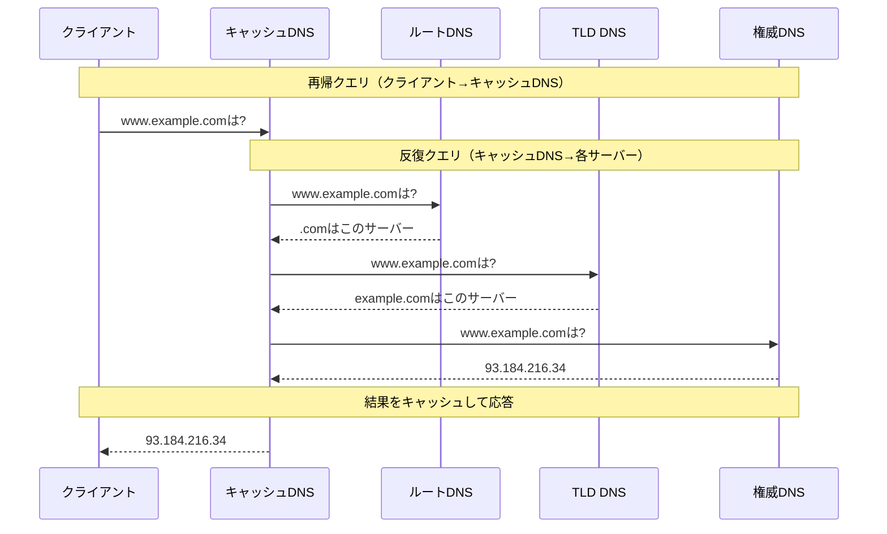
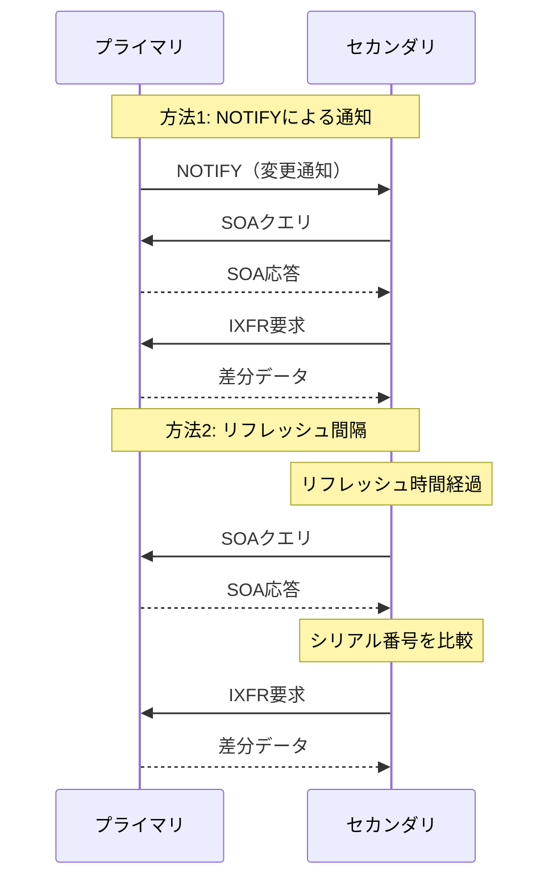
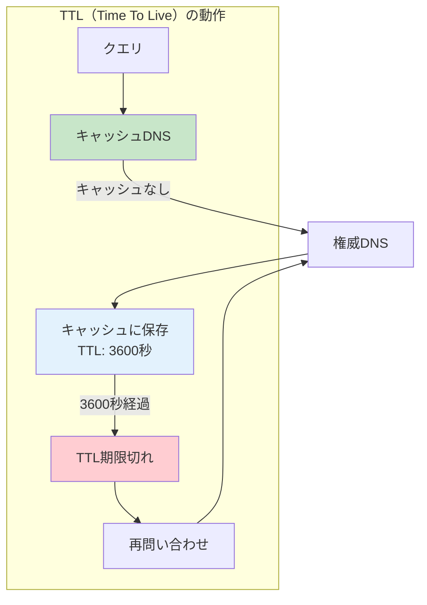
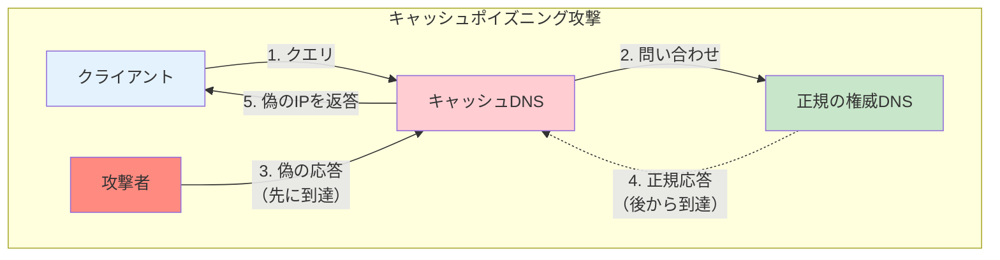
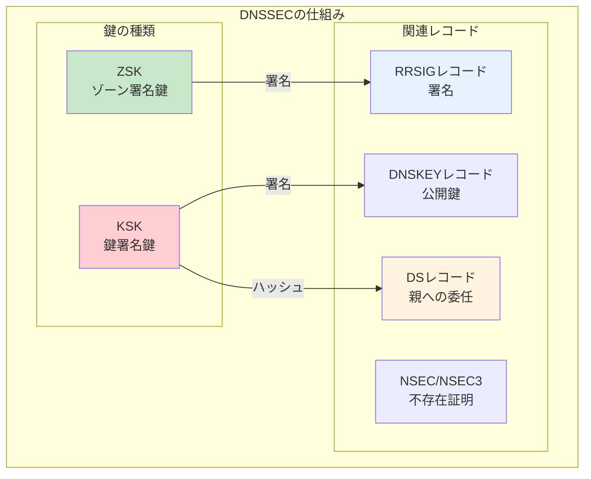
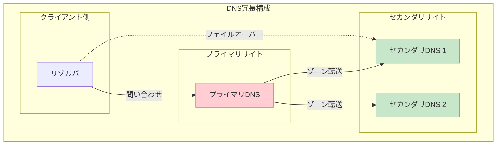
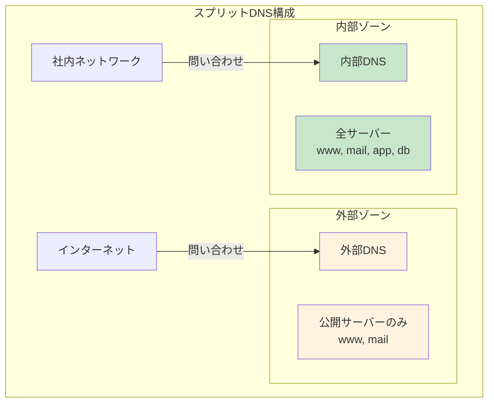

import { MermaidBox } from '../../../components/MermaidBox';


[[DNS]]（Domain Name System）は、[[ドメイン名]]と[[IPアドレス]]を相互に変換する分散データベースシステムです。この記事では、[[DNS]]の動作原理から設計・セキュリティまでを整理します。

## DNSの役割


<MermaidBox client:visible>



</MermaidBox>


---

## DNSの階層構造


<MermaidBox client:visible>



</MermaidBox>


| レベル | 説明 | 例 |
|:---|:---|:---|
| ルート | 最上位、「.」で表記 | . |
| [[TLD]] | トップレベルドメイン | .com, .jp, .org |
| [[SLD]] | セカンドレベルドメイン | example.com |
| ホスト名 | 個別のホスト | www.example.com |

---

## DNSサーバーの種類

| 種類 | 役割 | 特徴 |
|:---|:---|:---|
| [[プライマリDNS]] | ゾーン情報の原本を保持 | ゾーンファイルを直接管理 |
| [[セカンダリDNS]] | プライマリのコピーを保持 | [[ゾーン転送]]で同期 |
| [[フルリゾルバ]] | 再帰問い合わせを処理 | キャッシュ機能あり |
| [[フォワーダ]] | 他の[[DNS]]へ転送 | 自身では解決しない |

---

## 名前解決の流れ

### 再帰クエリと反復クエリ


<MermaidBox client:visible>



</MermaidBox>


### クエリの種類

- **[[再帰クエリ]]**
  - クライアントが送信
  - 完全な回答を要求
  - キャッシュ[[DNS]]が代わりに解決
- **[[反復クエリ]]**
  - キャッシュ[[DNS]]が送信
  - 参照先を返してもよい
  - 次の問い合わせ先を段階的に辿る


---

## DNSレコードタイプ

| レコード | 用途 | 例 |
|:---|:---|:---|
| [[Aレコード]] | ホスト名→[[IPv4]] | www IN A 192.168.1.1 |
| [[AAAAレコード]] | ホスト名→[[IPv6]] | www IN AAAA 2001:db8::1 |
| [[CNAME]] | 別名の定義 | blog IN CNAME www |
| [[MXレコード]] | メールサーバー指定 | @ IN MX 10 mail.example.com |
| [[NSレコード]] | ネームサーバー指定 | @ IN NS ns1.example.com |
| [[TXTレコード]] | テキスト情報 | @ IN TXT "v=spf1 ..." |
| [[PTRレコード]] | 逆引き（IP→名前） | 1 IN PTR www.example.com |
| [[SOAレコード]] | ゾーンの管理情報 | シリアル番号、更新間隔など |
| [[SRVレコード]] | サービスの場所 | _ldap._tcp IN SRV ... |

### MXレコードの優先度

**ポイント:** 優先度の数値が小さいほど優先される

---

## ゾーン転送

### AXFR と IXFR

- **[[AXFR]]（フル転送）**: ゾーン全体を転送。初回同期に使用。データ量が大きい。
- **[[IXFR]]（差分転送）**: 変更分のみ転送。定期同期に使用。効率的。


### ゾーン転送のトリガー


<MermaidBox client:visible>



</MermaidBox>


### SOAレコードの構成

| フィールド | 説明 | 典型値 |
|:---|:---|:---|
| SERIAL | 変更を示す番号（増加させる） | YYYYMMDDnn |
| REFRESH | セカンダリの確認間隔 | 3600（1時間） |
| RETRY | 確認失敗時の再試行間隔 | 600（10分） |
| EXPIRE | プライマリ不達時の有効期限 | 604800（1週間） |
| MINIMUM | ネガティブキャッシュのTTL | 3600（1時間） |

---

## DNSキャッシュとTTL


<MermaidBox client:visible>



</MermaidBox>


**[[TTL]]設計のポイント:**
- 長い[[TTL]]: キャッシュ効果大、変更反映が遅い
- 短い[[TTL]]: 変更反映が速い、問い合わせ負荷増大
- 切り替え前は[[TTL]]を短くしておく

---

## DNSセキュリティ

### キャッシュポイズニング


<MermaidBox client:visible>



</MermaidBox>


### 対策

- **ソースポートのランダム化**: 予測困難にする
- **トランザクションIDのランダム化**: 予測困難にする
- **[[DNSSEC]]**: 電子署名による応答の検証
- **レートリミット**: 攻撃の抑制


### DNSSEC


<MermaidBox client:visible>



</MermaidBox>


| レコード | 役割 |
|:---|:---|
| [[DNSKEY]] | 公開鍵を格納 |
| [[RRSIG]] | レコードの電子署名 |
| [[DS]] | 親ゾーンへの委任情報（[[KSK]]のハッシュ） |
| [[NSEC]]/[[NSEC3]] | レコードが存在しないことの証明 |

---

## DNS設計のベストプラクティス

### 冗長構成


<MermaidBox client:visible>



</MermaidBox>


### 内部DNS/外部DNS分離


<MermaidBox client:visible>



</MermaidBox>


**[[スプリットDNS]]のメリット:**
- 内部サーバー情報を外部に公開しない
- 内部では詳細な名前解決が可能
- セキュリティの向上

---

## DNSレコード設計例

```
; SOAレコード
example.com. IN SOA ns1.example.com. admin.example.com. (
    2024011801 ; シリアル番号
    3600       ; リフレッシュ（1時間）
    600        ; リトライ（10分）
    604800     ; 有効期限（1週間）
    3600       ; ネガティブキャッシュTTL
)

; NSレコード
example.com. IN NS ns1.example.com.
example.com. IN NS ns2.example.com.

; Aレコード
ns1     IN A     192.168.1.10
ns2     IN A     192.168.1.11
www     IN A     192.168.1.100
mail    IN A     192.168.1.50

; MXレコード
@       IN MX 10 mail.example.com.
@       IN MX 20 mail2.example.com.

; CNAMEレコード
blog    IN CNAME www

; TXTレコード（SPF）
@       IN TXT   "v=spf1 mx ip4:192.168.1.0/24 -all"
```

---

## 試験対策のポイント

1. **クエリの種類を理解する**
   - 再帰クエリ: クライアント→キャッシュDNS
   - 反復クエリ: キャッシュDNS→各権威DNS

2. **レコードタイプを正確に覚える**
   - A: IPv4、AAAA: IPv6
   - MX: メール（優先度は小さいほど優先）
   - CNAME: 他のAレコードのエイリアス

3. **ゾーン転送の仕組み**
   - AXFR: 全体転送、IXFR: 差分転送
   - NOTIFYによるプッシュ通知

4. **セキュリティ対策**
   - DNSSECの仕組み（ZSK, KSK, RRSIG, DS）
   - キャッシュポイズニングの原理と対策

5. **設計パターン**
   - プライマリ/セカンダリの冗長構成
   - スプリットDNSによる内外分離