import { MermaidBox } from '../../../components/MermaidBox';


[[なりすまし]]メール対策として、送信ドメイン認証技術が広く使われています。この記事では、[[SPF]]・[[DKIM]]・[[DMARC]]の仕組みと設定方法を整理します。

## メール認証の全体像


<MermaidBox client:visible>

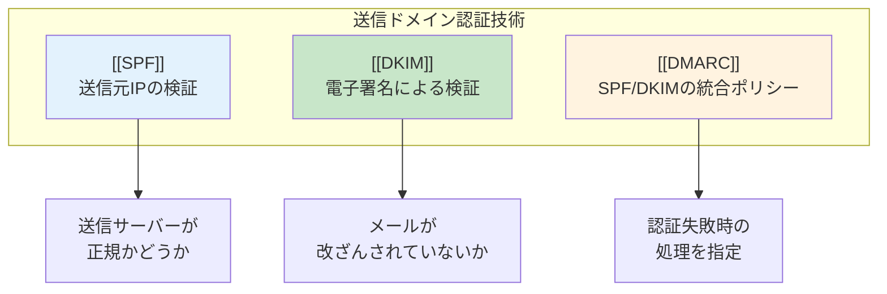

</MermaidBox>


---

## なりすましメールの仕組み


<MermaidBox client:visible>

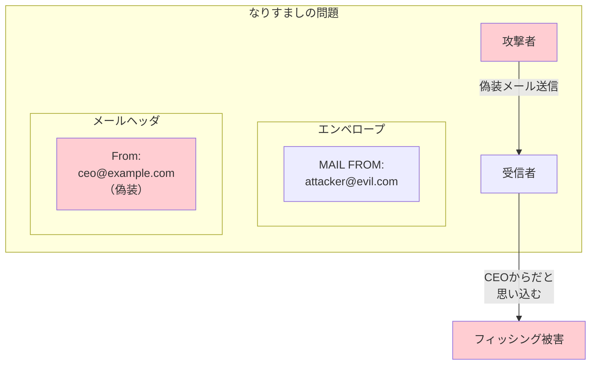

</MermaidBox>


**2つの「From」アドレス:**
- **[[エンベロープFrom]]（MAIL FROM）**: 実際の送信経路で使用
- **[[ヘッダFrom]]**: 受信者に表示されるアドレス

→ この2つが異なることで[[なりすまし]]が可能

---

## SPF（Sender Policy Framework）

### SPFの仕組み


<MermaidBox client:visible>

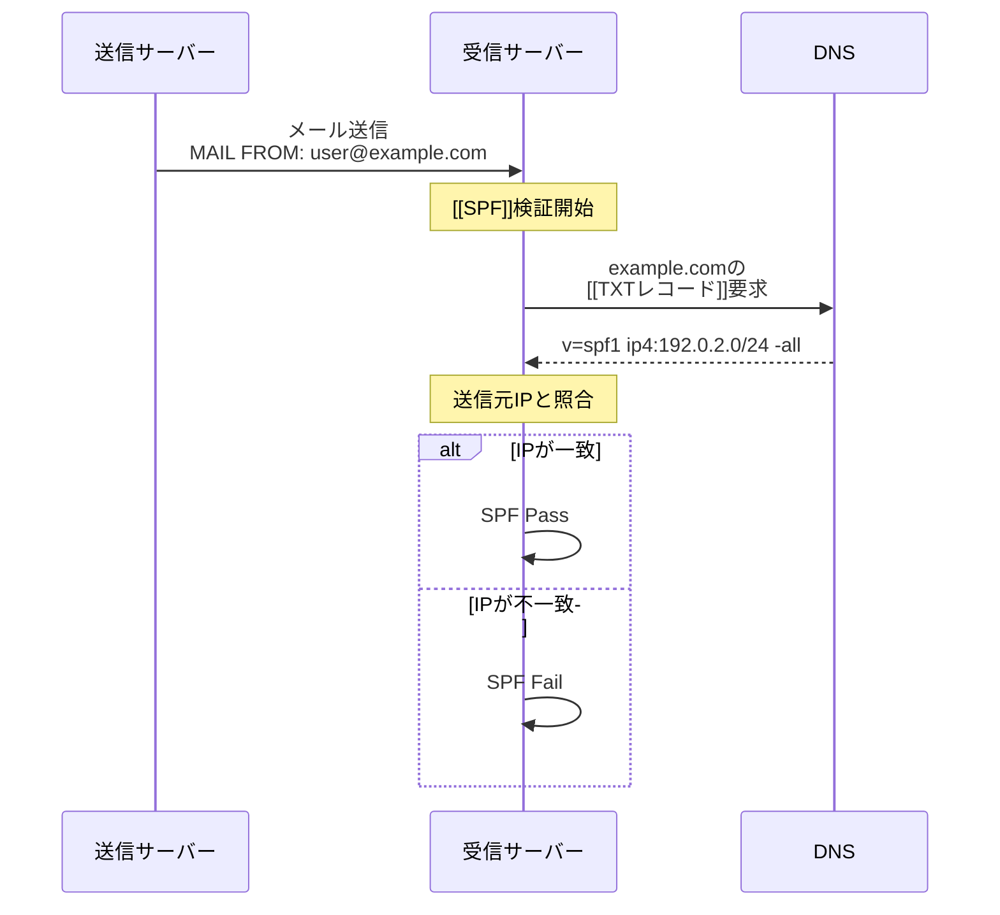

</MermaidBox>


<MermaidBox client:visible>

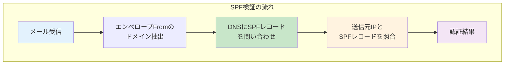

</MermaidBox>


### SPFレコードの構文

```
v=spf1 ip4:192.0.2.0/24 include:_spf.google.com mx -all
```

| 要素 | 説明 |
|:---|:---|
| `v=spf1` | [[SPF]]バージョン（必須） |
| `ip4:` | 許可する[[IPv4]]アドレス/範囲 |
| `ip6:` | 許可する[[IPv6]]アドレス/範囲 |
| `include:` | 他ドメインの[[SPF]]を参照 |
| `mx` | [[MXレコード]]のIPを許可 |
| `a` | [[Aレコード]]のホストを許可 |
| `-all` | それ以外は拒否（Fail） |
| `~all` | それ以外はソフトフェイル |
| `?all` | 結果を返さない（Neutral） |

### SPFの限定子


<MermaidBox client:visible>

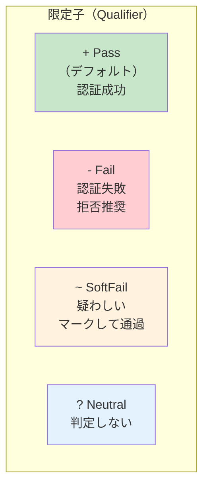

</MermaidBox>


### SPFの認証結果

| 結果 | 意味 |
|:---|:---|
| Pass | 送信元は許可されている |
| Fail | 送信元は許可されていない |
| SoftFail | 許可されていないが、厳密には判定しない |
| Neutral | SPFで判定しない |
| None | SPFレコードがない |
| TempError | 一時的なエラー |
| PermError | SPFレコードの構文エラー |

---

## DKIM（DomainKeys Identified Mail）

### DKIMの仕組み


<MermaidBox client:visible>

```mermaid
sequenceDiagram
    participant Sender as 送信サーバー
    participant Receiver as 受信サーバー
    participant DNS as DNS

    Note over Sender: 秘密鍵で署名
    Sender->>Receiver: メール送信<br/>（DKIM-Signatureヘッダ付き）

    Note over Receiver: [[DKIM]]検証開始
    Receiver->>DNS: セレクタ._domainkey.example.com<br/>の[[TXTレコード]]要求
    DNS-->>Receiver: v=DKIM1; p=公開鍵...

    Note over Receiver: 公開鍵で署名を検証
    alt 署名が有効
        Receiver->>Receiver: DKIM Pass
    else 署名が無効
        Receiver->>Receiver: DKIM Fail
    end
```

</MermaidBox>


<MermaidBox client:visible>

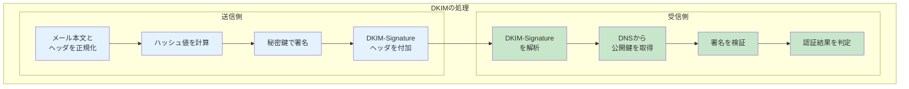

</MermaidBox>


### DKIM-Signatureヘッダ

```
DKIM-Signature: v=1; a=rsa-sha256; d=example.com;
    s=selector1; c=relaxed/relaxed;
    h=from:to:subject:date;
    bh=base64ボディハッシュ;
    b=base64署名データ
```

| タグ | 説明 |
|:---|:---|
| `v` | バージョン（必ず1） |
| `a` | 署名アルゴリズム（rsa-sha256等） |
| `d` | 署名ドメイン |
| `s` | セレクタ（鍵の識別子） |
| `c` | 正規化方式 |
| `h` | 署名対象のヘッダ |
| `bh` | 本文のハッシュ値 |
| `b` | 署名データ |

### DKIMの公開鍵レコード

```
selector1._domainkey.example.com IN TXT "v=DKIM1; k=rsa; p=公開鍵..."
```

| タグ | 説明 |
|:---|:---|
| `v` | バージョン（DKIM1） |
| `k` | 鍵の種類（rsa等） |
| `p` | 公開鍵（Base64） |

---

## DMARC（Domain-based Message Authentication, Reporting & Conformance）

### DMARCの役割


<MermaidBox client:visible>

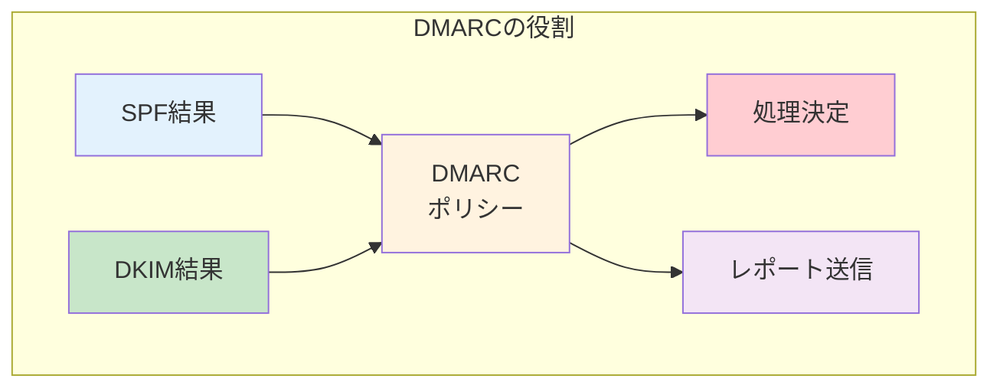

</MermaidBox>


### DMARCの認証フロー


<MermaidBox client:visible>

```mermaid
sequenceDiagram
    participant Receiver as 受信サーバー
    participant DNS as DNS

    Note over Receiver: [[SPF]]/[[DKIM]]検証後

    Receiver->>DNS: _dmarc.example.com<br/>の[[TXTレコード]]要求
    DNS-->>Receiver: v=DMARC1; p=reject; ...

    Note over Receiver: アライメント検証
    alt SPFまたはDKIMがPassかつアライメント一致
        Receiver->>Receiver: DMARC Pass
    else
        Receiver->>Receiver: DMARC Fail
        Note over Receiver: ポリシーに従い処理
    end

    Note over Receiver: レポート生成・送信
```

</MermaidBox>


### アライメント（Alignment）


<MermaidBox client:visible>

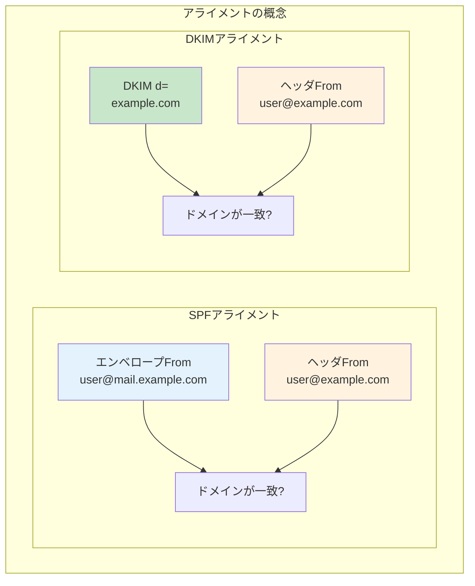

</MermaidBox>


**[[アライメント]]モード:**
- **strict（厳密）**: 完全一致が必要
- **relaxed（緩和）**: 組織[[ドメイン]]が一致すればOK

### DMARCレコードの構文

```
_dmarc.example.com IN TXT "v=DMARC1; p=reject; rua=mailto:dmarc@example.com; pct=100"
```

| タグ | 説明 | 値の例 |
|:---|:---|:---|
| `v` | バージョン（必須） | DMARC1 |
| `p` | ポリシー（必須） | none, quarantine, reject |
| `sp` | サブドメインポリシー | none, quarantine, reject |
| `rua` | 集約レポート送信先 | mailto:dmarc@example.com |
| `ruf` | 失敗レポート送信先 | mailto:forensic@example.com |
| `pct` | ポリシー適用割合 | 0-100 |
| `adkim` | DKIMアライメントモード | r（relaxed）, s（strict） |
| `aspf` | SPFアライメントモード | r（relaxed）, s（strict） |

### DMARCポリシー


<MermaidBox client:visible>

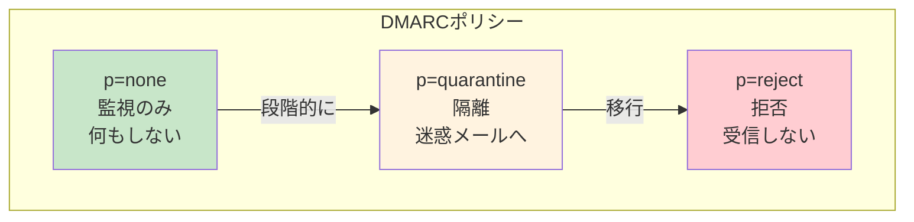

</MermaidBox>


| ポリシー | 動作 | 導入段階 |
|:---|:---|:---|
| none | 何もしない（レポートのみ） | 初期導入時 |
| quarantine | 迷惑メールフォルダへ | 検証後 |
| reject | 受信拒否 | 完全運用時 |

---

## 3つの認証技術の関係


<MermaidBox client:visible>

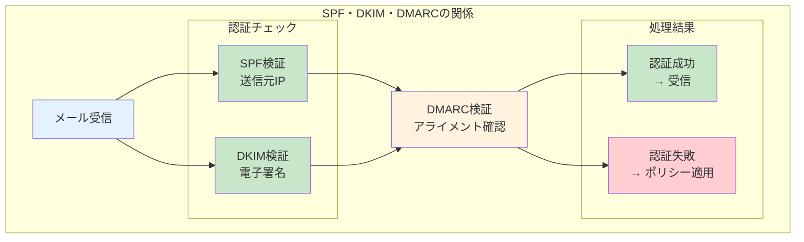

</MermaidBox>


| 認証技術 | 検証対象 | 保護内容 |
|:---|:---|:---|
| [[SPF]] | [[エンベロープFrom]]の[[ドメイン]] | 送信サーバーの詐称防止 |
| [[DKIM]] | メールの署名 | 改ざん検知、[[ドメイン]]認証 |
| [[DMARC]] | [[ヘッダFrom]]との整合性 | [[なりすまし]]防止、ポリシー統一 |

---

## ARC（Authenticated Received Chain）

メール転送時に認証情報を維持する仕組みです。

### 転送による認証失敗の問題


<MermaidBox client:visible>

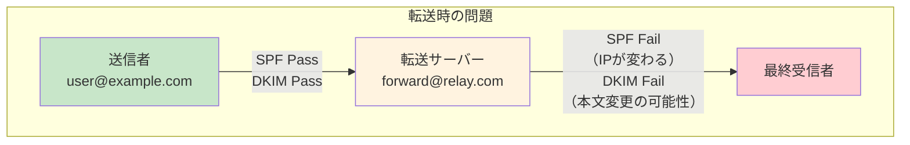

</MermaidBox>


### ARCの仕組み


<MermaidBox client:visible>

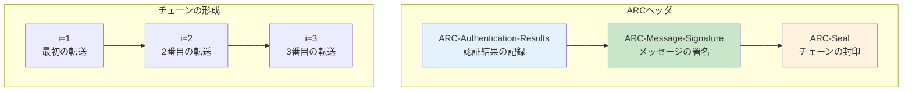

</MermaidBox>


| ヘッダ | 役割 |
|:---|:---|
| [[ARC-Authentication-Results]] | その時点での認証結果を記録 |
| [[ARC-Message-Signature]] | メッセージ内容の署名 |
| [[ARC-Seal]] | [[ARC]]チェーン全体の封印（改ざん防止） |

---

## 設定例まとめ

### DNSレコード設定例

```
; SPFレコード
example.com. IN TXT "v=spf1 ip4:192.0.2.0/24 include:_spf.google.com -all"

; DKIM公開鍵
selector1._domainkey.example.com. IN TXT "v=DKIM1; k=rsa; p=MIIBIjAN..."

; DMARCレコード
_dmarc.example.com. IN TXT "v=DMARC1; p=quarantine; rua=mailto:dmarc@example.com; pct=100"
```

---

## 導入のベストプラクティス


<MermaidBox client:visible>

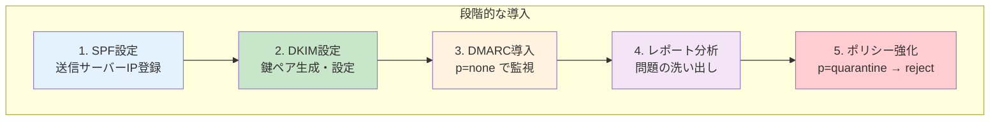

</MermaidBox>


---

## 試験対策のポイント


<MermaidBox client:visible>

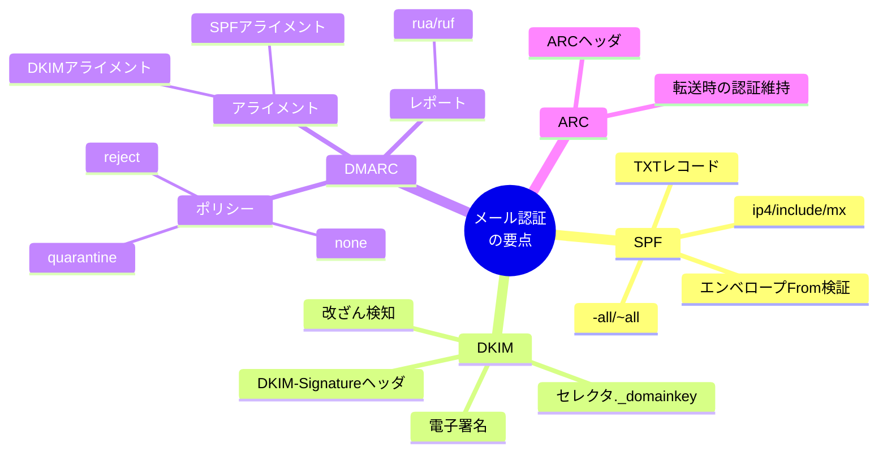

</MermaidBox>


1. **各技術の検証対象を理解する**
   - SPF: エンベロープFrom（MAIL FROM）のドメインとIP
   - DKIM: メールの電子署名とドメイン
   - DMARC: ヘッダFromとの整合性（アライメント）

2. **DNSレコードの形式を覚える**
   - SPF: `v=spf1 ... -all`
   - DKIM: `selector._domainkey.ドメイン`
   - DMARC: `_dmarc.ドメイン`

3. **アライメントの概念を把握**
   - SPF: エンベロープFromドメイン = ヘッダFromドメイン
   - DKIM: 署名のd=ドメイン = ヘッダFromドメイン

4. **DMARCポリシーの段階**
   - none → quarantine → reject の順で強化

5. **転送問題とARC**
   - 転送時にSPF/DKIMが失敗する理由
   - ARCによる認証チェーンの維持