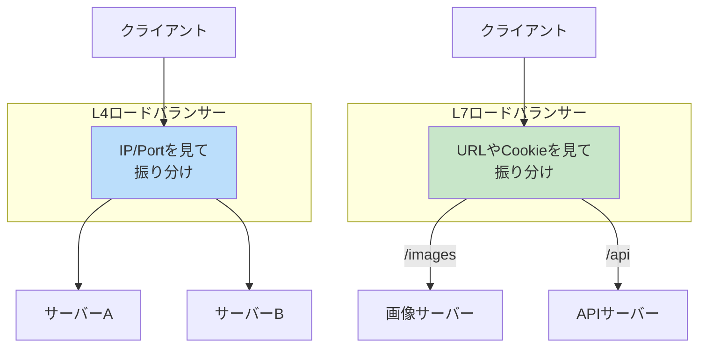
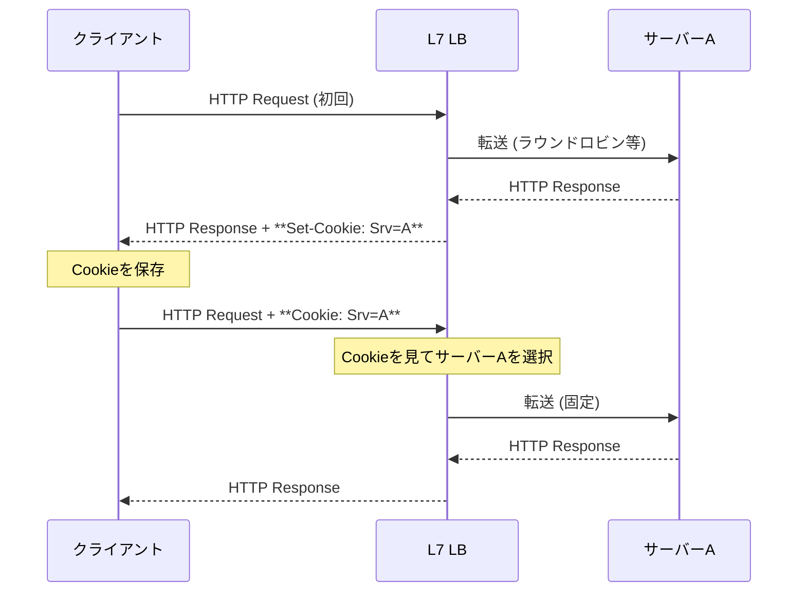
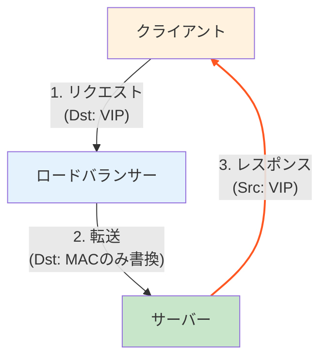
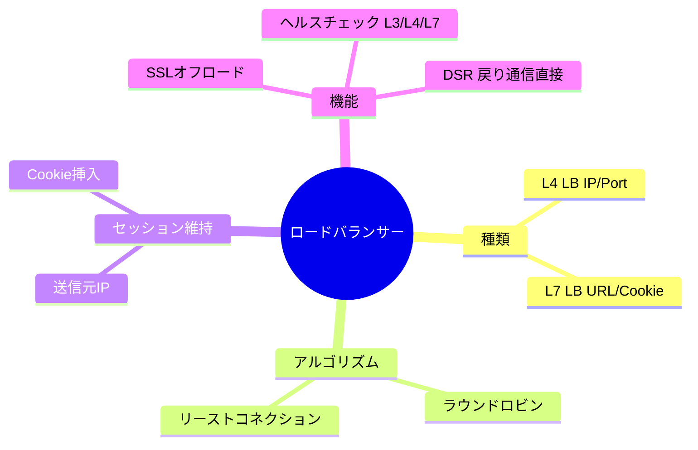

import { MermaidBox } from '../../../components/MermaidBox';

Webサービスの大規模化に伴い、トラフィックを複数のサーバーに分散させるロードバランサー（LB）は必須の技術となっています。試験では、L4/L7の違い、セッション維持の方法、ヘルスチェックの仕組みが頻出です。

## ロードバランサーの種類

OSI参照モデルのどの層で振り分けを行うかによって、大きくL4ロードバランサーとL7ロードバランサーに分類されます。

### L4 LB vs L7 LB

| 種類 | 動作レイヤー | 振り分け基準 | 特徴 |
|:---|:---|:---|:---|
| **L4 LB** | トランスポート層 (TCP/UDP) | IPアドレス、ポート番号 | 高速。パケットの中身（HTTPヘッダ等）は見ない。 |
| **L7 LB** | アプリケーション層 (HTTP/HTTPS) | URL、Cookie、HTTPヘッダ、User-Agent | 柔軟な振り分けが可能。SSL終端処理も行える。 |

<MermaidBox client:visible>

</MermaidBox>

---

## 負荷分散アルゴリズム

どのサーバーにリクエストを送るかを決定するロジックです。

| アルゴリズム | 説明 | 適したケース |
|:---|:---|:---|
| **ラウンドロビン** | サーバーに順番に振り分ける | サーバーの性能が均一な場合 |
| **加重ラウンドロビン** | サーバーの重み（性能）に応じて比率を変える | 性能の異なるサーバーが混在する場合 |
| **リーストコネクション** (最小接続数) | 現在の接続数が最も少ないサーバーに送る | 処理時間にばらつきがある場合 |
| **送信元IPハッシュ** | 送信元IPアドレスをハッシュ化して固定する | 同一クライアントを常に同じサーバーに送りたい場合 |

---

## パーシステンス (セッション維持)

ECサイトのカート情報など、一連の通信を同じサーバーで処理し続ける必要がある場合に使用します。

### 代表的な方式

1.  **送信元IPアドレス方式** (L4/L7)
    - クライアントのIPアドレスに基づいて振り分け先を固定。
    - プロキシ経由やNAT環境下では、複数のユーザーが同じIPに見えるため負荷が偏る可能性がある。

2.  **Cookie方式** (L7)
    - **Cookie挿入 (Cookie Insertion)**: LBが独自のCookieを発行してブラウザに保存させる。
    - **Cookie書き換え (Cookie Rewrite)**: サーバーが発行したCookieをLBが書き換えて利用する。
    - 最も確実で柔軟な方法。

<MermaidBox client:visible>

</MermaidBox>

---

## ヘルスチェック

サーバーの健全性を監視し、故障したサーバーを自動的に切り離す機能です。

| 方式 | 監視レベル | 説明 |
|:---|:---|:---|
| **L3チェック** (ICMP) | ネットワーク | Ping応答を確認。サーバーが起動しているかのみ確認。 |
| **L4チェック** (TCP) | サービス | 特定のポート（例: 80）へのTCP接続（3-way handshake）を確認。 |
| **L7チェック** (HTTP) | アプリケーション | 特定のURL（例: `/health`）へGETリクエストを送り、ステータスコード200を確認。 |

**アクティブ/スタンバイ構成**:
ロードバランサー自体もSPOF（単一障害点）にならないよう、VRRPなどを用いて冗長化するのが一般的です。

---

## SSLオフロードとDSR

### SSLオフロード (SSL Termination)
暗号化・復号処理をWebサーバーではなくLBで行う機能です。
- **メリット**: サーバーのCPU負荷軽減、証明書の一元管理、L7での内容検査が可能になる。
- **デメリット**: LBの負荷が高まる。

### DSR (Direct Server Return)
行きはLBを経由し、帰りのパケットはサーバーからクライアントへ直接返す方式です。

<MermaidBox client:visible>

</MermaidBox>

- **特徴**: 応答トラフィック（大容量になりがち）がLBを通らないため、LBの帯域負荷を大幅に削減できる。
- **要件**: サーバーのループバックインターフェースにVIP（仮想IP）を設定する必要がある。L7処理（Cookie挿入など）はできない。

---

## 試験対策のポイント

1.  **L4とL7の使い分け**: HTTPSの中身を見て振り分けたい場合はL7（SSLオフロード必須）が必要。
2.  **セッション維持**: プロキシ環境下ではIPハッシュが効かない（Cookie方式が有効）という文脈で出題される。
3.  **ヘルスチェックの失敗**: サーバーが高負荷で応答できない場合、L3チェックは成功するがL7チェックは失敗する、といった違い。
4.  **DSRの制約**: 戻りのパケットがLBを通らないため、L7機能が使えない点や、ネットワーク構成上の注意点。

<MermaidBox client:visible>

</MermaidBox>
