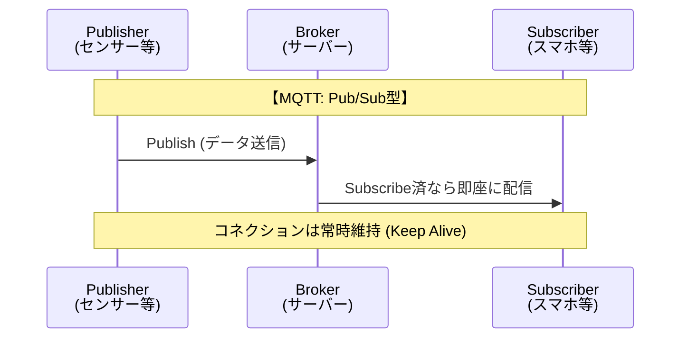

import { MermaidBox } from '../../../components/MermaidBox';

ネットワークスペシャリスト試験において、[[IoT]]（モノのインターネット）関連の出題が増加傾向にあります。
その中で特に重要なのが、[[HTTP]]に代わる軽量な通信プロトコルである**[[MQTT]]**です。

単に用語を覚えるだけでなく、「なぜHTTPではなくMQTTを採用するのか？」という**設計判断の理由**を記述式（午後試験）で答えられるようにしておくことが重要です。

## 主要なプロトコル一覧

試験対策として優先すべきは圧倒的に**MQTT**です。

| プロトコル | 名称 | 特徴・キーワード | 想定される用途 |
| :--- | :--- | :--- | :--- |
| **MQTT** | Message Queuing Telemetry Transport | **Pub/Sub型**、軽量、省電力、**Keep Alive** | IoTセンサー、モバイルアプリのプッシュ通知 |
| **AMQP** | Advanced Message Queuing Protocol | 高信頼性、トランザクション、多機能 | 金融システム、エンタープライズ連携 |
| **CoAP** | Constrained Application Protocol | **UDP**ベース、HTTPライク、REST | 超省電力デバイス、不安定な回線 |

---

## 最重要：MQTT (Message Queuing Telemetry Transport)

[[TCP]]上で動作する、パブリッシュ/サブスクライブ（Pub/Sub）型のプロトコルです。

### HTTPとのアーキテクチャの違い

HTTPが「クライアントがサーバーに取りに行く（Pull）」のに対し、MQTTは「ブローカーを介してメッセージを配信する（Push）」形をとります。

<MermaidBox client:visible>

</MermaidBox>

### 試験で問われる「メリット」 (採用理由)

午後試験で「HTTPではなくMQTTを採用した理由」を問われた場合、以下の観点が解答の軸になります。

1.  **通信量の削減（ヘッダが小さい）**
    * HTTPのヘッダが数十〜数百バイトあるのに対し、MQTTは**最小2バイト**です。帯域が狭い環境や、通信従量課金のSIMを利用する場合に有利です。
2.  **プッシュ通知が容易**
    * 常時接続（Keep Alive）が基本であるため、サーバー（ブローカー）側からクライアントへデータを即座に送信できます。HTTPで同様のことを行うにはポーリングが必要となり、無駄な通信が発生します。
3.  **不安定な通信環境への耐性**
    * **QoS (Quality of Service)** という品質レベル（0, 1, 2）を指定でき、「少なくとも1回は届ける」といった制御が可能です。また、切断時の「遺言（Last Will）」機能で異常検知も容易です。

### デメリット

* 常時接続を行うため、ブローカー（サーバー）側で大量の同時接続を維持・管理するリソースが必要になります。

---

## その他のプロトコル

### AMQP (Advanced Message Queuing Protocol)
MQTTよりも「信頼性」や「相互運用性」を重視したプロトコルです。
* **ポイント:** ミッションクリティカルな業務システムや、異なるベンダーのシステム間連携で「確実にメッセージを届ける（キューイング）」必要がある場合に採用されます。

### CoAP (Constrained Application Protocol)
* **ポイント:** トランスポート層に**[[UDP]]**を使用します。「オーバーヘッドを極限まで減らしたい」「再送制御はアプリ側でやる（あるいは多少欠落してもいい）」ような、極めてリソース制約の厳しいIoTデバイスで使われます。

---

## 試験対策シミュレーション

午後の記述式問題での出題イメージです。

> **問：** 多数の環境センサーからデータを収集するシステムにおいて、HTTPではなくMQTTを採用した理由を、通信負荷と通信方向の観点から40字以内で述べよ。

解答例を見る

**ヘッダサイズが小さく通信量が少ない上、サーバからのプッシュ通信が容易だから。** (37文字)

### ポイント
「軽量である（通信量）」ことと「双方向/プッシュが可能（通信方向）」ことの2点を盛り込むのが定石です。
