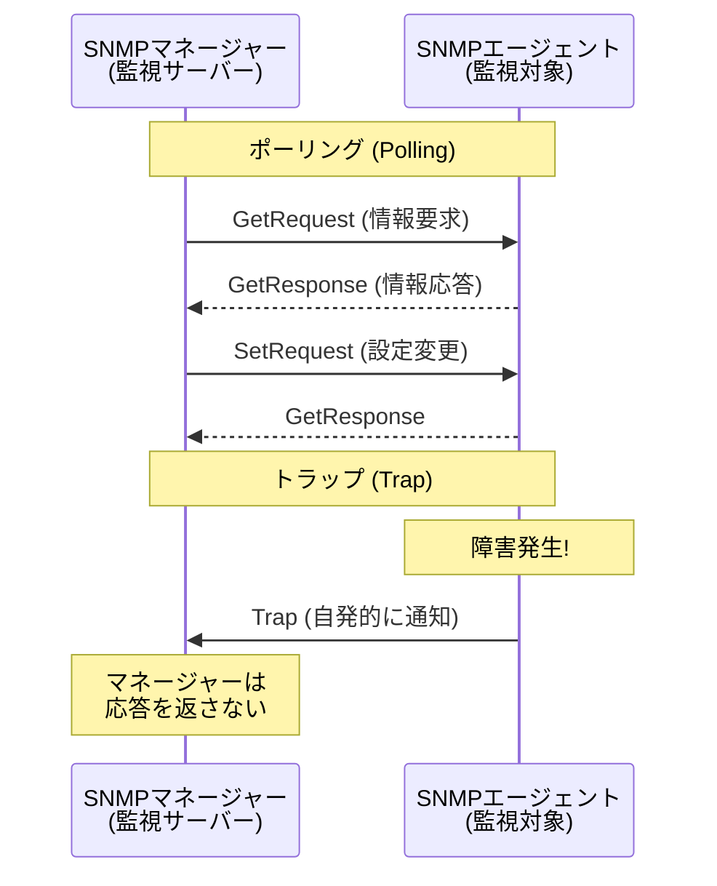
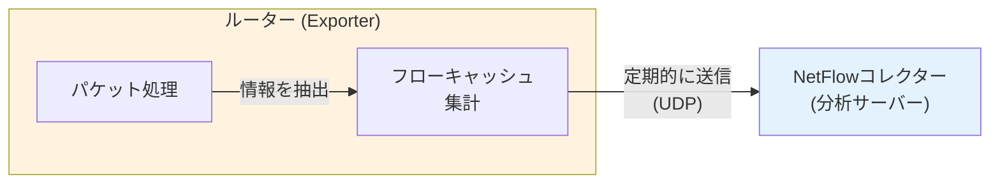

import { MermaidBox } from '../../../components/MermaidBox';

ネットワークの安定稼働には、常時の監視と障害時の迅速な対応が不可欠です。試験では、[[SNMP]]の仕組み、バージョンごとの違い、トラブルシューティング手法（コマンドやパケット解析）が頻出です。

## 監視プロトコルの代表格：SNMP

**[[SNMP]] (Simple Network Management Protocol)** は、[[TCP/IP]]ネットワーク上の機器を監視・制御するための標準プロトコルです。[[UDP]] 161 (Polling) / 162 (Trap) を使用します。

### 基本構成

1.  **[[SNMPマネージャー]]**: 監視を行うサーバー。
2.  **[[SNMPエージェント]]**: 監視対象の機器（[[ルーター]]、[[スイッチ]]、サーバー）。
3.  **[[MIB]] (Management Information Base)**: 管理情報のデータベース。ツリー構造を持つ。

<MermaidBox client:visible>

</MermaidBox>

### SNMPのバージョン比較

| バージョン | 特徴 | セキュリティ |
|:---|:---|:---|
| **[[SNMPv1]]** | 最初期の実装。機能は限定的。 | コミュニティ名（平文）のみで認証。 |
| **[[SNMPv2c]]** | パフォーマンス向上。GetBulkRequest（一括取得）追加。 | コミュニティ名（平文）のみで認証。 |
| **[[SNMPv3]]** | **セキュリティ強化**が主眼。 | **[[USM]]**（ユーザーベース認証）と**[[VACM]]**（ビューベースアクセス制御）。認証（[[MD5]]/[[SHA]]）と暗号化（[[DES]]/[[AES]]）に対応。 |

---

## トラフィック分析：NetFlow / sFlow

パケットの中身ではなく、**フロー情報**（送信元/宛先IP、ポート、プロトコル、パケット数など）を統計情報として収集する技術です。

<MermaidBox client:visible>

</MermaidBox>

| 技術 | 特徴 | 仕組み |
|:---|:---|:---|
| **[[NetFlow]]** | Cisco独自（標準化され[[IPFIX]]へ）。 | 全パケット（またはサンプリング）を見てフローを生成し、終了時や定期的に送信。 |
| **[[sFlow]]** | マルチベンダー対応。 | パケットを**サンプリング**して、そのままコレクターへ転送。解析はコレクター側で行うため機器負荷が軽い。 |

---

## ログ管理：Syslog

ネットワーク機器やサーバーのシステムログを収集・転送する標準規格です。[[UDP]] 514を使用するのが一般的ですが、信頼性が必要な場合は[[TCP]]や[[TLS]]も使われます。

**Syslogの重要度（Severity）**:
数字が小さいほど緊急度が高いです。

| 数値 | キーワード | 説明 |
|:---:|:---|:---|
| 0 | Emergency | システム使用不能 |
| 1 | Alert | 直ちに行動が必要 |
| 2 | Critical | 致命的な状態 |
| 3 | Error | エラー状態 |
| 4 | Warning | 警告 |
| 5 | Notice | 正常だが注意が必要 |
| 6 | Informational | 情報メッセージ |
| 7 | Debug | デバッグ情報 |

---

## トラブルシューティングの基本

### 切り分けのステップ

1.  **物理層**: ケーブルは繋がっているか？リンクランプは点灯しているか？
2.  **データリンク層**: MACアドレスは学習されているか？VLAN設定は正しいか？
3.  **ネットワーク層**: IPアドレスは正しいか？ルーティングはあるか？
4.  **トランスポート層以上**: ポートは開いているか？FWでブロックされていないか？

### 必須コマンド

| コマンド | 用途 | 確認ポイント |
|:---|:---|:---|
| `[[ping]]` | 疎通確認 ([[ICMP]]) | 応答があるか、パケットロス率、[[RTT]]（遅延時間）。 |
| `[[traceroute]]` (`tracert`) | 経路確認 | どの[[ルーター]]まで届いているか、どこで止まっているか。 |
| `[[arp]]` | [[ARP]]テーブル確認 | [[IPアドレス]]と[[MACアドレス]]の対応が正しいか。 |
| `[[nslookup]]` (`[[dig]]`) | [[DNS]]名前解決 | ホスト名から[[IPアドレス]]が引けるか。 |
| `[[netstat]]` (`ss`) | 接続状態確認 | ポートがLISTEN状態か、ESTABLISHEDか。 |

### パケットキャプチャ

原因不明の通信トラブルでは、[[Wireshark]]や`[[tcpdump]]`で実際のパケットを見るのが最終手段かつ最強の手段です。

- **[[TCP]] 3-way handshake**: `SYN` -> `SYN/ACK` -> `ACK` が正しく行われているか。
- **再送パケット**: 同じシーケンス番号のパケットが何度も送られていないか（パケットロスを示唆）。
- **リセットパケット**: 通信拒否を示す `RST` フラグが返ってきていないか。

---

## 試験対策のポイント

1.  **SNMPv3の要素**: USM（認証・暗号化）とVACM（アクセス制御）という用語、v1/v2cのコミュニティ名の危険性。
2.  **NetFlowとsFlowの違い**: 集計して送るか（NetFlow）、サンプリングして生データを送るか（sFlow）。
3.  **障害検知**: ポーリング（定期的確認）とトラップ（即時通知）の使い分け。トラップはUDPなのでロストする可能性がある点。
4.  **コマンド出力の読み取り**: 午後問題では、`ping` や `show ip route` などの実行結果から原因を特定させることが多い。
