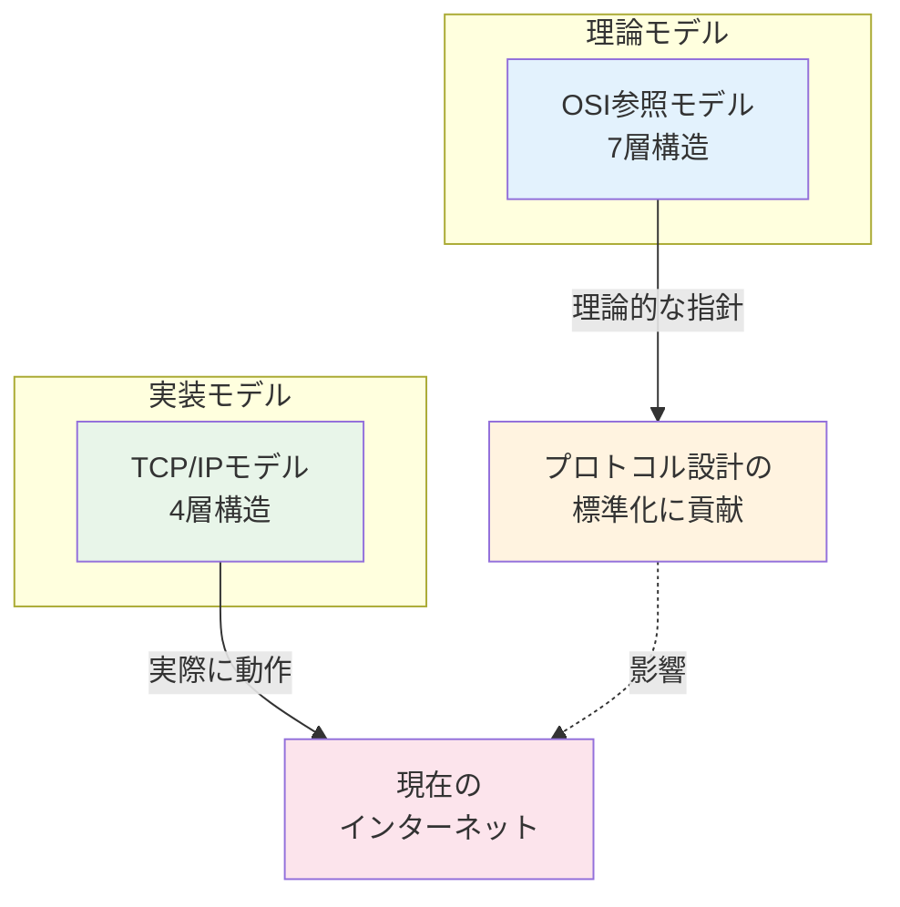
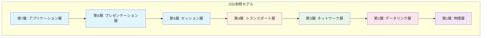
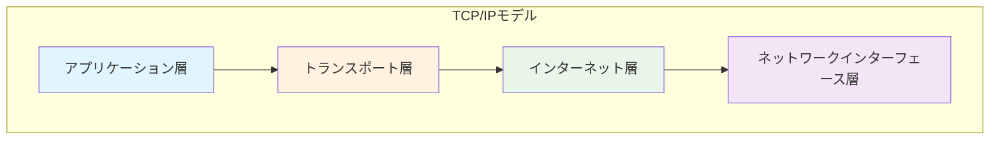
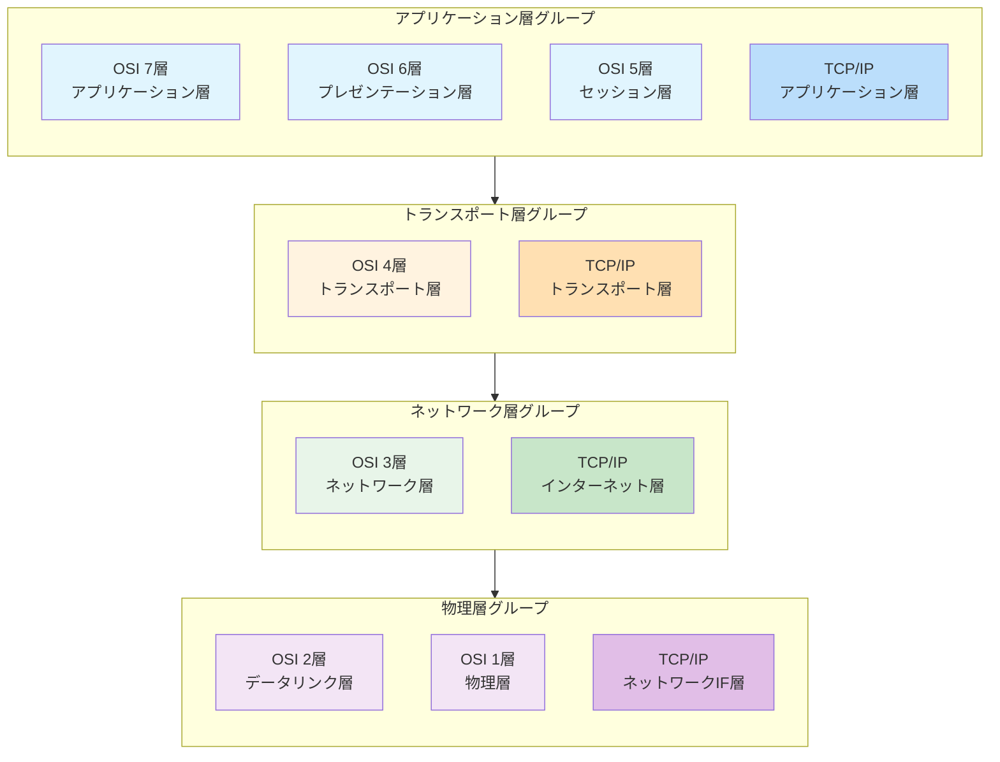
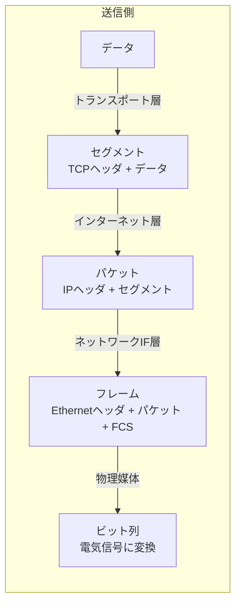
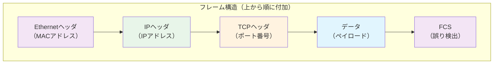
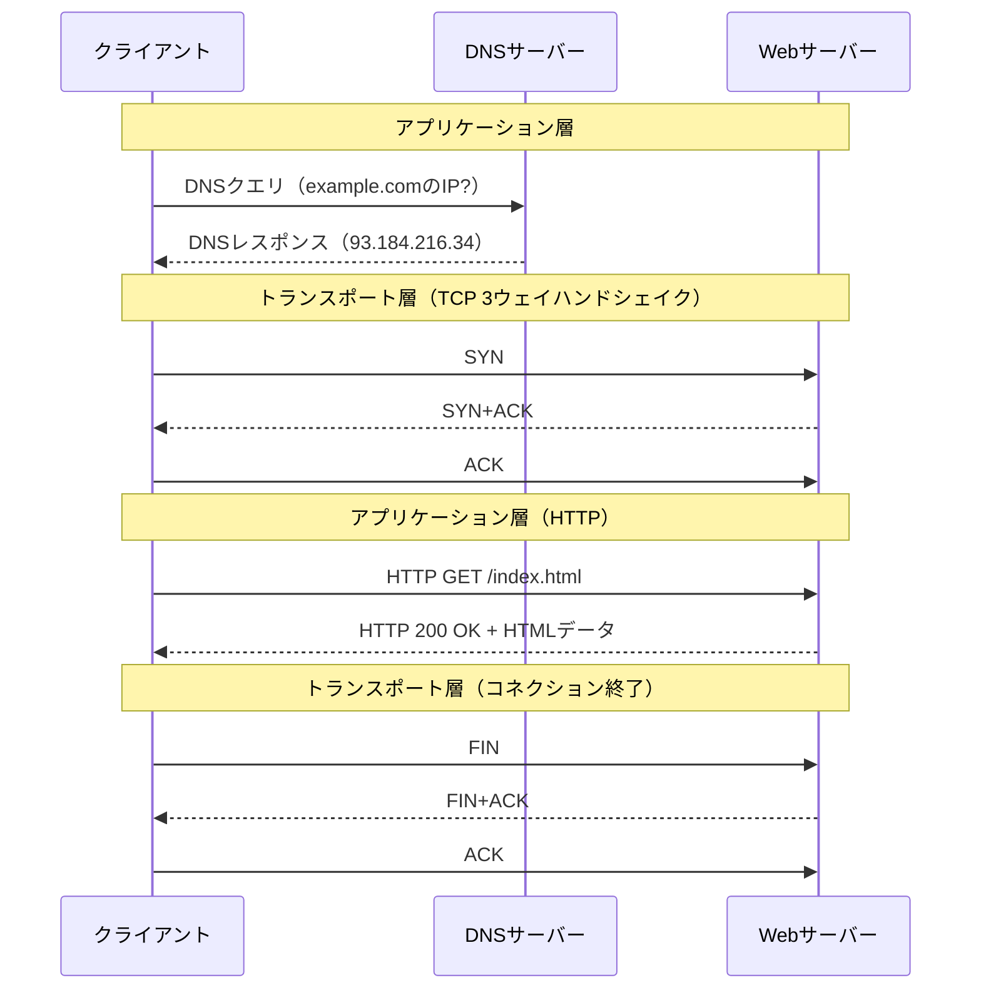
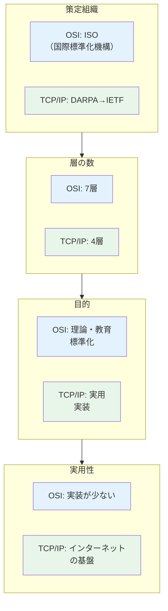
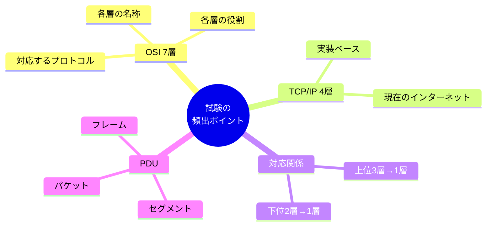

ネットワークの学習において、**OSI参照モデル**と**TCP/IPモデル**は最も基本的かつ重要な概念です。この記事では両モデルの構造、対応関係、そして実務での使い分けについて解説します。

## 全体像：2つのモデルの位置づけ

- **OSI参照モデル**: ISO（国際標準化機構）が策定した理論的な参照モデル
- **TCP/IPモデル**: 実際のインターネットで使われている実装ベースのモデル

---

## OSI参照モデル（7層）

| 層 | 名称 | 役割 | 代表的なプロトコル/機器 |
|:---:|:---|:---|:---|
| 7 | アプリケーション層 | ユーザーに直接サービスを提供 | HTTP, FTP, SMTP, DNS |
| 6 | プレゼンテーション層 | データ形式の変換・暗号化 | JPEG, MPEG, SSL/TLS |
| 5 | セッション層 | 通信の開始・維持・終了の管理 | NetBIOS, RPC |
| 4 | トランスポート層 | エンドツーエンドの信頼性確保 | TCP, UDP |
| 3 | ネットワーク層 | 論理アドレスによる経路選択 | IP, ICMP, ARP |
| 2 | データリンク層 | 物理アドレスによる隣接ノード間通信 | Ethernet, PPP, スイッチ |
| 1 | 物理層 | ビット列の電気信号への変換 | ケーブル, ハブ, リピータ |

---

## TCP/IPモデル（4層）

| 層 | 名称 | 役割 | 代表的なプロトコル |
|:---:|:---|:---|:---|
| 4 | アプリケーション層 | アプリケーション間の通信 | HTTP, FTP, SMTP, DNS, SSH |
| 3 | トランスポート層 | ホスト間の通信制御 | TCP, UDP |
| 2 | インターネット層 | ネットワーク間のルーティング | IP, ICMP, ARP |
| 1 | ネットワークインターフェース層 | 物理的なデータ転送 | Ethernet, Wi-Fi |

---

## 両モデルの対応関係

### 対応のポイント

1. **OSIの上位3層（5〜7層）→ TCP/IPのアプリケーション層**
   - TCP/IPでは機能ごとの細分化を行わず、1つの層にまとめている

2. **トランスポート層は1対1対応**
   - 両モデルで同じ役割・同じプロトコル（TCP/UDP）

3. **OSIのネットワーク層 → TCP/IPのインターネット層**
   - 名称は異なるが、IPによるルーティングという役割は同一

4. **OSIの下位2層（1〜2層）→ TCP/IPのネットワークインターフェース層**
   - TCP/IPでは物理的な実装詳細を1つの層として抽象化

---

## データのカプセル化

データが送信される際、各層でヘッダが付加されていきます。

| PDU名 | 層 | 付加情報 |
|:---|:---|:---|
| データ | アプリケーション層 | - |
| セグメント | トランスポート層 | ポート番号、シーケンス番号など |
| パケット | インターネット層 | 送信元/宛先IPアドレスなど |
| フレーム | ネットワークIF層 | MACアドレス、FCS（誤り検出）など |

---

## 通信の流れ

Webページを閲覧する例で、両モデルでの通信の流れを見てみましょう。

---

## 主な違いのまとめ

| 比較項目 | OSI参照モデル | TCP/IPモデル |
|:---|:---|:---|
| 策定組織 | ISO（国際標準化機構） | DARPA → IETF |
| 層の数 | 7層 | 4層 |
| 策定時期 | 1984年 | 1970年代 |
| 目的 | 理論的な参照モデル | 実際に動作する実装 |
| 現在の利用 | 教育・ベンダー間の共通言語 | インターネットの実装基盤 |
| 層間の独立性 | 厳密に分離 | 実装を優先し柔軟 |

---

## 試験対策のポイント

1. **各層の名称と番号を正確に覚える**
   - 特にOSI参照モデルの7層は頻出

2. **代表的なプロトコルと対応する層を把握する**
   - HTTP/DNS → アプリケーション層
   - TCP/UDP → トランスポート層
   - IP/ICMP → ネットワーク層（インターネット層）
   - Ethernet → データリンク層

3. **PDU（Protocol Data Unit）の名称を覚える**
   - セグメント、パケット、フレームの違い

4. **両モデルの対応関係を理解する**
   - OSIの上位3層がTCP/IPの1層に対応することがポイント

