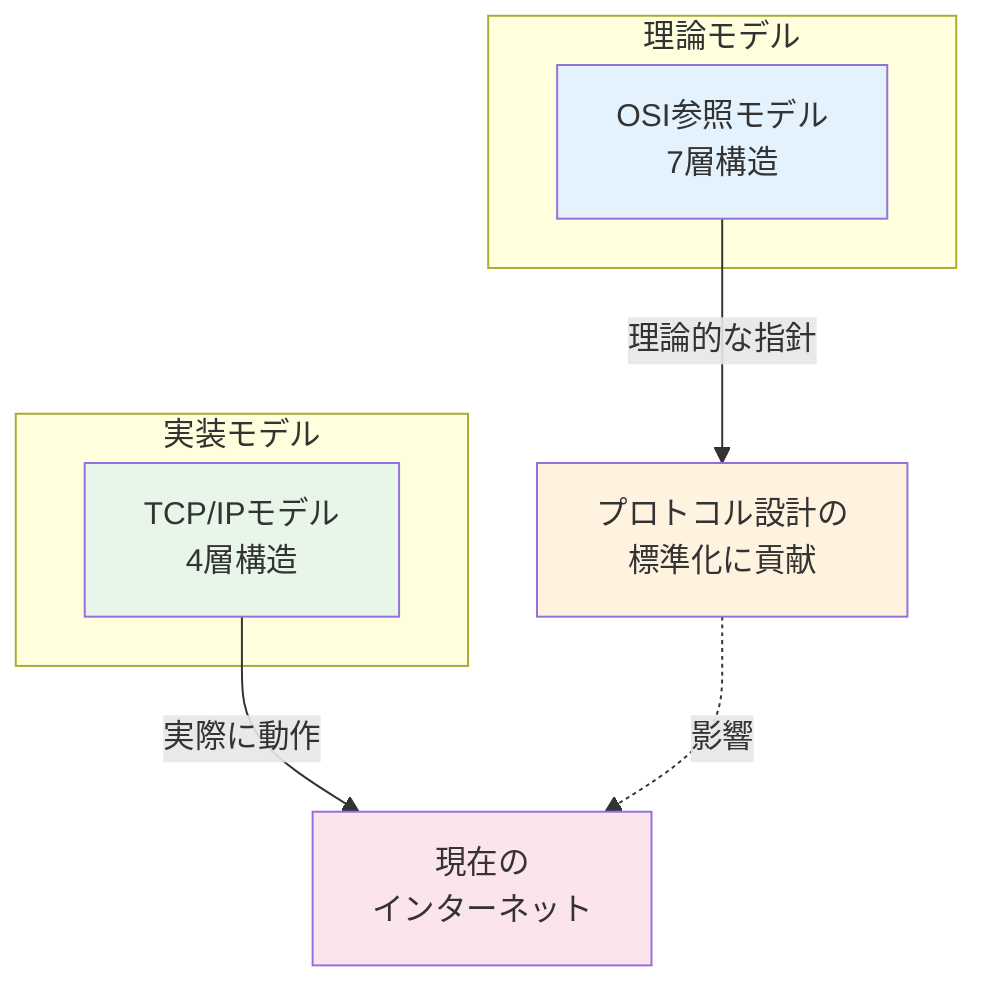
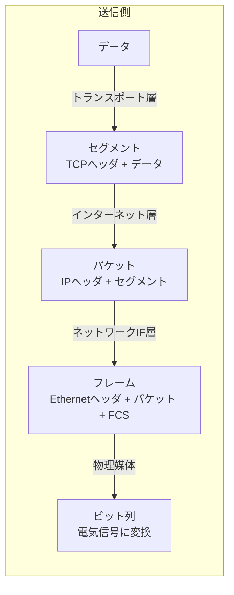
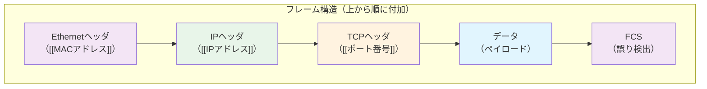
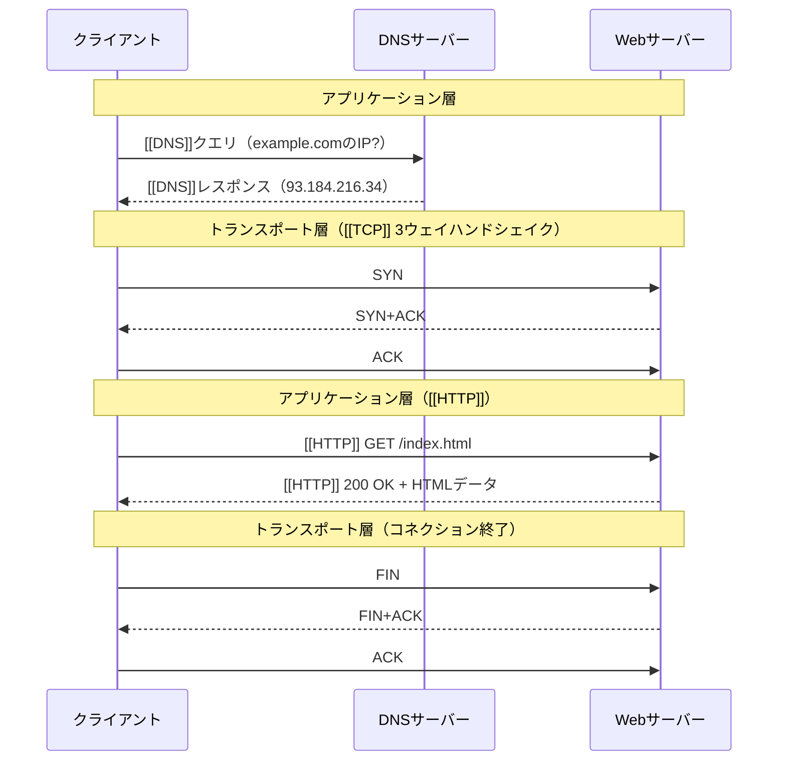

import { MermaidBox } from '../../../components/MermaidBox';

ネットワークの学習において、**[[OSI参照モデル]]**と**[[TCP/IP]]モデル**は最も基本的かつ重要な概念です。この記事では両モデルの構造、対応関係、そして実務での使い分けについて解説します。

## 全体像：2つのモデルの位置づけ

<MermaidBox client:visible>

</MermaidBox>

- **[[OSI参照モデル]]**: ISO（国際標準化機構）が策定した理論的な参照モデル
- **[[TCP/IP]]モデル**: 実際のインターネットで使われている実装ベースのモデル

---

## OSI参照モデル（7層）

| 層 | 名称 | 役割 | 代表的なプロトコル/機器 |
|:---:|:---|:---|:---|
| 7 | アプリケーション層 | ユーザーに直接サービスを提供 | [[HTTP]], [[FTP]], [[SMTP]], [[DNS]] |
| 6 | プレゼンテーション層 | データ形式の変換・暗号化 | JPEG, MPEG, [[SSL/TLS]] |
| 5 | セッション層 | 通信の開始・維持・終了の管理 | NetBIOS, RPC |
| 4 | トランスポート層 | エンドツーエンドの信頼性確保 | [[TCP]], [[UDP]] |
| 3 | ネットワーク層 | 論理アドレスによる経路選択 | [[IP]], [[ICMP]], [[ARP]] |
| 2 | データリンク層 | 物理アドレスによる隣接ノード間通信 | [[Ethernet]], PPP, スイッチ |
| 1 | 物理層 | ビット列の電気信号への変換 | ケーブル, ハブ, リピータ |

---

## TCP/IPモデル（4層）

| 層 | 名称 | 役割 | 代表的なプロトコル |
|:---:|:---|:---|:---|
| 4 | アプリケーション層 | アプリケーション間の通信 | [[HTTP]], [[FTP]], [[SMTP]], [[DNS]], [[SSH]] |
| 3 | トランスポート層 | ホスト間の通信制御 | [[TCP]], [[UDP]] |
| 2 | インターネット層 | ネットワーク間のルーティング | [[IP]], [[ICMP]], [[ARP]] |
| 1 | ネットワークインターフェース層 | 物理的なデータ転送 | [[Ethernet]], [[Wi-Fi]] |

---

## 両モデルの対応関係

| OSI参照モデル (7層) | TCP/IPモデル (4層) |
|:---|:---|
| アプリケーション層 | アプリケーション層 |
| プレゼンテーション層 | アプリケーション層 |
| セッション層 | アプリケーション層 |
| トランスポート層 | トランスポート層 |
| ネットワーク層 | インターネット層 |
| データリンク層 | ネットワークインターフェース層 |
| 物理層 | ネットワークインターフェース層 |

### 対応のポイント

1. **OSIの上位3層（5〜7層）→ TCP/IPのアプリケーション層**
   - TCP/IPでは機能ごとの細分化を行わず、1つの層にまとめている

2. **トランスポート層は1対1対応**
   - 両モデルで同じ役割・同じプロトコル（TCP/UDP）

3. **OSIのネットワーク層 → TCP/IPのインターネット層**
   - 名称は異なるが、IPによるルーティングという役割は同一

4. **OSIの下位2層（1〜2層）→ TCP/IPのネットワークインターフェース層**
   - TCP/IPでは物理的な実装詳細を1つの層として抽象化

---

## データのカプセル化

データが送信される際、各層でヘッダが付加されていきます。

<MermaidBox client:visible>

</MermaidBox>

<MermaidBox client:visible>

</MermaidBox>

| PDU名 | 層 | 付加情報 |
|:---|:---|:---|
| データ | アプリケーション層 | - |
| [[セグメント]] | トランスポート層 | [[ポート番号]]、シーケンス番号など |
| [[パケット]] | インターネット層 | 送信元/宛先[[IPアドレス]]など |
| [[フレーム]] | ネットワークIF層 | [[MACアドレス]]、FCS（誤り検出）など |

---

## 通信の流れ

Webページを閲覧する例で、両モデルでの通信の流れを見てみましょう。

<MermaidBox client:visible>

</MermaidBox>

---

## 主な違いのまとめ

| 比較項目 | OSI参照モデル | TCP/IPモデル |
|:---|:---|:---|
| 策定組織 | ISO（国際標準化機構） | DARPA → IETF |
| 層の数 | 7層 | 4層 |
| 策定時期 | 1984年 | 1970年代 |
| 目的 | 理論的な参照モデル | 実際に動作する実装 |
| 現在の利用 | 教育・ベンダー間の共通言語 | インターネットの実装基盤 |
| 層間の独立性 | 厳密に分離 | 実装を優先し柔軟 |

---

## 試験対策のポイント

1. **各層の名称と番号を正確に覚える**
   - 特にOSI参照モデルの7層は頻出

2. **代表的なプロトコルと対応する層を把握する**
   - [[HTTP]]/[[DNS]] → アプリケーション層
   - [[TCP]]/[[UDP]] → トランスポート層
   - [[IP]]/[[ICMP]] → ネットワーク層（インターネット層）
   - [[Ethernet]] → データリンク層

3. **PDU（Protocol Data Unit）の名称を覚える**
   - [[セグメント]]、[[パケット]]、[[フレーム]]の違い

4. **両モデルの対応関係を理解する**
   - [[OSI参照モデル]]の上位3層が[[TCP/IP]]の1層に対応することがポイント
