import { MermaidBox } from '../../../components/MermaidBox';

ネットワークの可用性を高めるために、各レイヤーで様々な冗長化技術が使われています。この記事では、[[OSI参照モデル]]の各層における代表的な冗長化技術を整理します。

## 冗長化の全体像

### 冗長化の目的
- 単一障害点（SPOF）の排除
- サービス継続性の確保
- 負荷分散によるパフォーマンス向上

### 実現方法
- 機器の二重化
- 経路の多重化
- 自動切り替え（フェイルオーバー）

---

## レイヤー別 冗長化技術マップ

- **L7 アプリケーション層**: [[DNS]]ラウンドロビン, L7ロードバランサー, [[CDN]]
- **L4 トランスポート層**: L4ロードバランサー, セッション維持
- **L3 ネットワーク層**: [[VRRP]] / [[HSRP]], [[ECMP]], 動的[[ルーティング]] ([[OSPF]] / [[BGP]])
- **L2 データリンク層**: [[STP]] / [[RSTP]], リンクアグリゲーション ([[LACP]]), スタック構成, MC-LAG
- **L1 物理層**: 冗長リンク, 冗長電源, 機器の二重化

---

## L1: 物理層の冗長化

物理層では、ハードウェアそのものの冗長化を行います。

| 技術 | 説明 | 効果 |
|:---|:---|:---|
| 冗長リンク | 複数の物理回線を用意 | 回線障害時の継続運用 |
| 冗長電源 | 複数の電源ユニットを搭載 | 電源障害時の継続運用 |
| UPS | 無停電電源装置 | 停電時の継続運用 |
| コールドスタンバイ | 予備機器を用意 | 機器故障時の交換 |

---

## L2: データリンク層の冗長化

### [[STP]]（スパニングツリープロトコル）

L2ネットワークでループを防止しながら冗長経路を確保します。

<MermaidBox client:visible>

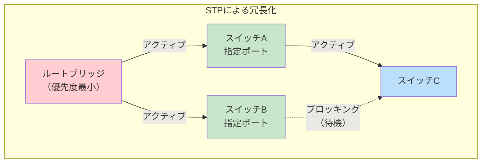

</MermaidBox>

<MermaidBox client:visible>

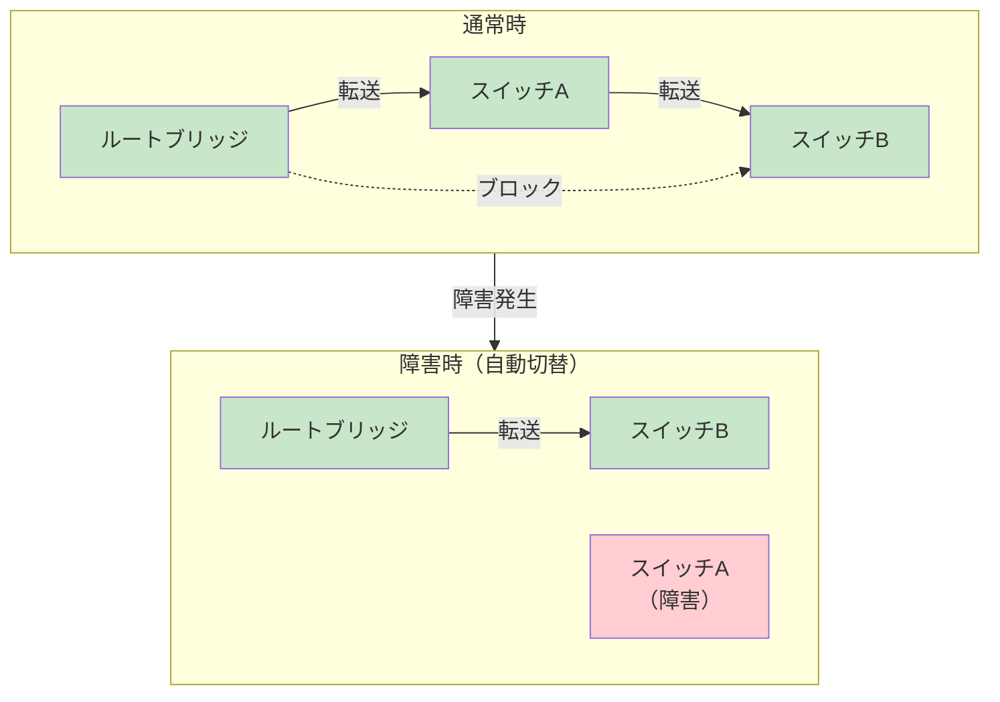

</MermaidBox>

| プロトコル | 収束時間 | 特徴 |
|:---|:---|:---|
| STP（IEEE 802.1D） | 30〜50秒 | 標準プロトコル |
| RSTP（IEEE 802.1w） | 数秒以内 | 高速収束 |
| MSTP（IEEE 802.1s） | 数秒以内 | VLAN対応 |

### リンクアグリゲーション（LACP）

複数の物理リンクを1つの論理リンクとして束ねます。

<MermaidBox client:visible>

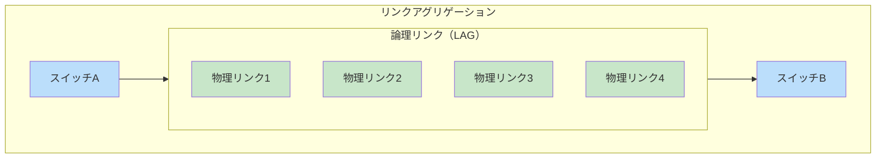

</MermaidBox>

**メリット:**
- 帯域幅の増加（例: 1Gbps × 4 = 4Gbps）
- 1本が故障しても残りで通信継続
- 負荷分散による効率化

### スタック構成

複数のスイッチを論理的に1台として扱います。

<MermaidBox client:visible>

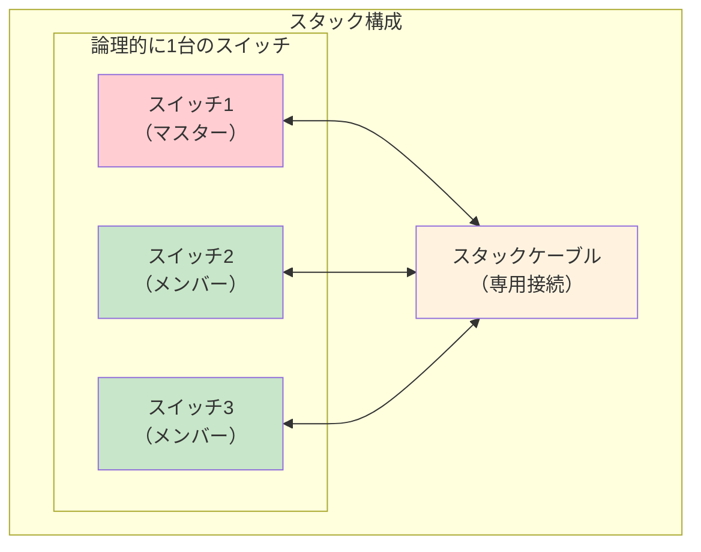

</MermaidBox>

### MC-LAG（マルチシャーシLAG）

異なる筐体間でリンクアグリゲーションを実現します。

<MermaidBox client:visible>

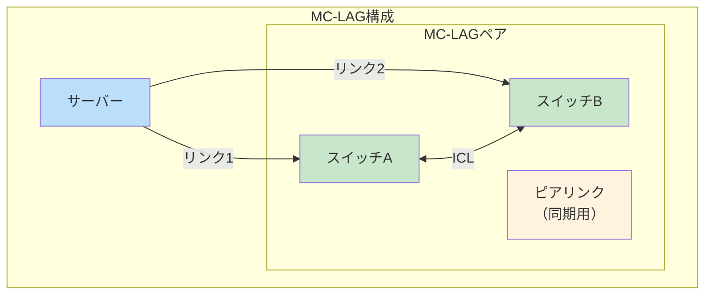

</MermaidBox>

**メリット:**
- スイッチ障害時も通信継続
- STPを使わずにループフリー
- アクティブ-アクティブ構成

---

## L3: ネットワーク層の冗長化

### [[VRRP]] / [[HSRP]]

デフォルトゲートウェイの冗長化を実現します。

<MermaidBox client:visible>

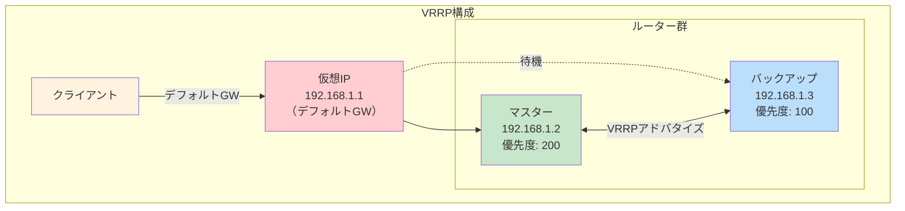

</MermaidBox>

<MermaidBox client:visible>

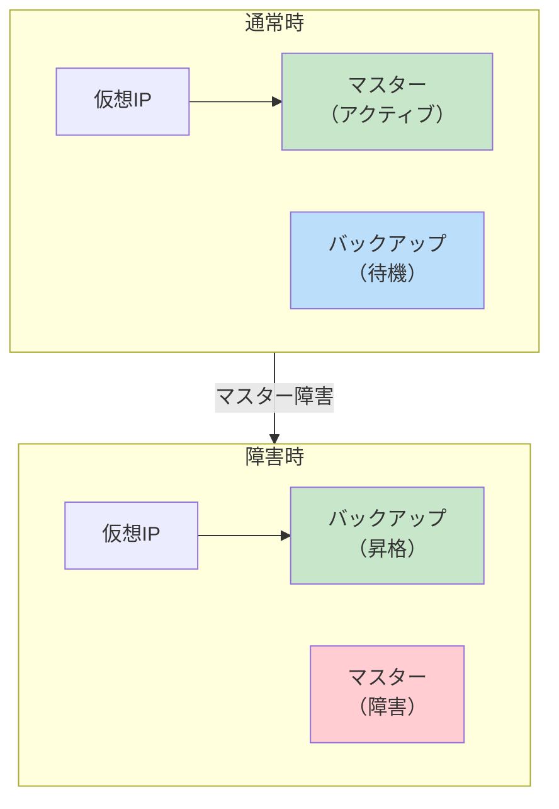

</MermaidBox>

| プロトコル | 標準 | 特徴 |
|:---|:---|:---|
| VRRP | RFC 5798 | 標準プロトコル |
| HSRP | Cisco独自 | Cisco機器で使用 |
| GLBP | Cisco独自 | 負荷分散対応 |

### [[ECMP]]（Equal-Cost Multi-Path）

同一コストの複数経路で負荷分散します。

<MermaidBox client:visible>

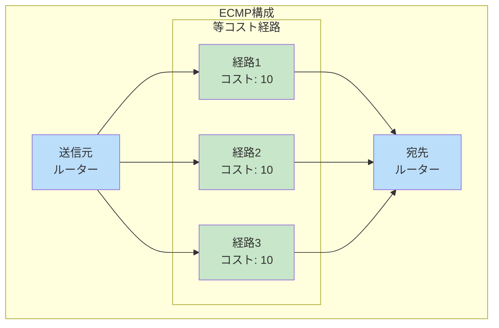

</MermaidBox>

**特徴:**
- 複数経路にトラフィックを分散
- 1経路障害時は残りの経路で継続
- ルーティングプロトコル（OSPF等）と連携

### 動的ルーティングプロトコル

障害時に自動で経路を再計算します。

<MermaidBox client:visible>

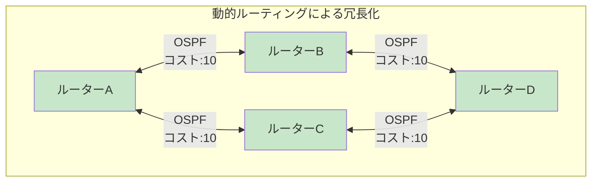

</MermaidBox>

| プロトコル | 種別 | 収束速度 | 用途 |
|:---|:---|:---|:---|
| OSPF | リンクステート | 高速 | 企業内ネットワーク |
| BGP | パスベクトル | 中程度 | ISP間接続 |
| EIGRP | ハイブリッド | 高速 | Cisco環境 |

---

## L4-L7: 上位層の冗長化

### ロードバランサー

複数のサーバーにトラフィックを分散します。

<MermaidBox client:visible>

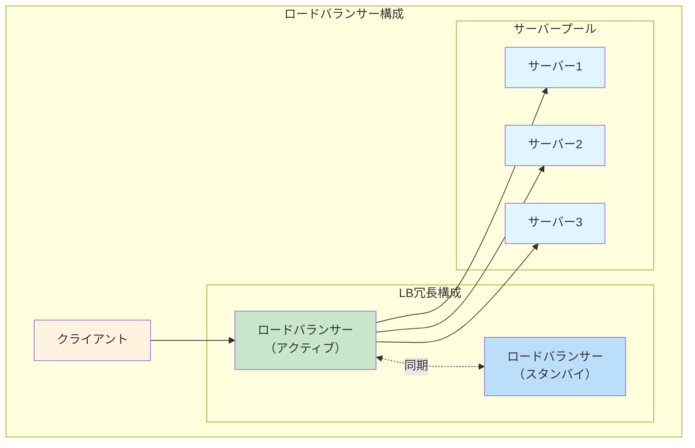

</MermaidBox>

| 種別 | 判断基準 | 特徴 |
|:---|:---|:---|
| L4 LB | IP/ポート | 高速、シンプル |
| L7 LB | HTTPヘッダ、URL | 柔軟な振り分け |

### DNSラウンドロビン

DNSで複数のIPアドレスを返却して分散します。

<MermaidBox client:visible>

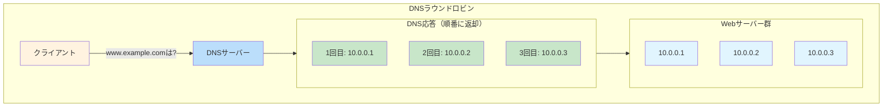

</MermaidBox>

**注意点:**
- ヘルスチェック機能がない
- セッション維持が困難
- 障害検知が遅い

---

## 冗長化構成パターン

### アクティブ-スタンバイ

<MermaidBox client:visible>

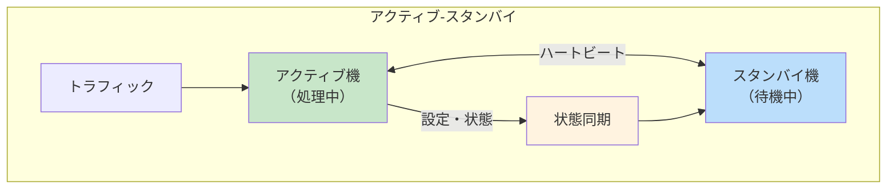

</MermaidBox>

**特徴:**
- 1台がアクティブ、1台が待機
- 障害時にスタンバイが昇格
- リソース効率は50%

### アクティブ-アクティブ

<MermaidBox client:visible>

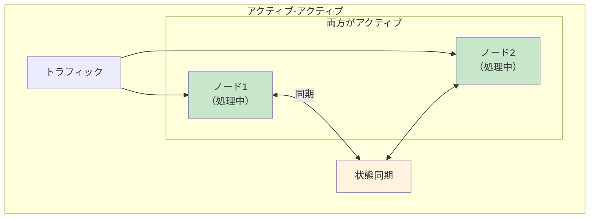

</MermaidBox>

**特徴:**
- 両方がトラフィックを処理
- 負荷分散効果あり
- リソース効率が高い

---

## 冗長化技術の比較表

| レイヤー | 技術 | 切替時間 | 構成 |
|:---|:---|:---|:---|
| L1 | 冗長電源 | なし | Active-Active |
| L2 | STP | 30〜50秒 | Active-Standby |
| L2 | RSTP | 数秒以内 | Active-Standby |
| L2 | LACP | 即時 | Active-Active |
| L2 | MC-LAG | 即時 | Active-Active |
| L3 | VRRP/HSRP | 3秒程度 | Active-Standby |
| L3 | ECMP | 即時 | Active-Active |
| L4-7 | LB | 設定依存 | どちらも可 |

---

## 試験対策のポイント

1. **各技術の動作原理を理解する**
   - STPのポート状態遷移
   - VRRPのマスター選出方法

2. **収束時間を把握する**
   - STP: 30〜50秒 → RSTP: 数秒
   - VRRP: アドバタイズ間隔 × 3

3. **構成パターンの使い分け**
   - Active-Standby: シンプル、確実
   - Active-Active: 高効率、複雑

4. **レイヤーごとの技術選択**
   - 冗長化は複数レイヤーで組み合わせる
   - 単一レイヤーだけでは不十分