動的ルーティングプロトコルは、ネットワークの経路情報を自動的に交換・学習する仕組みです。この記事では、企業ネットワークで頻出のOSPFとBGPを中心に、設計ポイントを整理します。

## ルーティングプロトコルの分類

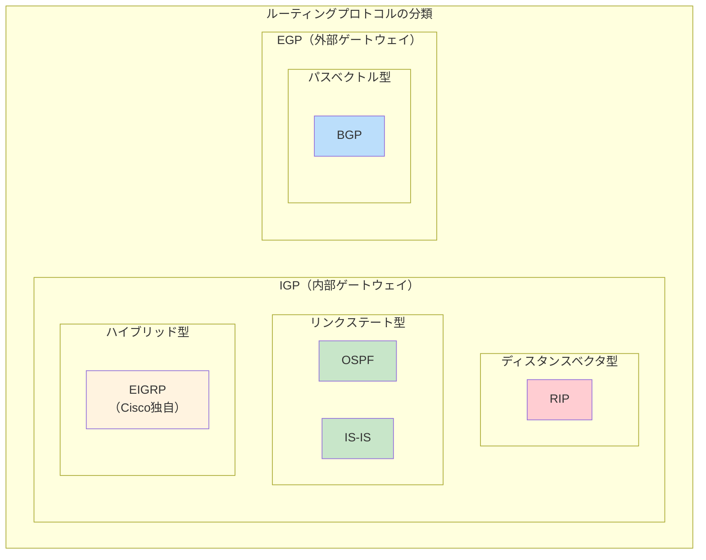

| 種別 | プロトコル | アルゴリズム | 用途 |
|:---|:---|:---|:---|
| IGP | RIP | ベルマンフォード | 小規模ネットワーク |
| IGP | OSPF | ダイクストラ（SPF） | 企業ネットワーク |
| IGP | IS-IS | ダイクストラ | ISP内部 |
| EGP | BGP | パスベクトル | ISP間接続 |

---

## OSPF（Open Shortest Path First）

OSPFはリンクステート型のIGPで、企業ネットワークで最も広く使われています。

### OSPFの基本動作

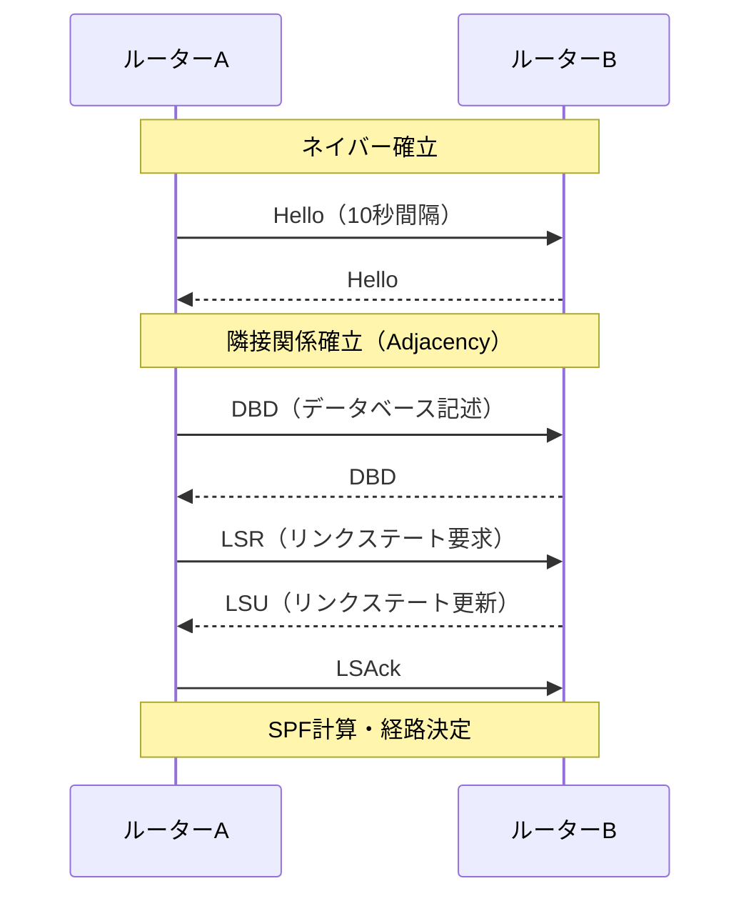

### OSPFの状態遷移

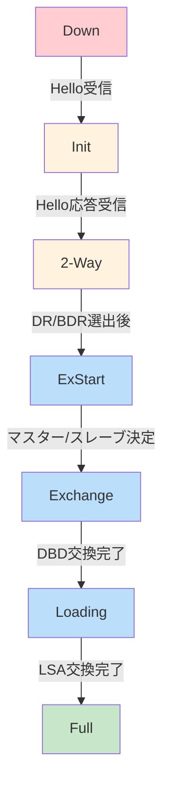

| 状態 | 説明 |
|:---|:---|
| Down | 初期状態 |
| Init | Helloを受信したがまだ双方向ではない |
| 2-Way | 双方向通信を確認、DR/BDR選出 |
| ExStart | マスター/スレーブを決定 |
| Exchange | DBDを交換 |
| Loading | 不足しているLSAを要求・受信 |
| Full | 隣接関係が完全に確立 |

### DR/BDRの選出

マルチアクセスネットワークでは、LSA交換の効率化のためDR（Designated Router）とBDR（Backup DR）を選出します。

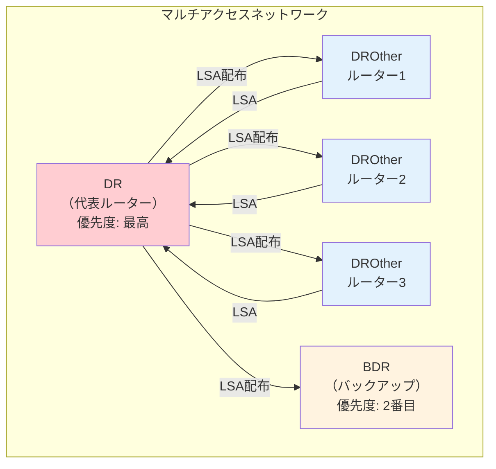

**DR選出の優先順位:**
1. プライオリティ値が最大（0は選出対象外）
2. ルーターIDが最大

### OSPFエリア設計

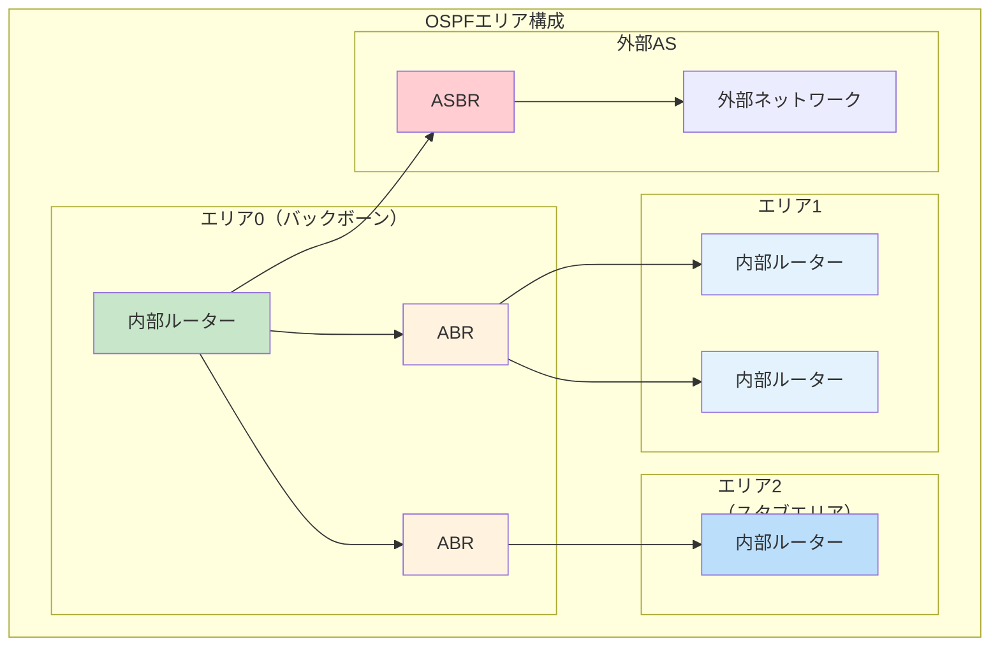

| ルーター種別 | 役割 |
|:---|:---|
| 内部ルーター | 1つのエリア内のみに所属 |
| ABR | 複数エリアに所属、エリア間の経路情報を中継 |
| ASBR | 外部ASとの境界、外部経路を再配布 |
| バックボーンルーター | エリア0に所属 |

### LSAタイプ

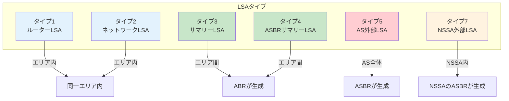

| タイプ | 名称 | 生成元 | 伝播範囲 |
|:---|:---|:---|:---|
| 1 | ルーターLSA | 全ルーター | エリア内 |
| 2 | ネットワークLSA | DR | エリア内 |
| 3 | サマリーLSA | ABR | 他エリアへ |
| 4 | ASBRサマリーLSA | ABR | ASBRの位置情報 |
| 5 | AS外部LSA | ASBR | AS全体 |
| 7 | NSSA外部LSA | NSSA内ASBR | NSSA内 |

### スタブエリアの種類

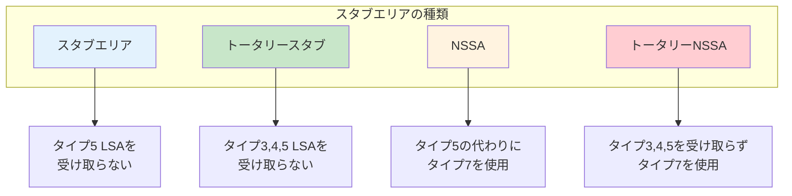

---

## BGP（Border Gateway Protocol）

BGPはAS（自律システム）間の経路交換に使用されるEGPです。

### BGPの基本概念

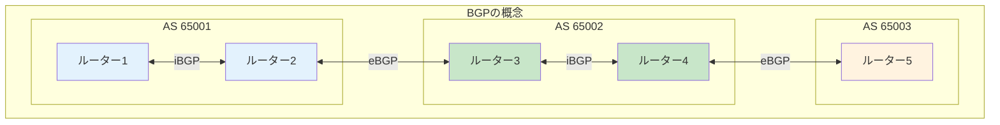

| 用語 | 説明 |
|:---|:---|
| AS | 自律システム。同一管理下のネットワーク群 |
| eBGP | 異なるAS間のBGPセッション |
| iBGP | 同一AS内のBGPセッション |
| AS番号 | ASを識別する番号（2バイトまたは4バイト） |

### BGPメッセージタイプ

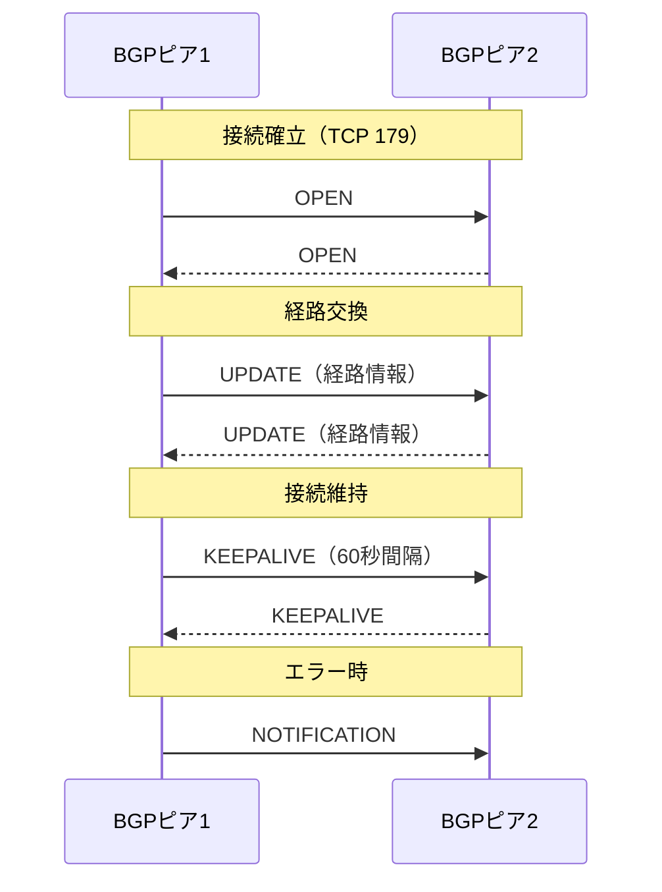

| メッセージ | 役割 |
|:---|:---|
| OPEN | セッション確立、パラメータ交換 |
| UPDATE | 経路情報の広告・取り消し |
| KEEPALIVE | 接続維持（デフォルト60秒） |
| NOTIFICATION | エラー通知、セッション切断 |

### BGPパス属性

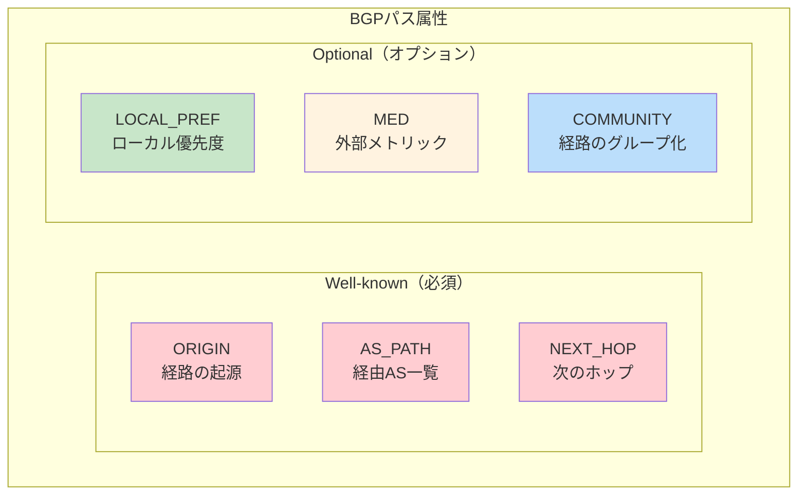

| 属性 | 種別 | 説明 | 経路選択での優先度 |
|:---|:---|:---|:---|
| ORIGIN | 必須 | 経路の起源（i, e, ?） | 7番目 |
| AS_PATH | 必須 | 経由したASの一覧 | 3番目 |
| NEXT_HOP | 必須 | パケットの転送先 | - |
| LOCAL_PREF | オプション | AS内での優先度（大きいほど優先） | 2番目 |
| MED | オプション | 他ASへの優先度指示（小さいほど優先） | 6番目 |

### BGP経路選択アルゴリズム

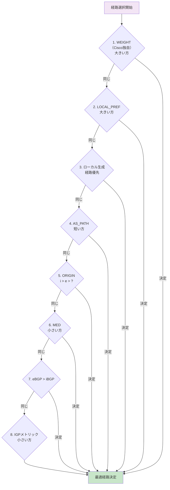

### iBGPのフルメッシュ問題

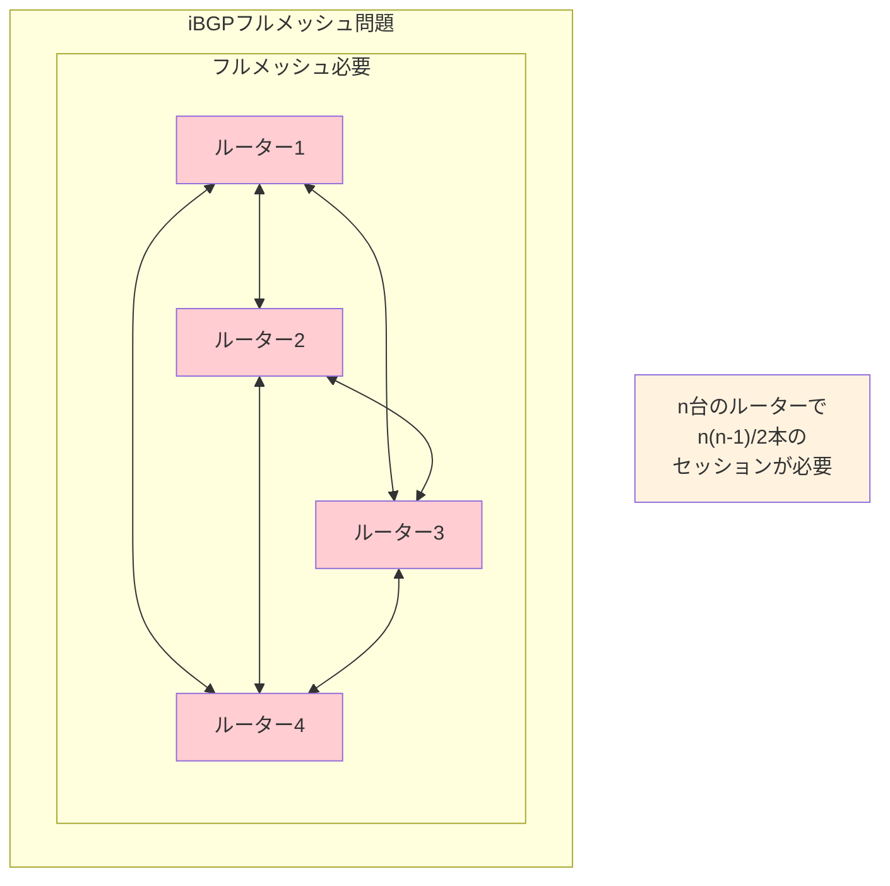

### ルートリフレクタ

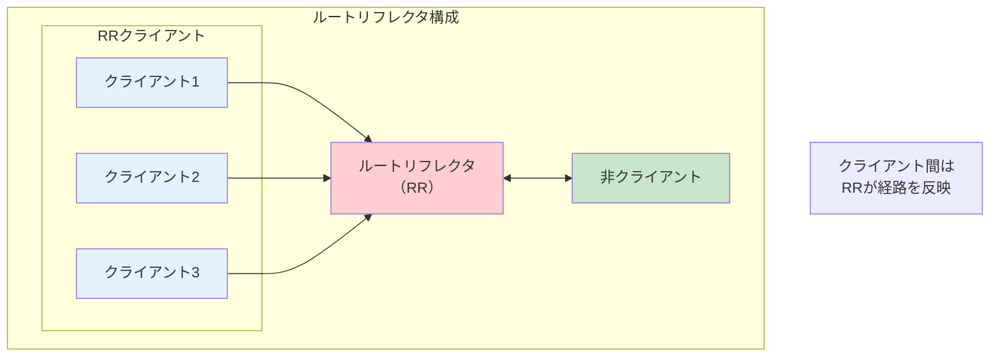

**ルートリフレクタの動作:**
- クライアントから受信した経路 → 他のクライアント・非クライアントへ反映
- 非クライアントから受信した経路 → クライアントへのみ反映

---

## BFD（Bidirectional Forwarding Detection）

障害検知を高速化するプロトコルです。

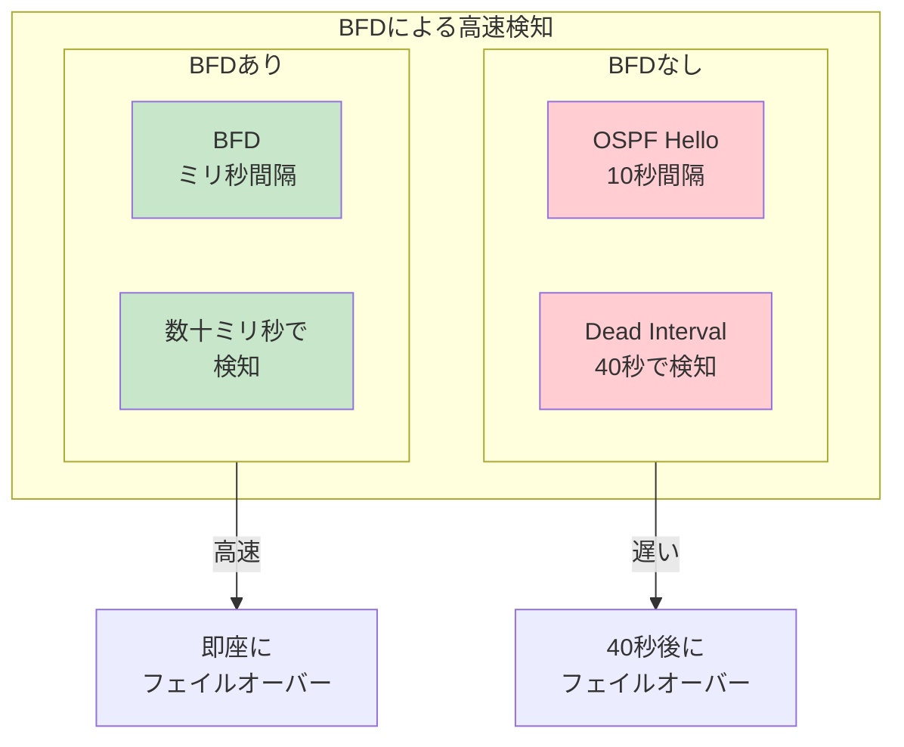

| 項目 | BFDなし | BFDあり |
|:---|:---|:---|
| 検知間隔 | 秒単位 | ミリ秒単位 |
| OSPF障害検知 | 約40秒 | 50ms〜数秒 |
| BGP障害検知 | 約180秒 | 50ms〜数秒 |

---

## 経路再配布

異なるルーティングプロトコル間で経路情報を交換します。

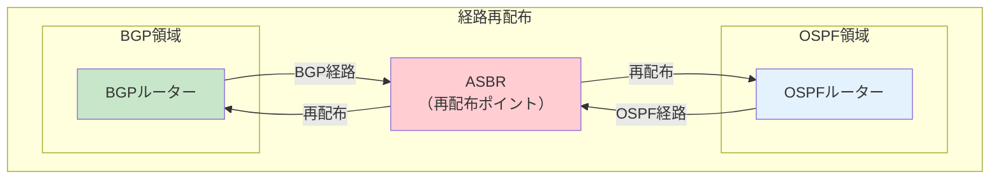

**再配布時の注意点:**
- ルーティングループの可能性
- メトリックの変換が必要
- フィルタリングの検討

---

## OSPF vs BGP 比較表

| 項目 | OSPF | BGP |
|:---|:---|:---|
| 種別 | IGP | EGP |
| アルゴリズム | SPF（ダイクストラ） | パスベクトル |
| メトリック | コスト | パス属性 |
| 収束速度 | 高速 | 比較的遅い |
| スケーラビリティ | 中規模 | 大規模 |
| 使用場面 | 企業ネットワーク内 | ISP間、大規模ネットワーク |
| プロトコル | IP（プロトコル番号89） | TCP（ポート179） |

---

## 試験対策のポイント

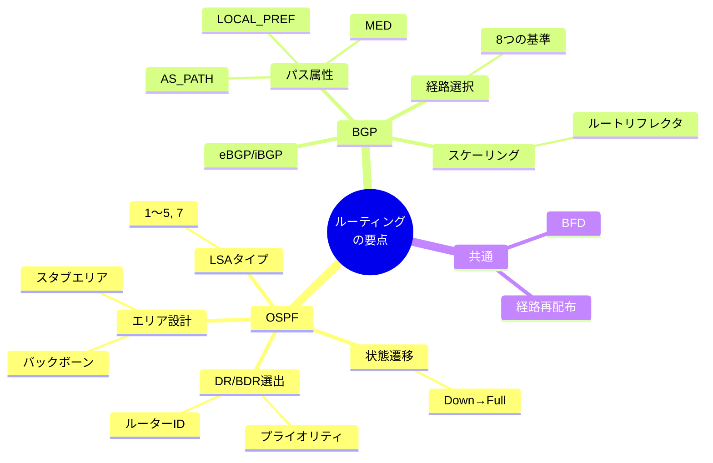

1. **OSPFの状態遷移を理解する**
   - Down → Init → 2-Way → ExStart → Exchange → Loading → Full
   - 2-WayでDR/BDR選出が行われる

2. **LSAタイプを把握する**
   - タイプ1, 2: エリア内
   - タイプ3, 4: エリア間（ABR生成）
   - タイプ5: AS外部（ASBR生成）

3. **BGP経路選択の優先順位**
   - LOCAL_PREF（大） → AS_PATH（短） → MED（小）
   - 覚え方: 「ローカルで短いパスが低コスト」

4. **iBGPのスケーリング**
   - フルメッシュの問題点
   - ルートリフレクタによる解決

5. **BFDの効果**
   - 障害検知を秒単位からミリ秒単位へ高速化
