import { MermaidBox } from '../../../components/MermaidBox';

ネットワークの仮想化・ソフトウェア化は現代のネットワーク設計に欠かせない技術です。この記事では、SDN、NFV、SD-WANの概念と仕組みを整理します。

## ネットワーク仮想化の全体像

<MermaidBox client:visible>

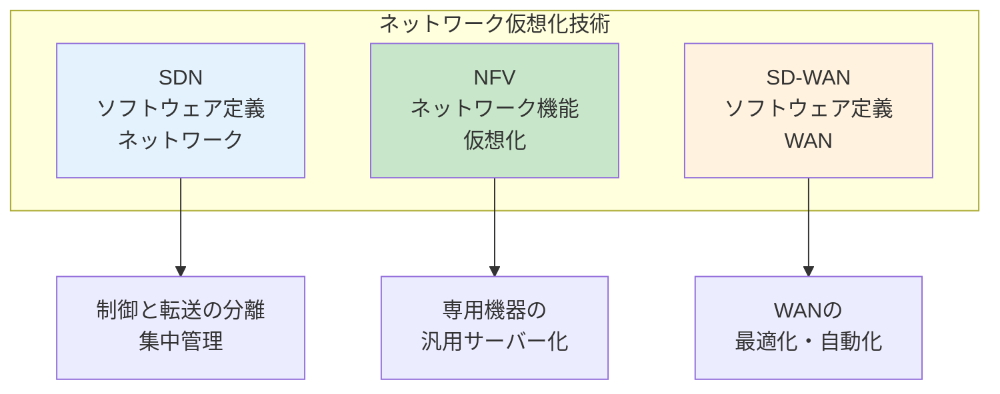

</MermaidBox>

---

## SDN（Software-Defined Networking）

### 従来のネットワーク vs SDN

<MermaidBox client:visible>

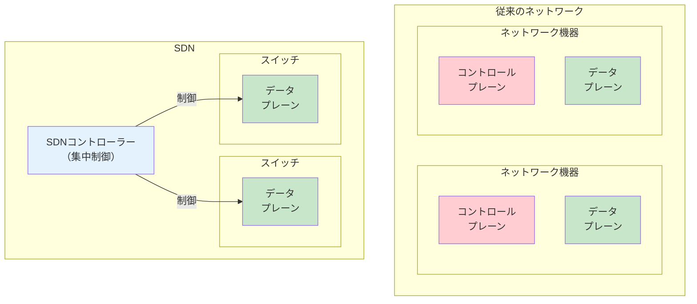

</MermaidBox>

| 項目 | 従来 | SDN |
|:---|:---|:---|
| 制御 | 各機器が個別に判断 | コントローラーが集中制御 |
| 設定変更 | 機器ごとに個別設定 | コントローラーから一括 |
| 柔軟性 | 低い | 高い |
| 運用コスト | 高い | 低い |

### SDNの3層アーキテクチャ

<MermaidBox client:visible>

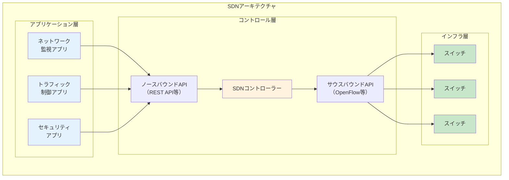

</MermaidBox>

| 層 | 役割 | 例 |
|:---|:---|:---|
| アプリケーション層 | ネットワーク機能の実装 | 監視、QoS、セキュリティ |
| コントロール層 | ネットワーク全体の制御 | SDNコントローラー |
| インフラ層 | パケット転送 | OpenFlowスイッチ |

### API

<MermaidBox client:visible>

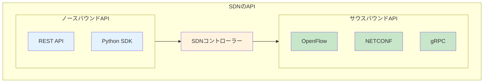

</MermaidBox>

---

## OpenFlow

SDNを実現するための代表的なプロトコルです。

### OpenFlowの構成要素

<MermaidBox client:visible>

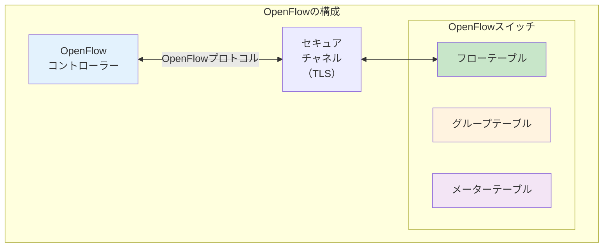

</MermaidBox>

### フローテーブル

<MermaidBox client:visible>

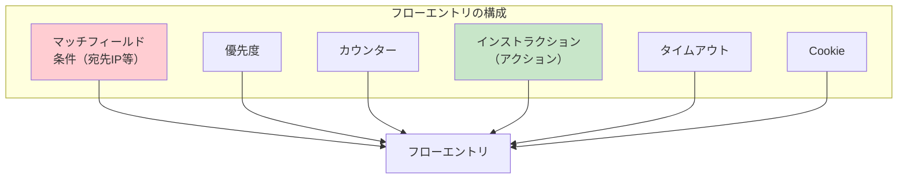

</MermaidBox>

### パケット処理の流れ

<MermaidBox client:visible>

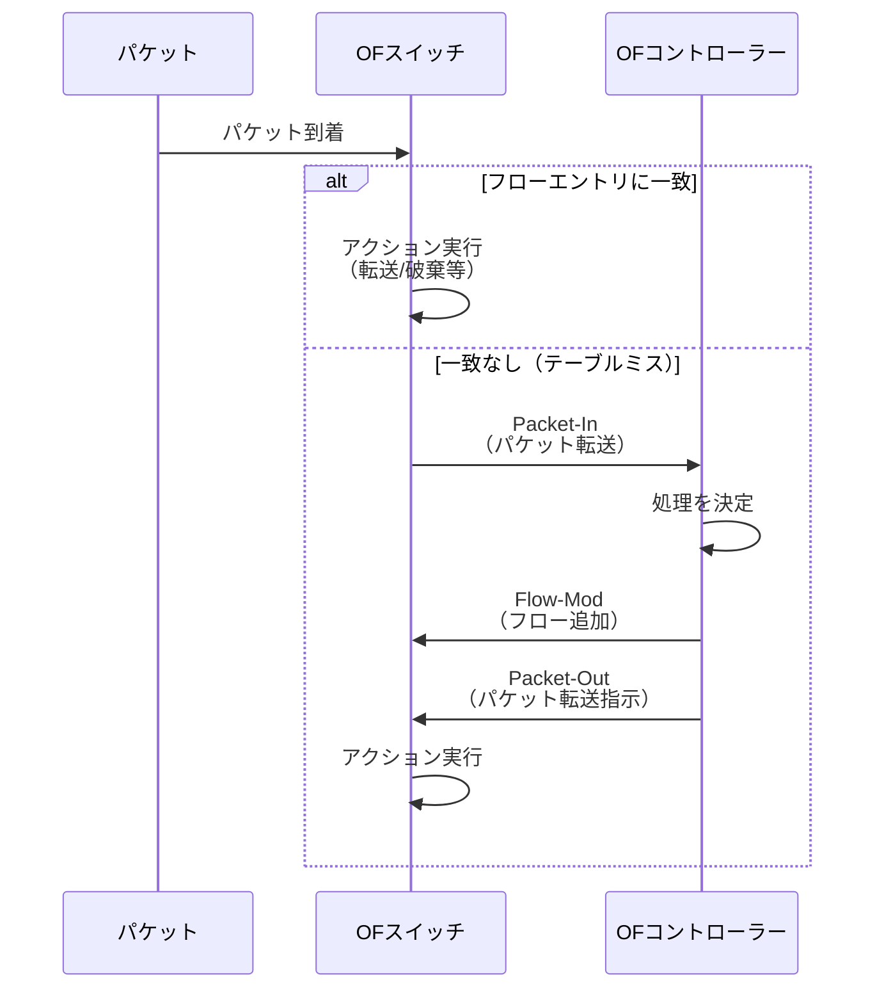

</MermaidBox>

### OpenFlowメッセージ

<MermaidBox client:visible>

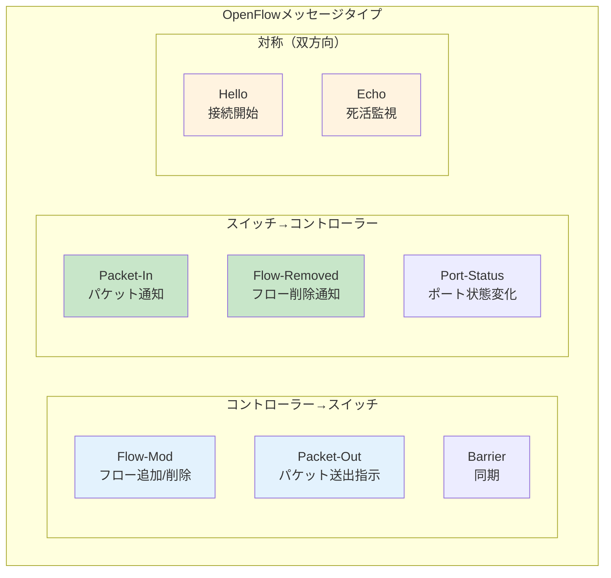

</MermaidBox>

---

## NFV（Network Functions Virtualization）

### NFVの概念

<MermaidBox client:visible>

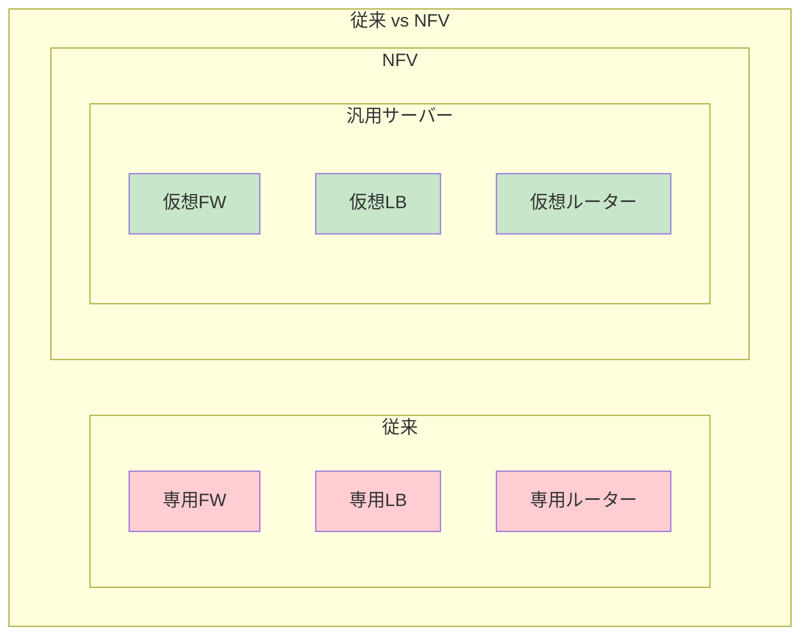

</MermaidBox>

| 項目 | 従来（専用機器） | NFV |
|:---|:---|:---|
| ハードウェア | ベンダー専用 | 汎用サーバー |
| 導入コスト | 高い | 低い |
| スケーリング | 機器追加が必要 | VM追加で対応 |
| 導入期間 | 長い | 短い |
| 柔軟性 | 低い | 高い |

### NFVアーキテクチャ

<MermaidBox client:visible>

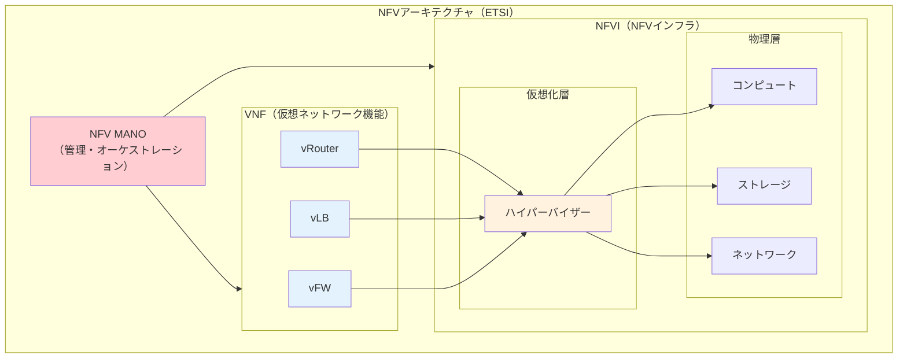

</MermaidBox>

### NFV MANOの構成

<MermaidBox client:visible>

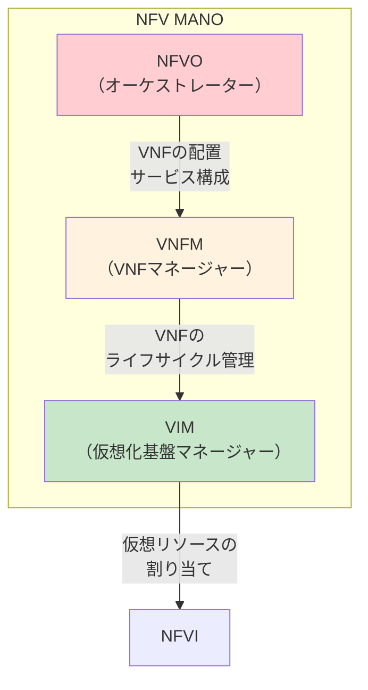

</MermaidBox>

| コンポーネント | 役割 |
|:---|:---|
| NFVO | ネットワークサービスのオーケストレーション |
| VNFM | VNFのライフサイクル管理（起動、停止、スケール） |
| VIM | 仮想化基盤のリソース管理 |

---

## SDN と NFV の関係

<MermaidBox client:visible>

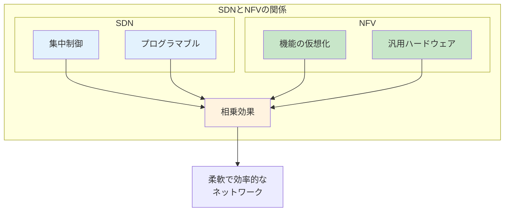

</MermaidBox>

| 観点 | SDN | NFV |
|:---|:---|:---|
| 対象 | ネットワーク制御 | ネットワーク機能 |
| アプローチ | 制御と転送の分離 | 専用機器の仮想化 |
| 標準化団体 | ONF | ETSI |
| 関係 | 補完的（組み合わせ可能） | 補完的（組み合わせ可能） |

---

## SD-WAN（Software-Defined WAN）

### SD-WANの概要

<MermaidBox client:visible>

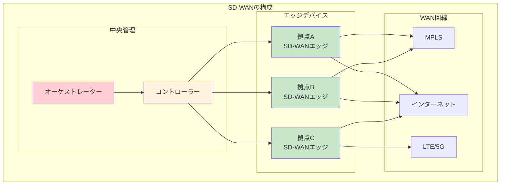

</MermaidBox>

### SD-WANの主要機能

<MermaidBox client:visible>

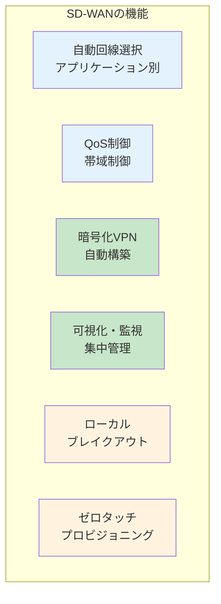

</MermaidBox>

### ローカルブレイクアウト

<MermaidBox client:visible>

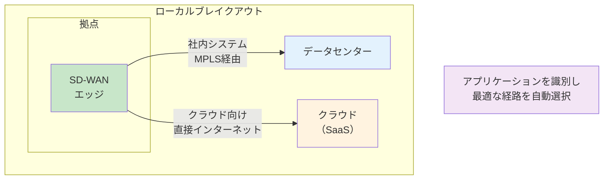

</MermaidBox>

**メリット:**
- データセンターの回線負荷軽減
- クラウドサービスへの遅延低減
- コスト削減

### 従来のWAN vs SD-WAN

<MermaidBox client:visible>

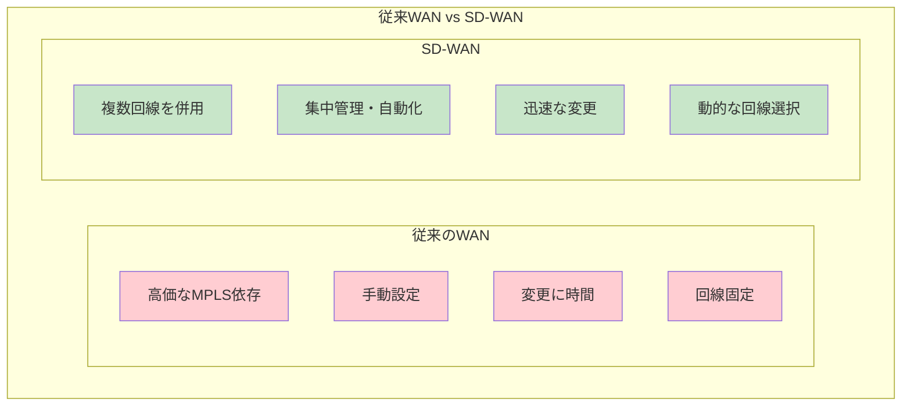

</MermaidBox>

| 項目 | 従来WAN | SD-WAN |
|:---|:---|:---|
| 回線 | MPLS主体 | MPLS + インターネット + LTE |
| コスト | 高い | 削減可能 |
| 設定 | 機器ごと手動 | 集中管理・自動化 |
| 可視性 | 限定的 | アプリケーションレベル |
| 冗長性 | 回線ごとに設計 | 自動フェイルオーバー |

---

## VXLAN（Virtual Extensible LAN）

### VXLANの概要

<MermaidBox client:visible>

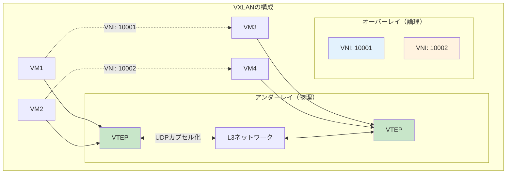

</MermaidBox>

### VXLANヘッダ構造

<MermaidBox client:visible>

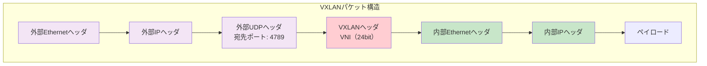

</MermaidBox>

| 特徴 | 説明 |
|:---|:---|
| VNI | 24ビット（約1600万のネットワーク識別子） |
| カプセル化 | UDP（ポート4789） |
| VTEP | VXLANトンネルエンドポイント |
| 用途 | データセンター内L2延伸、マルチテナント |

---

## 技術比較表

| 技術 | 目的 | 標準化 | 主な用途 |
|:---|:---|:---|:---|
| SDN | ネットワーク制御の集中化 | ONF | データセンター、キャンパス |
| OpenFlow | SDNプロトコル | ONF | SDN実装 |
| NFV | 機能の仮想化 | ETSI | 通信事業者、企業 |
| SD-WAN | WAN最適化 | - | 企業WAN |
| VXLAN | L2オーバーレイ | RFC 7348 | データセンター |

---

## 試験対策のポイント

<MermaidBox client:visible>

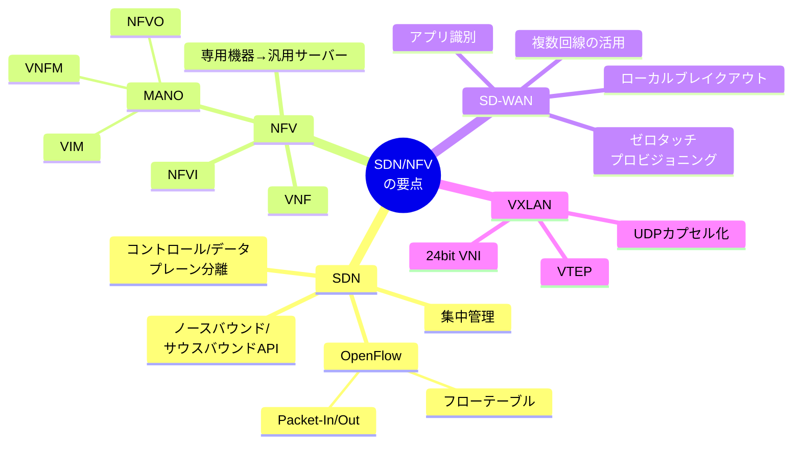

</MermaidBox>

1. **SDNの3層を理解する**
   - アプリケーション層、コントロール層、インフラ層
   - ノースバウンド/サウスバウンドAPI

2. **OpenFlowの動作を把握する**
   - フローテーブルによるパケット処理
   - Packet-In/Packet-Out/Flow-Modメッセージ

3. **NFVの構成要素を覚える**
   - VNF: 仮想化されたネットワーク機能
   - NFVI: NFVインフラ
   - MANO: 管理・オーケストレーション

4. **SD-WANの特徴**
   - ローカルブレイクアウトの概念
   - 複数回線の動的選択
   - ゼロタッチプロビジョニング

5. **VXLANの仕組み**
   - 24ビットVNI（VLAN 12ビットの制限を解消）
   - UDPカプセル化（ポート4789）