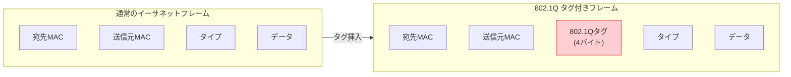
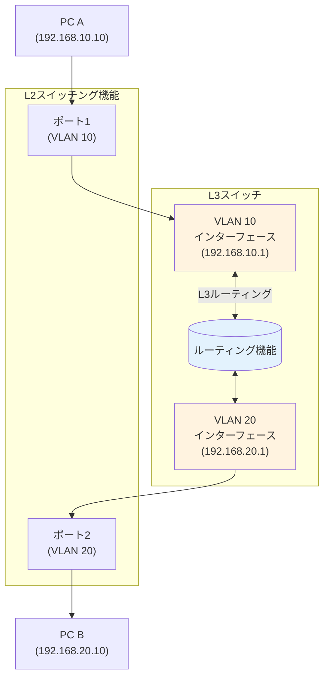
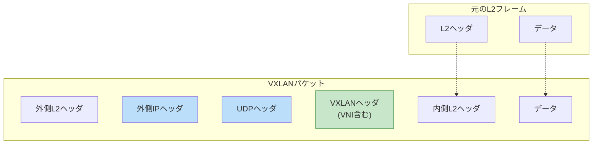
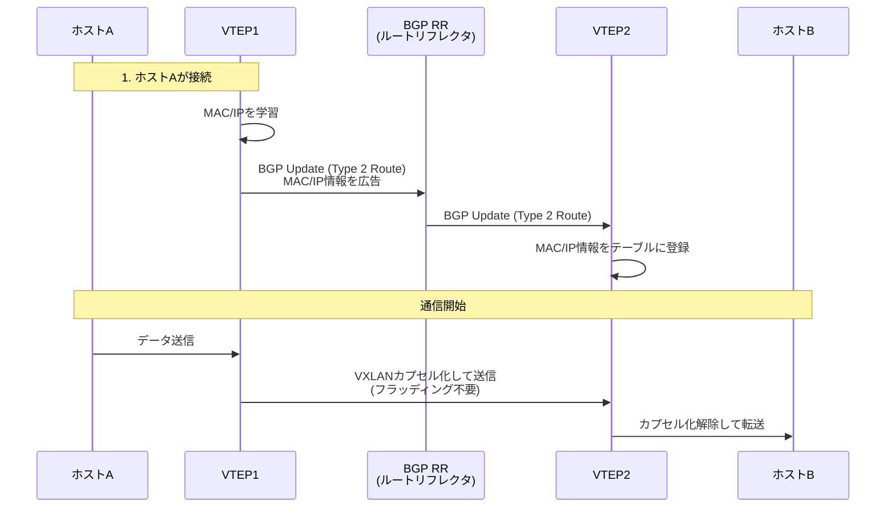
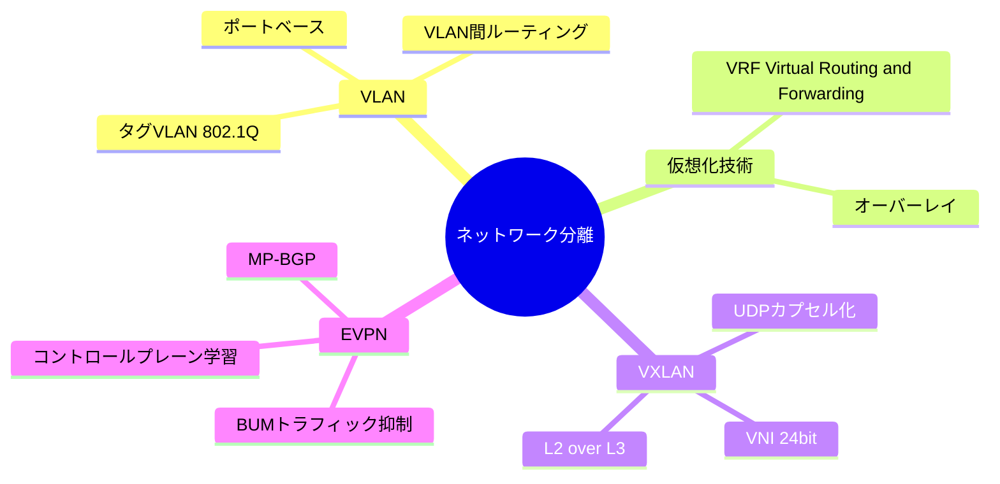

import { MermaidBox } from '../../../components/MermaidBox';

[[VLAN]]（Virtual LAN）は、物理的な接続形態とは独立して仮想的なネットワークグループを作成する技術です。近年では、データセンターネットワークの大規模化に伴い、[[VXLAN]]や[[EVPN]]といった新しい分離技術も出題されています。

## VLANの基礎

### VLANの種類

| 種類 | 説明 | 特徴 |
|:---|:---|:---|
| ポートベース[[VLAN]] | スイッチのポートごとにVLAN IDを割り当てる | 設定が簡単だが、物理的な配線変更が必要な場合に手間がかかる |
| タグ[[VLAN]] | [[Ethernet]]フレームにタグ情報を付加する | 1本のリンクで複数の[[VLAN]]を識別可能（トランクリンク） |
| [[MACアドレス]]ベース[[VLAN]] | [[MACアドレス]]に基づいて[[VLAN]]を決定する | 端末が移動しても同じ[[VLAN]]に所属できる |

### [[IEEE 802.1Q]] タグVLAN

タグ[[VLAN]]では、[[Ethernet]]フレームの送信元[[MACアドレス]]とタイプフィールドの間に**4バイトのタグ**を挿入します。

<MermaidBox client:visible>

</MermaidBox>

**タグの構造**:
- **TPID (Tag Protocol Identifier)**: 0x8100 (固定)
- **TCI (Tag Control Information)**:
    - PCP (Priority Code Point): 優先制御用 (3bit)
    - DEI (Drop Eligible Indicator): 廃棄適性 (1bit)
    - **VID (VLAN ID)**: VLAN識別子 (12bit, 1-4094)

### ネイティブVLAN
トランクリンク上でタグを付けずに送受信されるVLANです。通常はVLAN 1がデフォルトですが、セキュリティ上の理由から変更することが推奨されます。

---

## VLAN間ルーティング

異なるVLAN間の通信には、ルーターやL3スイッチによるルーティングが必要です。

<MermaidBox client:visible>

</MermaidBox>

- **SVI (Switch Virtual Interface)**: L3スイッチ内部に作成される仮想インターフェース。各VLANのデフォルトゲートウェイとして機能します。

---

## VXLAN (Virtual Extensible LAN)

従来の[[VLAN]] ID（12bit、最大4094個）では大規模データセンターやクラウド環境で不足するため、**24bitのVNI（[[VXLAN]] Network Identifier）**を使用して最大約1600万個のセグメントを作成できる技術です。

### VXLANの仕組み

L2フレームをUDPパケットでカプセル化し、L3ネットワーク上でトンネリングします（L2 over L3）。

<MermaidBox client:visible>

</MermaidBox>

- **VTEP (VXLAN Tunnel End Point)**: VXLANのカプセル化・非カプセル化を行う端点。物理スイッチや仮想スイッチ（vSwitch）がこの役割を担います。
- **オーバーレイネットワーク**: 物理網（アンダーレイ）の上に構築される論理的なネットワーク。

---

## EVPN (Ethernet VPN)

[[VXLAN]]はデータプレーンのプロトコルですが、[[EVPN]]は**[[BGP]] (MP-BGP)** をコントロールプレーンとして使用し、[[VXLAN]]ネットワークの制御を行う技術です。

### 従来の課題とEVPNの解決策

| 課題 | 従来 (Flood & Learn) | EVPN (BGP) |
|:---|:---|:---|
| MACアドレス学習 | データプレーンでのフラッディングによる学習 | **コントロールプレーン (BGP) で事前にMAC情報を広告** |
| 無駄なトラフィック | BUMトラフィックが網全体に流れる | 必要なVTEPのみに転送、ARP抑制などが可能 |
| マルチホーミング | 冗長化が複雑 (STP等) | **Active-Active構成**が容易に実現可能 |

### EVPNの動作イメージ

<MermaidBox client:visible>

</MermaidBox>

**EVPNの主要なルートタイプ**:
- **Type 2 (MAC/IP Advertisement Route)**: ホストのMACアドレスとIPアドレスを広告。
- **Type 3 (Inclusive Multicast Ethernet Tag Route)**: BUMトラフィック（Broadcast, Unknown unicast, Multicast）の転送先VTEPを広告。
- **Type 5 (IP Prefix Route)**: 外部ネットワークへのプレフィックス情報を広告。

---

## 試験対策のポイント

1.  **タグVLANのフレーム構造**: 4バイトのタグがどこに挿入されるか、TPIDの値（0x8100）などを理解する。
2.  **VXLANの目的と構造**: VLAN ID枯渇問題への対応、L2 over L3、UDPカプセル化（ポート4789）といったキーワードを押さえる。
3.  **EVPNのメリット**: 従来の「Flood & Learn」方式との違い、BGPを使ってMACアドレスを学習する仕組み、Active-Active構成が可能な点を理解する。
4.  **ネットワーク分離**: 物理的な分離と論理的な分離（VLAN, VRF）の違いや、セキュリティゾーンの設計における活用法。

<MermaidBox client:visible>

</MermaidBox>
