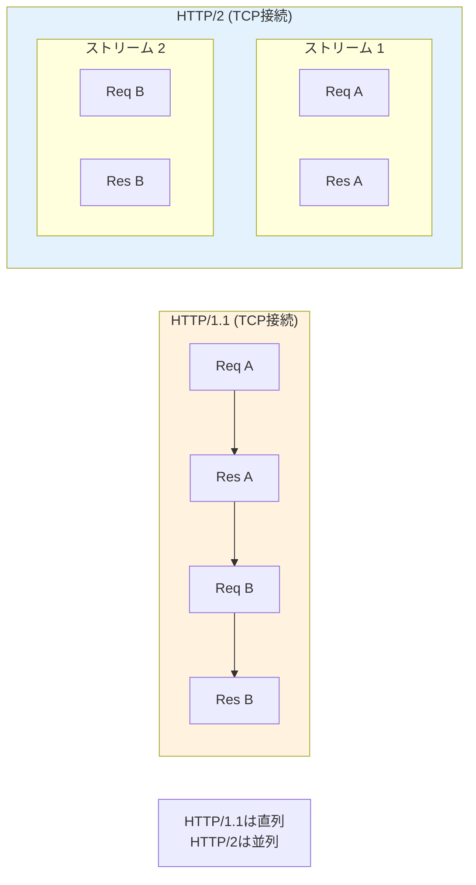
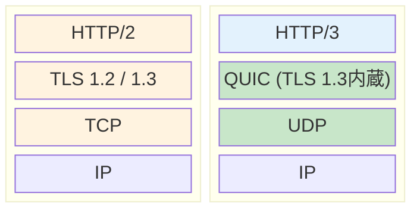
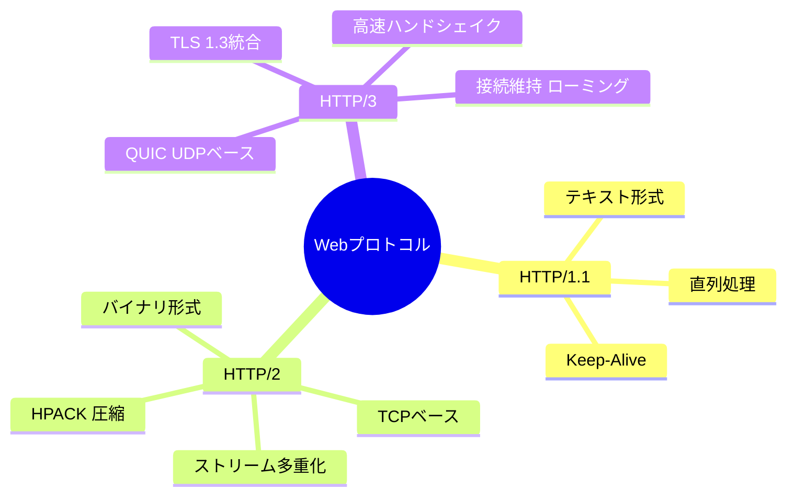

import { MermaidBox } from '../../../components/MermaidBox';

Webの基盤となる[[HTTP]]プロトコルは、リッチなコンテンツの増加やモバイル通信の普及に合わせて進化してきました。試験では、各バージョンの違い、特にパフォーマンス改善の仕組みと、最新の[[HTTP/3]] ([[QUIC]]) の特徴が問われます。

## プロトコルの変遷と概要

| バージョン | 登場時期 | トランスポート層 | 主な特徴 |
|:---|:---|:---|:---|
| **[[HTTP/1.1]]** | 1997 | [[TCP]] | Keep-Alive、パイプライニング（実質未使用） |
| **[[HTTP/2]]** | 2015 | [[TCP]] | ストリーム多重化、ヘッダー圧縮、バイナリ形式 |
| **[[HTTP/3]]** | 2022 | **[[UDP]] ([[QUIC]])** | 高速な接続確立、[[パケット]]ロス耐性、[[TLS]] 1.3統合 |

---

## HTTP/1.1 の課題

HTTP/1.1では、1つのTCP接続で同時に1つのリクエストしか処理できませんでした（パイプライニングは実装上の問題で普及せず）。

- **HOL (Head-of-Line) ブロッキング**: 先頭のリクエストの処理が遅れると、後続のリクエストもすべて待たされる現象。
- **ヘッダーの冗長性**: 毎回同じようなヘッダー（User-Agent, Cookieなど）をテキスト形式で送信するため無駄が多い。

---

## [[HTTP/2]] の革新

GoogleのSPDYプロトコルをベースに策定されました。

### 1. ストリーム多重化
1つのTCP接続の中に複数の「ストリーム」を作り、リクエストとレスポンスを並列に処理します。

<MermaidBox client:visible>

</MermaidBox>

### 2. その他の機能
- **HPACK**: ヘッダー圧縮技術。差分のみを送信することで通信量を削減。
- **バイナリフレーミング**: テキストではなくバイナリ形式でデータをやり取りし、解析効率を向上。
- **サーバープッシュ**: クライアントが要求する前に、サーバー側から関連リソース（CSS, JSなど）を送りつける機能。

### HTTP/2 の弱点 (TCP HOL Blocking)
HTTPレベルのHOLブロッキングは解消しましたが、**TCPレベルのHOLブロッキング**は残りました。TCPパケットが1つでもロスすると、再送されるまで後続のすべてのストリームが止まってしまいます。

---

## [[HTTP/3]] と [[QUIC]]

[[TCP]]を捨て、[[UDP]]上に構築された新しいトランスポートプロトコル **[[QUIC]]** を採用しました。

### プロトコルスタックの比較

<MermaidBox client:visible>

</MermaidBox>

### HTTP/3 (QUIC) のメリット

1.  **接続確立の高速化 (0-RTT / 1-RTT)**
    - [[TCP]]+[[TLS]]ではハンドシェイクに往復回数が多くかかりますが、[[QUIC]]は[[TLS]] 1.3を統合しており、初回接続でも1-RTT、再接続なら0-RTT（データ送信開始まで待ち時間なし）が可能です。

2.  **TCP HOLブロッキングの解消**
    - ストリームごとに独立してパケット再送制御を行うため、あるストリームのパケットがロスしても、他のストリームは止まりません。

3.  **コネクションマイグレーション**
    - IPアドレスではなく「コネクションID」で接続を識別します。
    - スマホがWi-Fiから4G/5Gに切り替わりIPが変わっても、通信を切断することなく継続できます。

---

## 試験対策のポイント

1.  **各バージョンのボトルネック解消**:
    - HTTP/1.1 HOLブロッキング → HTTP/2で多重化により解消
    - HTTP/2 TCP HOLブロッキング → HTTP/3(QUIC)でUDP採用により解消
2.  **トランスポート層の違い**: HTTP/1.1, 2はTCP、HTTP/3はUDP。
3.  **QUICの特徴**: TLS 1.3が必須（統合されている）、コネクションIDによるローミング対応。

<MermaidBox client:visible>

</MermaidBox>
