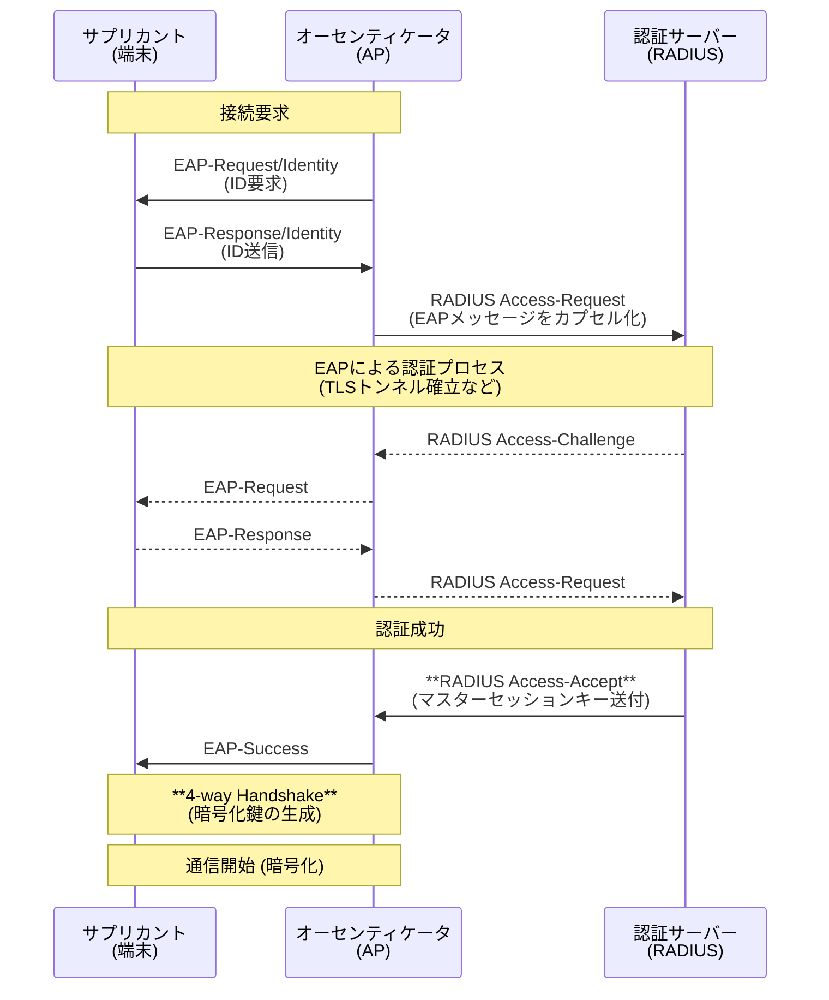

import { MermaidBox } from '../../../components/MermaidBox';

[[無線LAN]]は電波を使用するため、有線LANに比べて盗聴や不正アクセスのリスクが高くなります。そのため、強力な[[認証]]と[[暗号化]]技術が不可欠です。本記事では、[[WPA2]]/[[WPA3]]を中心としたセキュリティ規格と、企業で利用される[[IEEE 802.1X]][[認証]]について解説します。

## セキュリティ規格の変遷

| 規格 | 策定年 | [[暗号化]]アルゴリズム | 改ざん検知 | [[認証]]方式 | 現状 |
|:---|:---|:---|:---|:---|:---|
| [[WEP]] | 1997 | RC4 | ICV | 共有鍵 | **使用禁止**（脆弱性あり） |
| [[WPA]] | 2002 | [[TKIP]] (RC4) | Michael | PSK / [[IEEE 802.1X]] | 使用非推奨 |
| **[[WPA2]]** | 2004 | **[[AES]] (CCMP)** | CBC-MAC | PSK / [[IEEE 802.1X]] | **現在も主流** |
| **[[WPA3]]** | 2018 | **[[AES]] (GCMP/CCMP)** | GMAC/CBC-MAC | [[SAE]] / [[IEEE 802.1X]] | 普及拡大中 |

### パーソナルモード vs エンタープライズモード

| モード | 正式名称 | 認証方式 | 用途 | 特徴 |
|:---|:---|:---|:---|:---|
| **Personal** | WPA2-Personal (WPA2-PSK) | **PSK** (Pre-Shared Key) | 家庭・SOHO | 全端末で同じパスフレーズを使用。 個別のID管理はできない。 |
| **Enterprise** | WPA2-Enterprise | **802.1X** (EAP認証) | 企業・組織 | ユーザーごとにID/パスワードや証明書で認証。 **RADIUSサーバー**が必要。 |

---

## IEEE 802.1X認証の仕組み

企業向け[[無線LAN]]で標準的に使用されるポートベース[[認証]]の枠組みです。以下の3つの要素で構成されます。

1.  **サプリカント (Supplicant)**: クライアント端末（PC、スマホなど）
2.  **オーセンティケータ (Authenticator)**: [[無線LAN]]アクセスポイント (AP)
3.  **[[認証]]サーバー (Authentication Server)**: [[RADIUS]]サーバー

### 認証シーケンス

<MermaidBox client:visible>

</MermaidBox>

- **[[EAP]] (Extensible Authentication Protocol)**: [[認証]]プロトコルのコンテナ。実際の[[認証]]手順は内部のメソッド（[[EAP-TLS]]など）によって異なります。
- **[[RADIUS]] (Remote Authentication Dial In User Service)**: [[認証]]・認可・アカウンティングを行うプロトコル。[[UDP]] 1812(Auth)/1813(Acct)を使用。

---

## EAP認証の種類

試験で問われる主要なEAPメソッドの違いを整理します。

| EAPメソッド | サーバー証明書 | クライアント証明書 | クライアント認証情報 | 特徴 |
|:---|:---:|:---:|:---|:---|
| **EAP-TLS** | 必要 | **必要** | 証明書 | 最も安全だが、証明書配布の手間がかかる。 |
| **PEAP** | 必要 | 不要 | ID/パスワード | サーバー認証後にTLSトンネルを作り、その中でID/PW認証を行う。最も普及。 |
| **EAP-TTLS** | 必要 | 不要 | ID/PW, CHAP等 | PEAPと似ているが、トンネル内の認証方式の自由度が高い。 |

---

## WPA3の新機能

WPA2の脆弱性（KRACKsなど）への対策として登場しました。

### 1. WPA3-Personal (SAE)
- **SAE (Simultaneous Authentication of Equals)**: 従来のPSKに代わる鍵交換方式。
- **Dragonfly Key Exchange** を使用し、辞書攻撃やオフライン総当たり攻撃を防ぎます。
- パスワードを知っていても、通信を傍受して後から解読することが困難（前方秘匿性）。

### 2. WPA3-Enterprise
- **192ビットセキュリティモード**: 政府機関や軍事レベルのセキュリティ要件に対応（CNSA Suite）。
- 認証サーバーの確認が必須化され、偽APへの接続リスクを低減。

### 3. OWE (Opportunistic Wireless Encryption)
- **Wi-Fi Enhanced Open**: 公衆無線LANなどのパスワードなし（オープン）ネットワークでも、通信を暗号化する仕組み。
- 認証は行わないが、Diffie-Hellman鍵交換により盗聴を防ぐ。

---

## 試験対策のポイント

1.  **暗号化方式の組み合わせ**:
    - WPA2 = AES (CCMP)
    - WPA = TKIP (RC4)
    - WEP = RC4 (脆弱)
2.  **802.1X認証の構成**: サプリカント、オーセンティケータ、認証サーバー（RADIUS）の役割分担。
3.  **EAPメソッドの要件**: 「クライアント証明書が必要なのはEAP-TLS」というのが頻出。
4.  **WPA3のキーワード**: SAE（対等な認証）、Dragonfly、OWE（オープンでも暗号化）。
