VPN（Virtual Private Network）は、インターネットなどの公衆ネットワーク上に仮想的な専用線を構築する技術です。この記事では、IPsec-VPN、SSL-VPN、IP-VPN、広域イーサネットの違いと使い分けを整理します。

## VPN技術の全体像

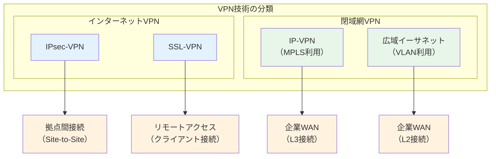

---

## インターネットVPN vs 閉域網VPN

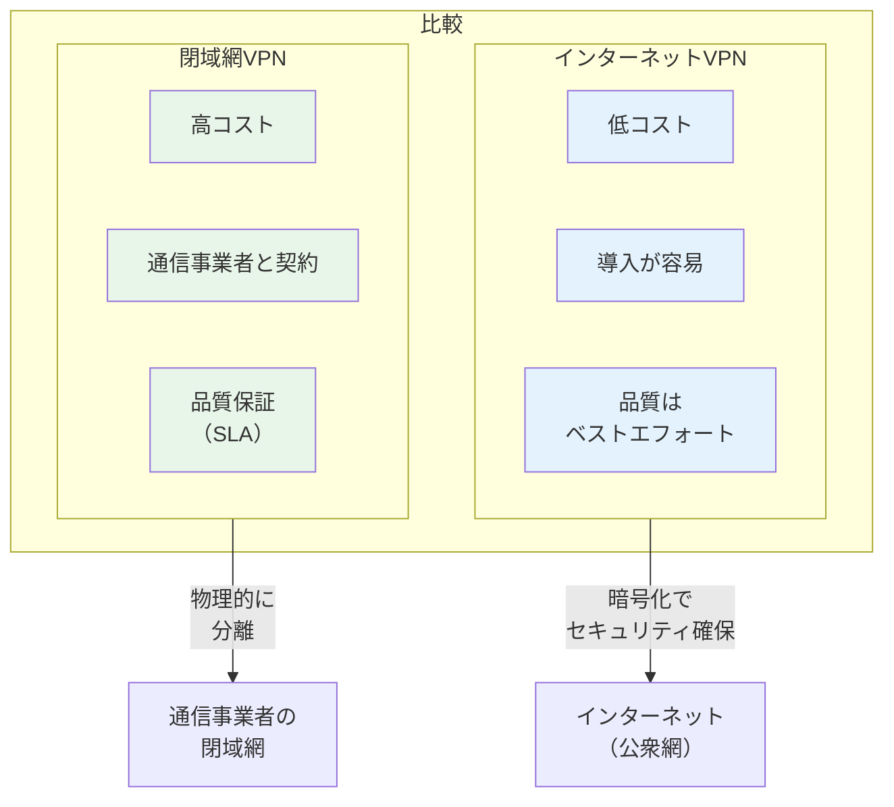

| 項目 | インターネットVPN | 閉域網VPN |
|:---|:---|:---|
| 回線 | インターネット | 通信事業者の専用網 |
| コスト | 低い | 高い |
| 品質 | ベストエフォート | SLAで保証 |
| セキュリティ | 暗号化で確保 | 網分離で確保 |
| 導入期間 | 短い | 長い |

---

## IPsec-VPN

IPsecはネットワーク層（L3）で動作するセキュリティプロトコルです。

### IPsecの構成要素

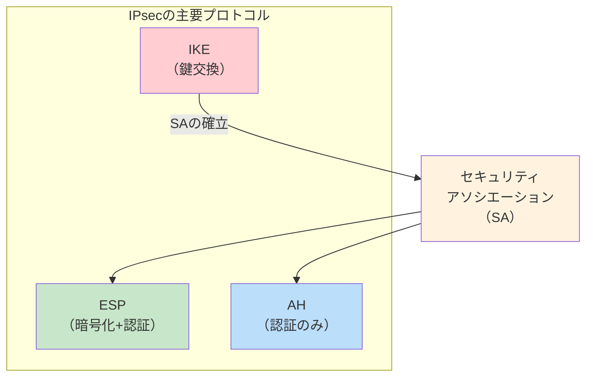

| プロトコル | 役割 | 説明 |
|:---|:---|:---|
| IKE | 鍵交換 | SA（セキュリティアソシエーション）の確立 |
| ESP | 暗号化+認証 | データの暗号化と改ざん検知（プロトコル番号50） |
| AH | 認証のみ | 改ざん検知のみ（プロトコル番号51） |

### IKEのフェーズ

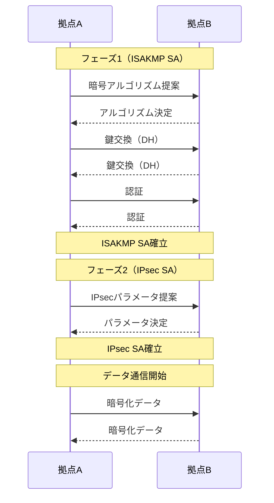

### メインモード vs アグレッシブモード

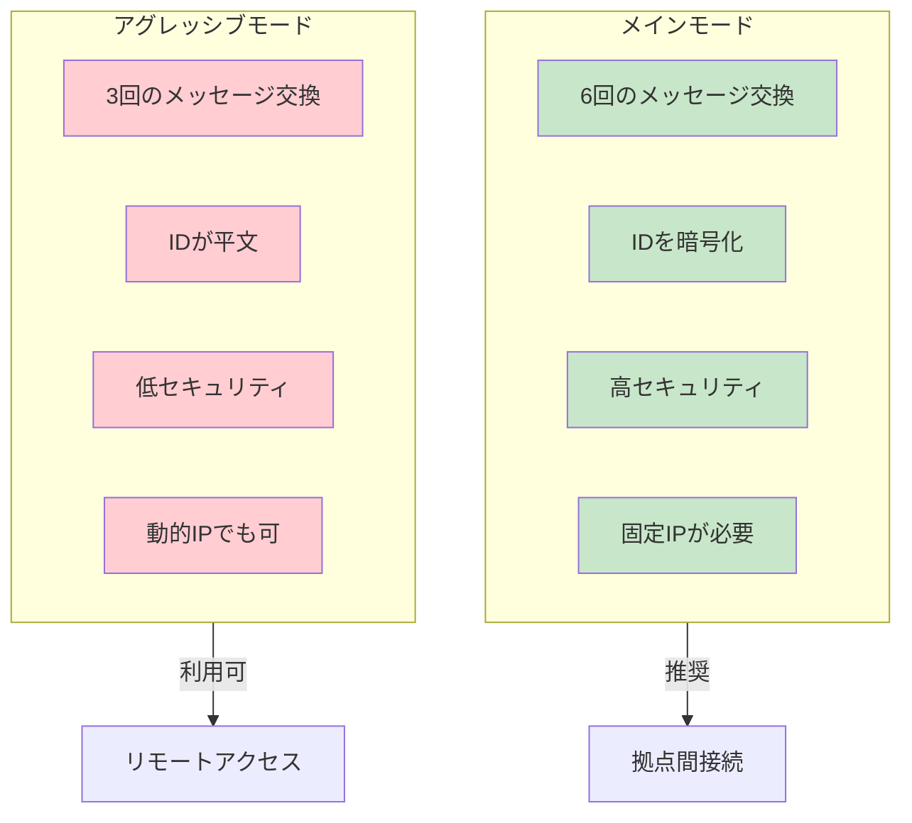

### トンネルモード vs トランスポートモード

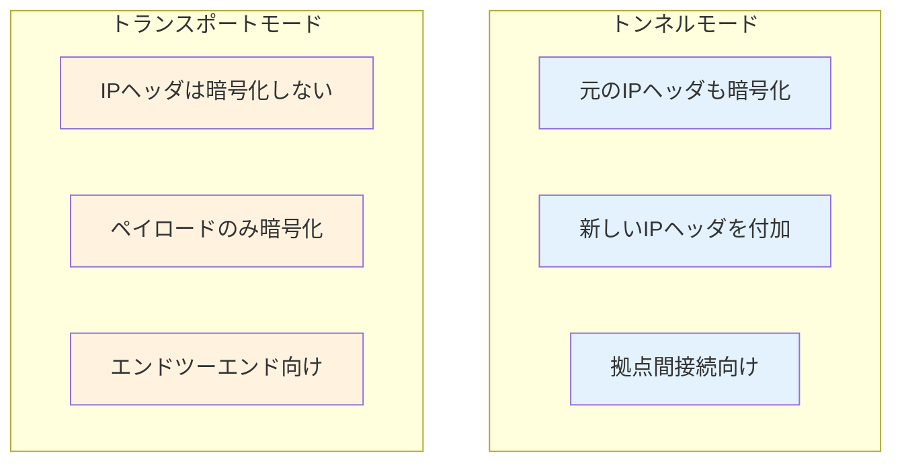

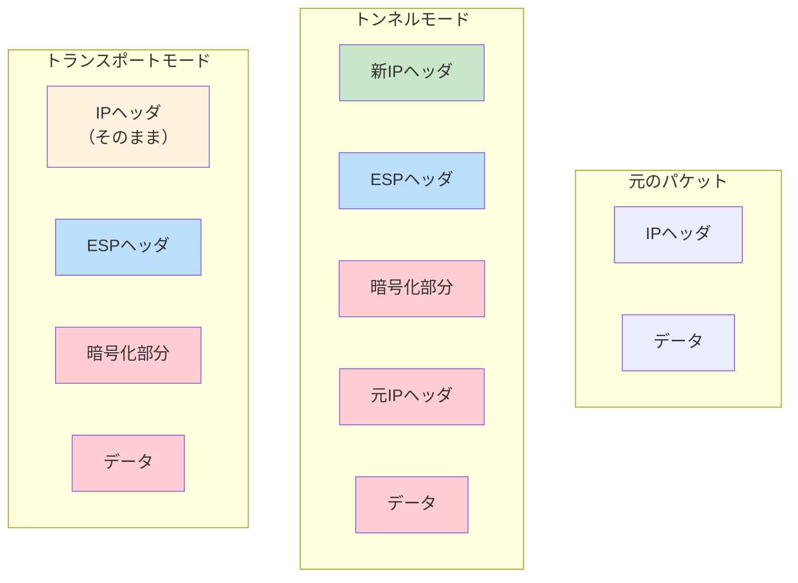

---

## SSL-VPN

SSL/TLSを利用したVPNで、主にリモートアクセス用途で使用されます。

### SSL-VPNの種類

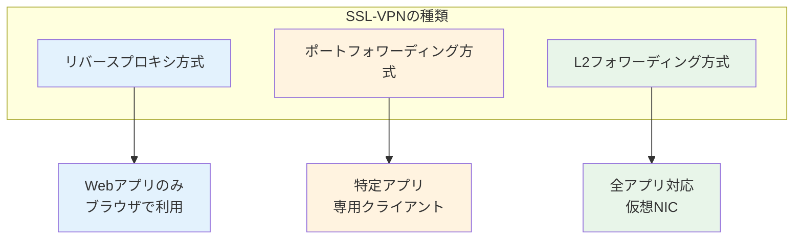

| 方式 | 対応アプリ | クライアント | 特徴 |
|:---|:---|:---|:---|
| リバースプロキシ | Webのみ | ブラウザ | 導入が最も容易 |
| ポートフォワーディング | 特定アプリ | 専用ソフト | TCP/UDPアプリ対応 |
| L2フォワーディング | 全アプリ | 仮想NIC | IPsec相当の機能 |

### IPsec-VPN vs SSL-VPN

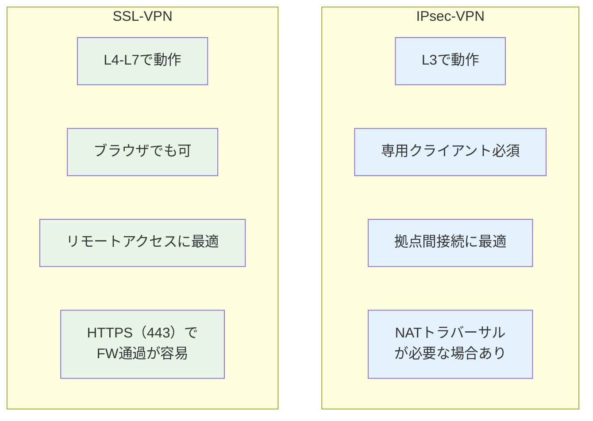

---

## IP-VPN（MPLS-VPN）

通信事業者のMPLS網を利用した閉域網VPNです。

### IP-VPNの仕組み

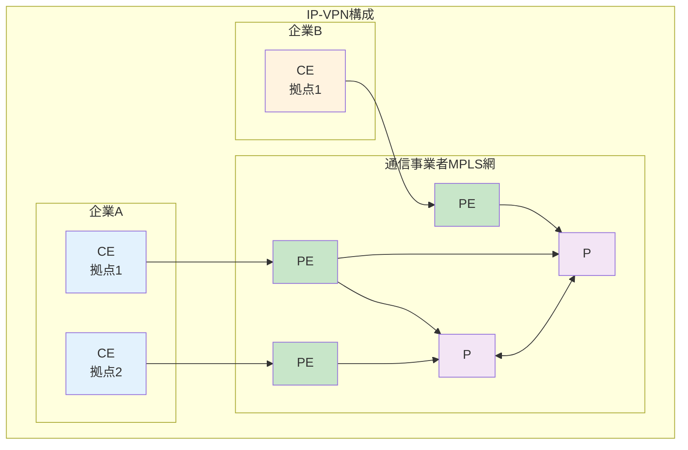

| 機器 | 役割 |
|:---|:---|
| CE（Customer Edge） | 顧客側のルーター |
| PE（Provider Edge） | 事業者網の入口ルーター |
| P（Provider） | 事業者網内部のルーター |

### MPLSラベル

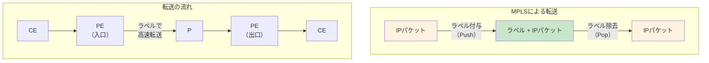

---

## 広域イーサネット

通信事業者のL2網を利用したサービスで、拠点間をL2で接続します。

### 広域イーサネットの仕組み

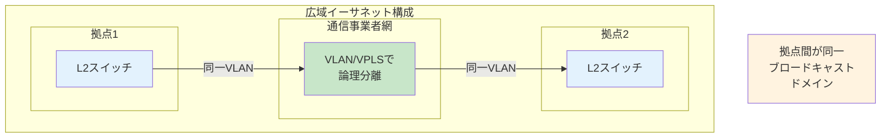

### IP-VPN vs 広域イーサネット

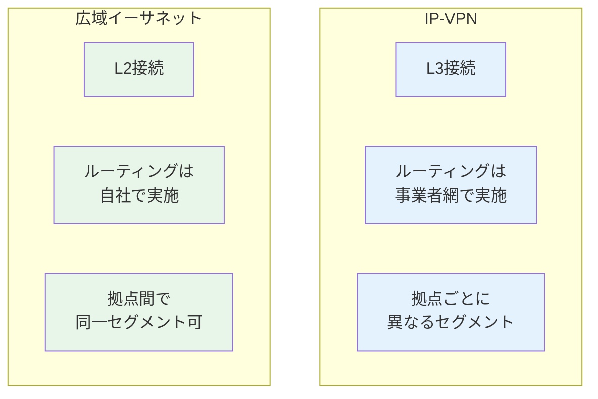

| 項目 | IP-VPN | 広域イーサネット |
|:---|:---|:---|
| 接続レイヤー | L3（ネットワーク層） | L2（データリンク層） |
| ルーティング | 事業者が管理 | 自社で管理 |
| プロトコル | IP限定 | 任意（IPX等も可） |
| 拡張性 | 高い | 中程度 |
| 自由度 | 低い | 高い |

---

## GRE over IPsec

GRE（Generic Routing Encapsulation）とIPsecを組み合わせた構成です。

### GREの役割

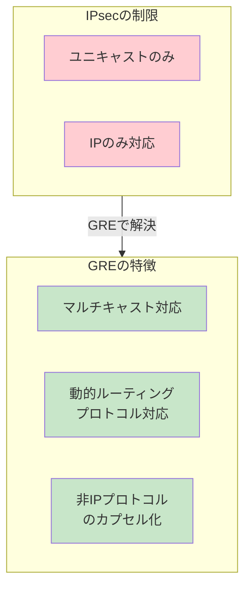

### GRE over IPsecの構造

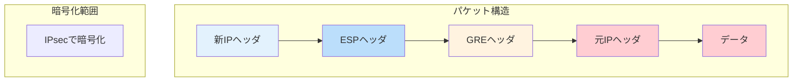

---

## ローカルブレイクアウト

クラウドサービス向けの通信を、本社データセンターを経由せず直接インターネットへ出す構成です。

### 従来構成 vs ローカルブレイクアウト

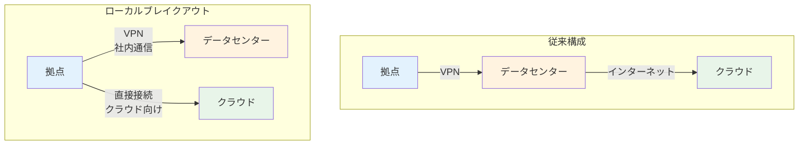

**メリット:**
- データセンターの回線負荷軽減
- クラウドサービスへの遅延低減
- 回線コストの削減

**注意点:**
- 各拠点でのセキュリティ対策が必要
- 通信経路の可視化が複雑化

---

## VPN技術の選定フロー

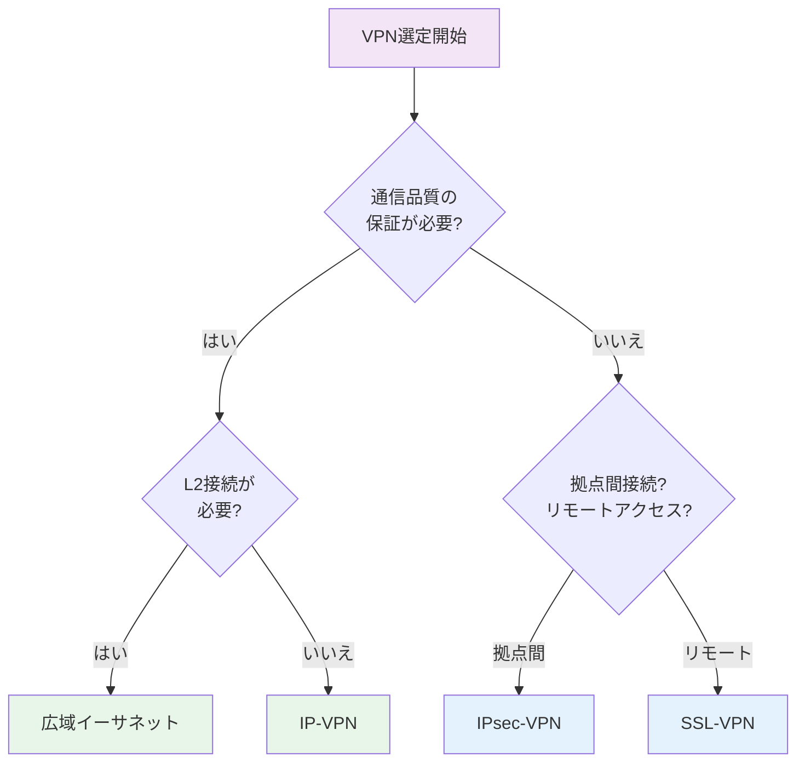

---

## VPN技術比較表

| 項目 | IPsec-VPN | SSL-VPN | IP-VPN | 広域イーサネット |
|:---|:---|:---|:---|:---|
| 動作層 | L3 | L4-L7 | L3 | L2 |
| 回線 | インターネット | インターネット | 閉域網 | 閉域網 |
| コスト | 低 | 低 | 高 | 高 |
| 品質 | ベストエフォート | ベストエフォート | SLA保証 | SLA保証 |
| 主な用途 | 拠点間接続 | リモートアクセス | 企業WAN | 企業WAN |
| 暗号化 | 必須 | 必須 | オプション | オプション |

---

## 試験対策のポイント

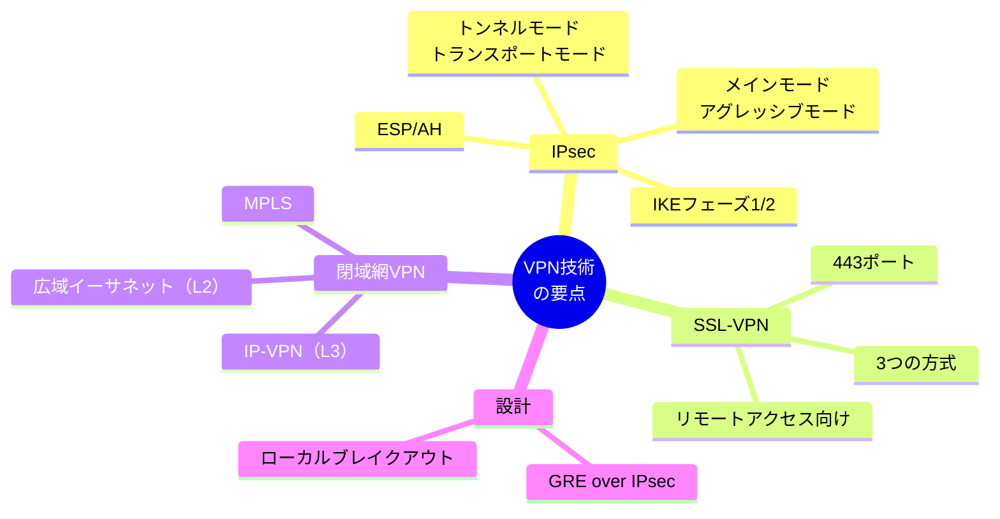

1. **IPsecの動作を理解する**
   - フェーズ1でISAKMP SA、フェーズ2でIPsec SAを確立
   - ESPは暗号化+認証、AHは認証のみ

2. **モードの違いを把握する**
   - メインモード: 6往復、IDを暗号化、固定IP向け
   - アグレッシブモード: 3往復、IDが平文、動的IP可

3. **閉域網VPNの使い分け**
   - IP-VPN: L3接続、ルーティングは事業者任せ
   - 広域イーサネット: L2接続、自由度が高い

4. **最新トレンド**
   - ローカルブレイクアウトによるクラウド最適化
   - SD-WANとの組み合わせ
