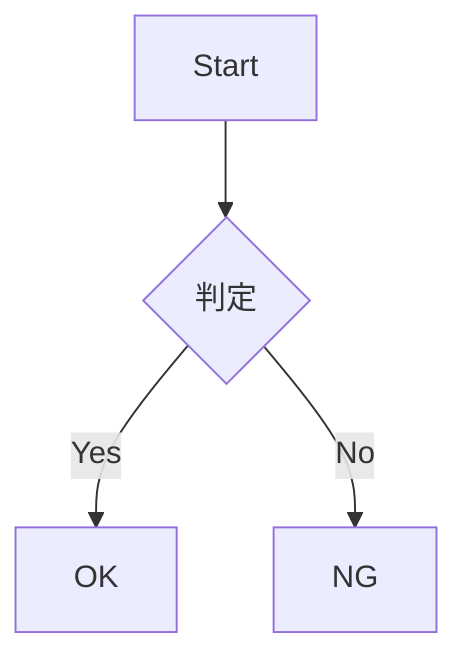

import { MermaidBox } from '../../../components/MermaidBox';

<MermaidBox client:visible>

```mermaid
graph TD;
    A[Start] --> B{判定};
    B -- Yes --> C[OK];
    B -- No --> D[NG];
```

</MermaidBox>
