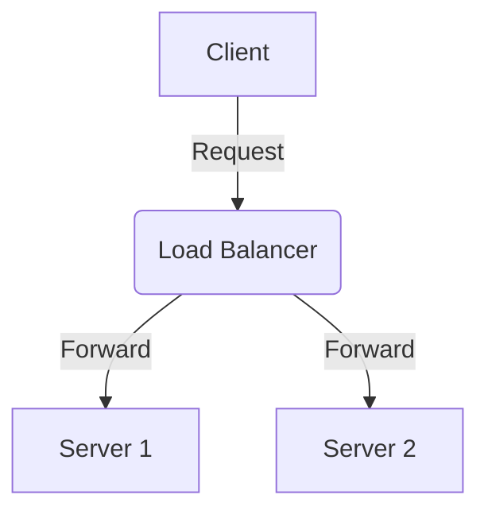
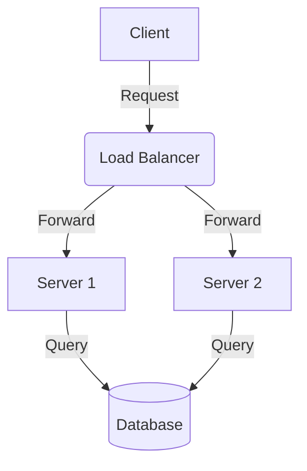

import { MermaidBox } from '../../../components/MermaidBox';

`MermaidBox`は、Mermaid記法で記述された図をモーダルウィンドウで拡大表示するためのコンポーネントです。
複雑なネットワーク図やフローチャートを表示する際、通常は全体を縮小表示し、必要に応じて詳細を確認できるようにするために使用します。

## 機能と特徴

- **通常表示**: 図全体がコンテナ幅に合わせて縮小表示されます（Shrink-to-fit）。余白を最小限に抑え、記事の流れを妨げません。
- **拡大表示**: コンテナ右上の「拡大ボタン」をクリックすると、全画面モーダルが開きます。
- **操作性**: モーダル内では、マウスホイールやピンチ操作で図の**拡大・縮小（ズーム）**ができ、ドラッグで**移動（パン）**が可能です。

## 基本的な使い方

`MermaidBox`コンポーネントをインポートし、`children`としてMermaidのコードブロックを渡します。
MDXファイル内では、HTML要素のようにタグで囲んで使用します。

### コード例

````mdx
import { MermaidBox } from '../../../components/MermaidBox';

<MermaidBox client:visible>



</MermaidBox>
````

## プレビュー

実際にレンダリングされると以下のように表示されます。
右上の「拡大ボタン」をクリックして、モーダル表示を試してみてください。

<MermaidBox client:visible>



</MermaidBox>

## 注意点

- `client:visible` ディレクティブを付与することで、コンポーネントが画面内に表示されたタイミングでReactハイドレーションが行われ、インタラクティブな機能（拡大ボタンなど）が有効になります。
- Mermaidのコードブロックは、`<MermaidBox>`タグの直下（children）に配置してください。
