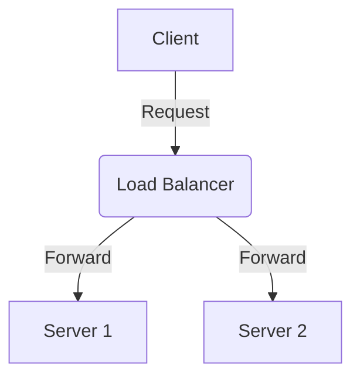
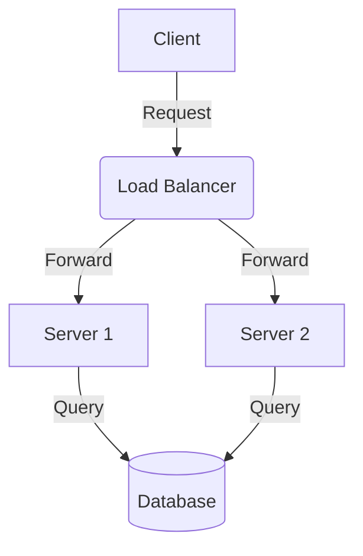

import { MermaidBox } from '../../../components/MermaidBox';

`MermaidBox`は、Mermaid記法で記述された図を拡大・縮小・パン操作が可能なコンテナ内に表示するためのコンポーネントです。
複雑なネットワーク図やフローチャートを表示する際に、詳細部分を確認しやすくするために使用します。

## 基本的な使い方

`MermaidBox`コンポーネントをインポートし、`children`としてMermaidのコードブロックを渡します。
MDXファイル内では、HTML要素のようにタグで囲んで使用します。

### コード例

````mdx
import { MermaidBox } from '../../../components/MermaidBox';

<MermaidBox client:visible>



</MermaidBox>
````

## プレビュー

実際にレンダリングされると以下のように表示されます。マウスホイールで拡大縮小、ドラッグで移動が可能です。右上のリセットボタンで初期状態に戻せます。

<MermaidBox client:visible>



</MermaidBox>

## 注意点

- `client:visible` ディレクティブを付与することで、コンポーネントが画面内に表示されたタイミングでReactハイドレーションが行われ、インタラクティブな機能（拡大縮小など）が有効になります。
- Mermaidのコードブロックは、`<MermaidBox>`タグの直下（children）に配置してください。
