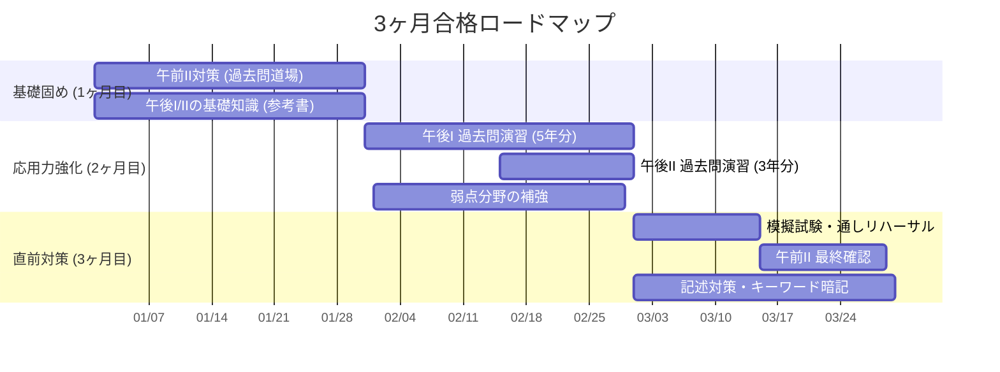

import { MermaidBox } from '../../../components/MermaidBox';

ネットワークスペシャリスト試験は範囲が広く、闇雲に勉強しても合格は難しい試験です。ここでは、試験3ヶ月前から当日までの効率的な学習スケジュールを提案します。

## 全体スケジュール概要

まずは、3ヶ月間の学習配分をイメージしましょう。

<MermaidBox client:visible>

</MermaidBox>

## 1ヶ月目：基礎知識のインプットと午前突破力

最初の1ヶ月は、「広く浅く」全体像を掴むことと、午前II試験を確実に通過できる基礎力をつけることに集中します。

-   **午前II対策**: スキマ時間を使って、過去問サイト（過去問道場など）を周回します。目標は正答率80%以上です。
-   **参考書の通読**: ネットワークスペシャリスト向けの「教科書」系参考書を1冊読み切ります。細かい技術仕様よりも、各プロトコルの役割や動作のイメージを掴むことを優先してください。

## 2ヶ月目：午後過去問で「解く力」をつける

この時期が合否を分けます。インプットした知識を、アウトプット（記述解答）に変える訓練を行います。

-   **午後I対策**: 記述問題には「お作法」があります。「30字以内で述べよ」と言われたらどう答えるか、問題文中のヒントをどう見つけるか、過去問を解きながらパターンを体得します。
-   **解説の熟読**: 解けなかった問題こそが宝の山です。なぜ間違えたのか、解説を読み込んで理解します。

## 3ヶ月目：総仕上げとメンタル調整

本番形式での演習を行い、時間配分の感覚を養います。また、頻出キーワード（「セッションハイジャック」「DNSキャッシュポイズニング」など）を正確に漢字で書けるように練習します。

このロードマップを参考に、自分の得意・不得意に合わせてカスタマイズしてください。
