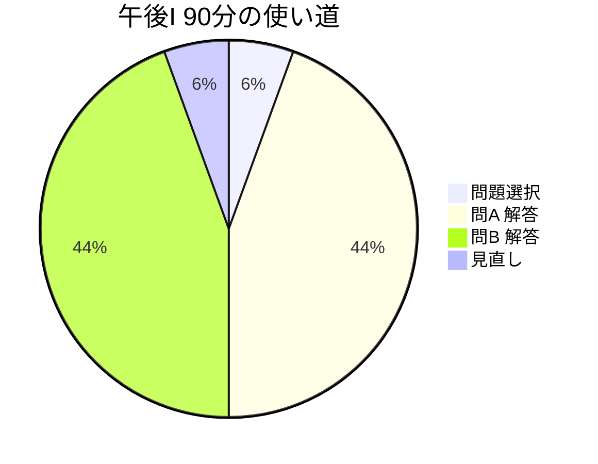

import { MermaidBox } from '../../../components/MermaidBox';

午後I試験は90分で3問中2問を選択して解答します。1問あたり45分ですが、問題選択の時間も含めると、実際はもっとタイトです。ここでは、時間を味方につけるための戦略を紹介します。

## 理想的な時間配分

<MermaidBox client:visible>

</MermaidBox>

## ステップ1：最初の5分で「捨てる問題」を決める

3問全てをじっくり読んでから選ぶ時間はありません。以下のポイントで瞬時に判断します。

1.  **テーマ**: 自分の得意分野か（例：DNSは得意だが、VoIPは苦手など）。
2.  **設問数**: 設問数が極端に多い、あるいは記述量が多い問題は避けるのが無難です。
3.  **図の複雑さ**: ネットワーク構成図がシンプルで見やすいか。

迷ったら、パラパラと見て「キーワードを知っているか」で決めましょう。

## ステップ2：1問40分のペースを守る

1問目に時間をかけすぎて、2問目が手付かずになるのが最悪のパターンです。
40分経過したら、途中でも一旦次の問題に移る勇気を持ちましょう。2問目が早く終われば、戻ってこれます。

## ステップ3：設問を先に読む

問題文（長文）を最初から最後まで読んでから設問に行くと、内容を忘れてしまい、二度読みすることになります。

1.  **設問をチラ見する**: 何を問われているか（IPアドレス？機器名？セキュリティ対策？）を頭に入れる。
2.  **本文を読む**: 設問に関連するキーワードが出てきたら、その周辺を重点的に読む。
3.  **解答する**: 記憶が鮮明なうちに答えを書く。

この「サンドイッチ方式」で読み進めると、効率よく解答できます。

## 迷ったら「後回し」

記述問題で、完璧な文章を作ろうとして手が止まることがあります。
部分点狙いでキーワードだけメモしておくか、一旦飛ばして他の空欄埋めなどを先に片付けましょう。止まっている時間が一番のロスです。
