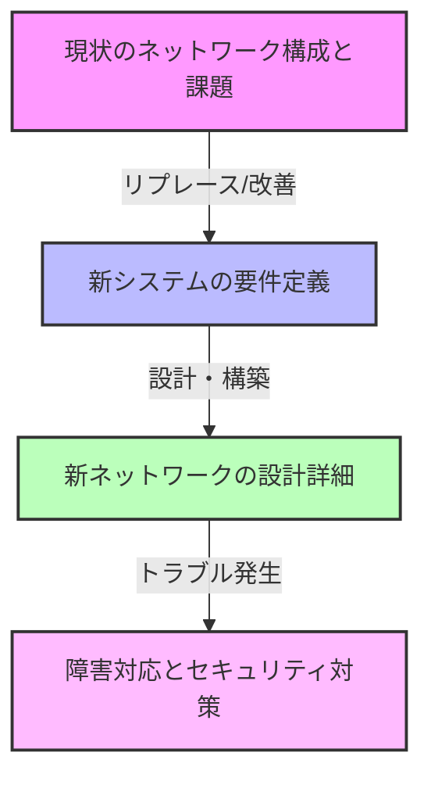

import { MermaidBox } from '../../../components/MermaidBox';

午後II試験は、技術力もさることながら、「国語力（読解力）」が試される試験と言われます。数十ページに及ぶ問題文から、出題者が求める答えを導き出すテクニックを解説します。

## 問題文の構造を理解する

午後IIの問題文は、ある程度決まった構成になっています。

<MermaidBox client:visible>

</MermaidBox>

この流れを意識して読むだけで、現在どのフェーズの話をしているのか見失わずに済みます。

## 「ヒント」の隠し場所を見つける

答えは必ず問題文の中にあります。特に以下の表現には注意しましょう。

-   **「〜の要望がある」**: 要件定義。これを満たす設計が正解になる。
-   **「〜という事象が発生した」**: トラブルシューティングの起点。
-   **「ただし、〜とする」**: 制約条件。これを見落とすと解答の方針がズレる。
-   **「現在、〜を行っている」**: 現状分析。これの問題点を指摘させる問題が多い。

## 設問と本文の「対応付け」を行う

午後IIは文章が長いので、設問で問われている箇所が本文のどこにあるかを探すだけで時間がかかります。
読む際に、以下のようなマーキングをすることをお勧めします。

-   **[空欄]の前後**: 文脈を決定する重要な手がかり。
-   **IPアドレスやVLAN ID**: 構成図に書き込む。
-   **機器の役割**: 「L3SW」「LB」「FW」などを四角で囲む。

## 設問の意図を汲み取る（プロファイリング）

出題者は、「この技術を知っているか」だけでなく、「この状況で最適な判断ができるか」を問うています。
「技術的にはAもBも可能だが、問題文に『コストを抑えたい』とあるからBが正解」といった判断が求められます。
自分の知識だけで答えるのではなく、常に**「問題文の文脈（制約条件）」**に沿って答えることが、午後II突破の鍵です。
