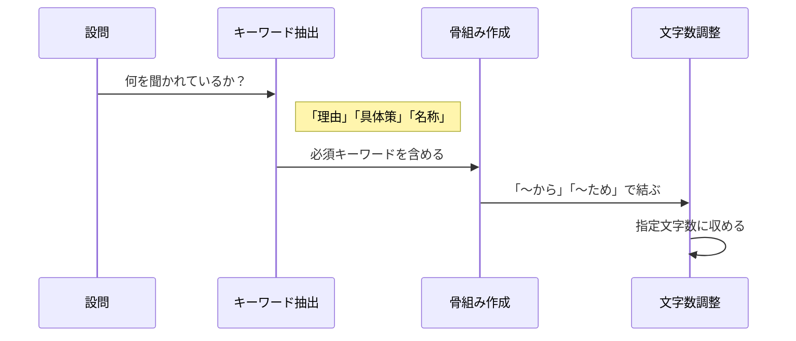

import { MermaidBox } from '../../../components/MermaidBox';

「内容は合っているはずなのに、点数が伸びない…」。そんな時は、解答の書き方（表現）で損をしている可能性があります。採点者に伝わる、減点されない文章作成のコツを伝授します。

## 解答作成の3ステップ

<MermaidBox client:visible>

</MermaidBox>

## 1. 文末を設問に合わせる

基本中の基本ですが、これができていないと減点対象になります。

-   **理由を問われたら**: 「〜から」「〜ため」「〜ので」
-   **目的を問われたら**: 「〜こと」「〜ため」
-   **内容を問われたら**: 「〜こと」

## 2. 問題文の言葉を使う

自分独自の言葉で説明するよりも、**問題文中で使われている用語やフレーズ**をそのまま引用する方が安全です。
問題文に「L3スイッチ」と書いてあるなら、「ルータ」ではなく「L3スイッチ」と書く、といった具合です。

## 3. 「主語」と「述語」を明確にする

「何が」「どうなる」のかを明確にします。
悪い例：「通信ができないため」
良い例：「**PCが**DNSサーバと通信できないため」

## 4. 文字数制限を有効活用する

指定文字数は、解答の詳細度を示すヒントです。

-   **10〜20字**: キーワード一発勝負。
-   **30〜50字**: 理由＋結論の構成。
-   **50字以上**: 条件や背景も含めた丁寧な説明が必要。

文字数が余りすぎる場合は、必要な要素（修飾語や具体性）が抜けている可能性が高いです。逆に足りない場合は、重複表現を削ってスリムにします。

## 具体例

**問**: この構成で通信ができない理由を30字以内で述べよ。

-   × ポートが閉じているから（11文字：具体的でない）
-   × FWの設定でWebサーバへのアクセスが許可されていないため（28文字：これくらいがベスト）
