import { MermaidBox } from '../../../components/MermaidBox';

試験当日のパフォーマンスは、準備で決まります。長丁場の試験を乗り切るための持ち物、休憩時間の過ごし方、心構えをまとめました。

## 当日のタイムライン

```mermaid
gantt
    title 試験当日のスケジュール
    dateFormat HH:mm
    axisFormat %H:%mm

    section 午前
    移動・着席         :09:00, 30m
    午前I試験          :09:30, 50m
    休憩              :10:20, 30m
    午前II試験         :10:50, 40m
    昼休憩            :11:30, 60m

    section 午後
    午後I試験          :12:30, 90m
    休憩              :14:00, 30m
    午後II試験         :14:30, 120m
```

<MermaidBox client:visible>

</MermaidBox>

※午前I免除の人は10:50に合わせて集合します。

## 持ち物チェックリスト

-   **受験票**: これがないと始まりません。写真は貼りましたか？
-   **筆記用具**: シャープペンシル（芯は多めに）、消しゴム2個（落とした時用）。
-   **時計**: 会場に時計がない場合があります。スマートウォッチはNGです。
-   **上着**: 会場の空調が極端に暑い・寒い場合があります。調整しやすい服装で。
-   **昼食・飲み物**: 近くのコンビニは混雑・品切れのリスクがあります。事前に買っておきましょう。
-   **糖分**: 午後の長丁場には脳のエネルギーが必要です。チョコレートやブドウ糖を持参しましょう。

## 昼休みの過ごし方

昼休みは「午後のための充電時間」です。

1.  **答え合わせをしない**: 午前の出来が悪くても、終わったことは変えられません。メンタルへの悪影響しかないので、SNSや掲示板は見ないようにしましょう。
2.  **軽く食べる**: 満腹になると眠くなります。腹八分目に抑えましょう。
3.  **仮眠**: 10〜15分目をつぶるだけでも脳が回復します。

## 午後試験中の注意点

-   **トイレ**: 試験中でも挙手すれば行けます。我慢して集中力を欠くよりはマシです。
-   **諦めない**: 「全くわからない」と思っても、部分点をかき集めれば合格ライン（60点）に届くことがあります。最後まで空欄を埋めましょう。
