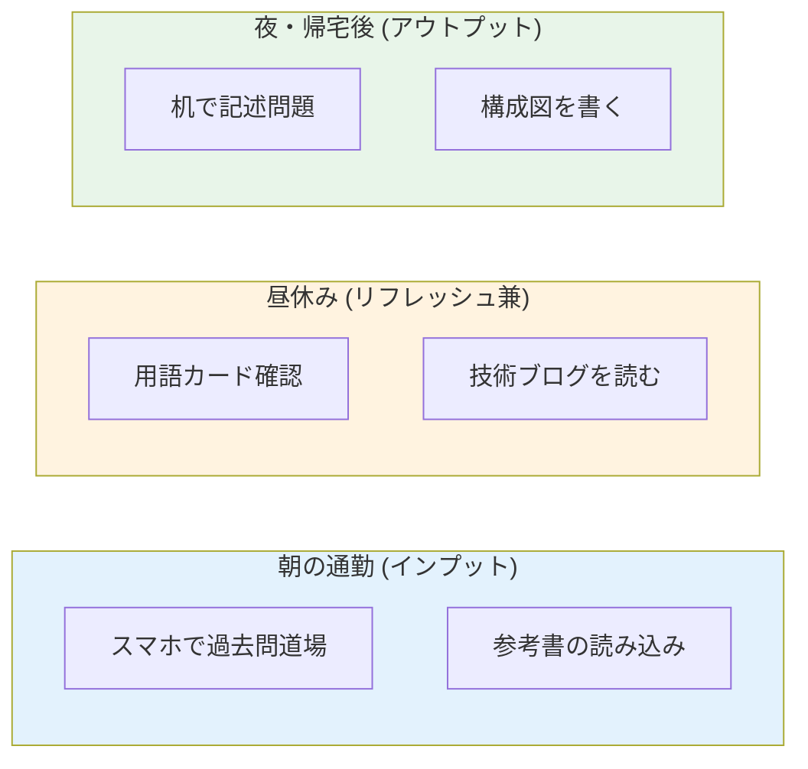

import { MermaidBox } from '../../../components/MermaidBox';

社会人の受験生にとって最大の課題は「勉強時間の確保」です。机に向かう時間だけが勉強ではありません。通勤時間や休憩時間などの「隙間時間」を積み重ねることで、膨大な学習量を確保できます。

## 時間帯別・学習メニュー

<MermaidBox client:visible>

</MermaidBox>

## スマホ学習の極意

満員電車などで本を開けない状況でも、スマホがあれば勉強できます。

-   **過去問道場**: 片手で操作でき、中断も容易です。ゲーム感覚で取り組みましょう。
-   **電子書籍**: 参考書をKindleなどで購入しておけば、いつでも読めます。
-   **音声学習**: YouTubeの解説動画などを音声だけで聞くのも有効です。

## 「チリツモ」の効果

1日1時間のまとまった時間が取れなくても、15分の隙間時間を4回作れば同じ1時間です。
むしろ、短時間の方が集中力が続きやすく、記憶の定着が良いという研究もあります（ポモドーロ・テクニックなど）。

-   **トイレに入ったら1問解く**
-   **お湯が沸くまでの間に用語を1つ覚える**

このような「if-thenルール」を生活に組み込むと、無意識に勉強習慣が身につきます。
