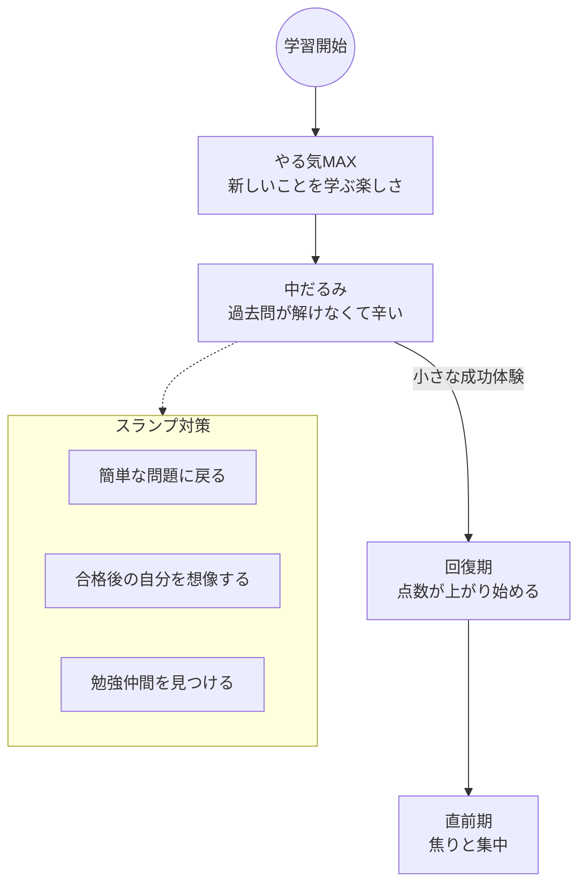

import { MermaidBox } from '../../../components/MermaidBox';

ネットワークスペシャリスト試験は、半年に一度（春期）しかチャンスがなく、学習期間も長期に渡ります。途中で心が折れないための、メンタル維持のテクニックを紹介します。

## モチベーションの波を乗りこなす

やる気は常に一定ではありません。下がった時にどう対処するかが重要です。

<MermaidBox client:visible>

</MermaidBox>

## 1. 合格後のメリットを具体的にイメージする

なぜこの資格を取りたいのか、原点に立ち返りましょう。
-   報奨金が出る、給料が上がる
-   希望の部署に異動できる
-   名刺に書いてドヤ顔できる
-   転職市場での価値が上がる

具体的な「ご褒美」を設定するのも効果的です。

## 2. SNSで「勉強垢」を作る

X（旧Twitter）などで勉強専用のアカウントを作り、日々の学習記録をつぶやきます。
同じ目標を持つ仲間と繋がることで、「みんなも頑張っている」という刺激を受けられます。ただし、見過ぎには注意しましょう。

## 3. 「やらない日」を作らない

完全に勉強をゼロにする日を作ると、再開するのにエネルギーが要ります。
どうしてもやる気が出ない日でも、「参考書を1ページ開く」「単語を1つ見る」だけでOKとしましょう。
**「継続している」という事実が自己肯定感を生み出します。**

## 4. 睡眠と休息を大切にする

脳は寝ている間に記憶を定着させます。睡眠時間を削って勉強するのは逆効果です。
しっかりと寝て、スッキリした頭で短時間集中する方が効率的です。
また、適度な運動（散歩など）は脳の血流を良くし、リフレッシュになります。
