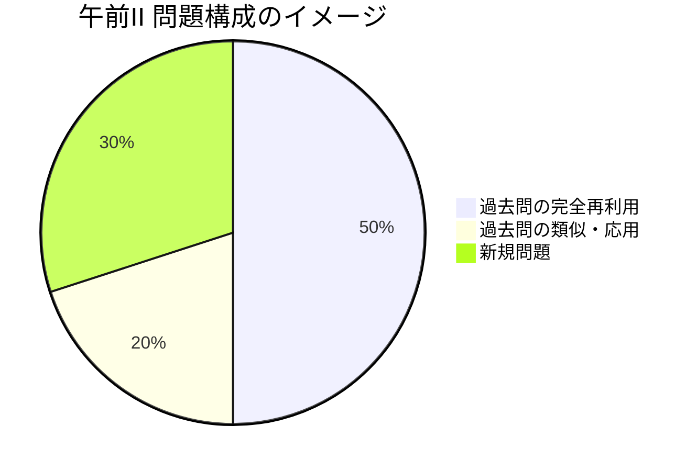

import { MermaidBox } from '../../../components/MermaidBox';

午前II試験は、専門知識を問う4択問題です。合格ラインは60%ですが、ここを余裕を持って通過し、午後の体力温存に繋げることが重要です。最小限の努力で合格点を取るための戦略を紹介します。

## 過去問からの「再利用率」を知る

午前II試験の最大の特徴は、**過去問からの再出題率が非常に高い（約50〜60%）**ことです。つまり、過去問を完璧に仕上げれば、それだけで合格ラインに到達可能です。

<MermaidBox client:visible>

</MermaidBox>

## 最強ツール「過去問道場」の活用法

Webサイト「ネットワークスペシャリスト試験ドットコム」の過去問道場を活用しない手はありません。

1.  **直近5〜7年分を回す**: 古すぎる問題は技術トレンドが変わっているため、直近を優先します。
2.  **「答え」ではなく「理由」を覚える**: 選択肢のア・イ・ウ・エの配置まで覚えるのではなく、「なぜこれが正解か」を一言で説明できるようにします。
3.  **間違えた問題をリスト化**: アカウント登録機能などを使い、間違えた問題だけを繰り返し解きます。

## 新規問題への対処法

残り30%の新規問題は、最新の技術トレンド（AI、IoT、最新のセキュリティ脅威など）から出題されます。
これらは、IPAの「情報セキュリティ10大脅威」や、日経ネットワークなどの技術誌の見出しをチェックしておくだけでも対応できる場合があります。
ただし、過去問部分で6割取れていれば、新規問題は「当たればラッキー」程度で問題ありません。

## 試験当日の「速解き」テクニック

午前IIは25問で40分。1問あたり1分半以上ありますが、知っていれば一瞬、知らなければいくら考えても解けません。

-   **即答できる問題を先にマーク**: 悩む問題は飛ばして、まずは最後までマークシートを埋めます。
-   **見直し時間を確保**: マークミスがないかを確認した後、余った時間で自信のない問題を再考します。
-   **途中退室でリフレッシュ**: 早く解き終わったら、早めに退室してトイレ休憩や午後の準備に充てるのも戦略の一つです。
