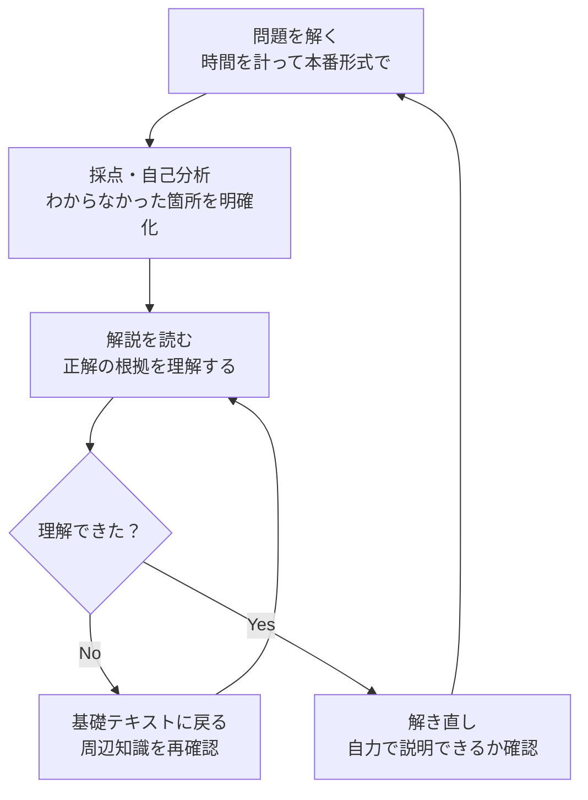

import { MermaidBox } from '../../../components/MermaidBox';

「過去問を何年分解けばいいですか？」という質問をよく受けますが、重要なのは「何年分解くか」よりも「どう解くか」です。ただ漫然と解いて採点するだけでは、実力は伸びません。

## 過去問学習のプロセス

効果的な過去問演習のサイクルを以下に示します。

<MermaidBox client:visible>

</MermaidBox>

## 1. 時間を計って解く

午後Iは90分で2問、午後IIは120分で1問を解く必要があります。普段の学習から時間を意識しないと、本番で「時間が足りない」という事態に陥ります。
最初は時間がかかっても良いですが、徐々にタイムマネジメントを意識しましょう。

## 2. 解説は「正解の理由」だけでなく「不正解の理由」も読む

特に午前問題では、正解の選択肢だけでなく、他の選択肢がなぜ間違いなのか（あるいは何の用語の説明なのか）を理解することで、1問から4問分の知識を得ることができます。

## 3. 「なぜ？」を3回繰り返す

記述式問題で間違えた場合、「なぜ間違えたのか」を深掘りします。

-   **知識不足**: 知らなかった用語や仕組みは覚えるしかない。
-   **読み落とし**: 問題文のヒントを見逃していたなら、なぜ見逃したのか（下線を引く、丸で囲むなどの対策）。
-   **書き方**: わかっていたのにうまく表現できなかったなら、模範解答の言い回しをマネする。

## 4. 同じ問題を期間を空けて解き直す

人間の記憶は忘れるようにできています。1週間後、1ヶ月後にもう一度同じ問題を解いて、瞬殺できるか確認しましょう。「解き方を覚えている」状態になれば、そのパターンは習得したと言えます。
