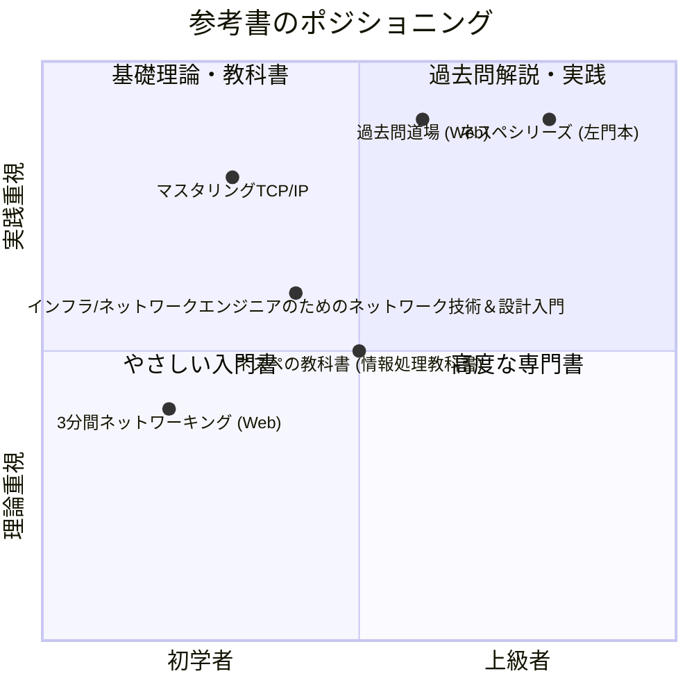

import { MermaidBox } from '../../../components/MermaidBox';

合格者が実際に使っている「鉄板」の参考書やWebサイトを紹介します。自分に合ったツールを選ぶことが、合格への近道です。

## 必携の参考書マップ

<MermaidBox client:visible>

</MermaidBox>

## カテゴリ別おすすめ

### 1. 基礎固め・教科書
-   **マスタリングTCP/IP 入門編**: ネットワーク技術者のバイブル。試験範囲外のことも含まれますが、基礎理解には必須。
-   **情報処理教科書 ネットワークスペシャリスト**: 網羅性が高く、辞書的に使えます。

### 2. 午後対策・過去問解説
-   **ネスペシリーズ（左門至峰 著）**: 「ネスペの基礎力」「ネスペの魂」など。解説が非常に丁寧で、思考プロセスが学べます。多くの合格者が「これのおかげで受かった」と言う名著。
-   **徹底攻略 ネットワークスペシャリスト 過去問題集**: 解説が充実している過去問集を選びましょう。

### 3. Webサイト・ツール
-   **ネットワークスペシャリスト試験ドットコム（過去問道場）**: 午前対策の決定版。
-   **3分間ネットワーキング**: 基礎概念を会話形式でわかりやすく解説。
-   **CCNA/CCNP対策サイト**: シスコ試験向けですが、プロトコルの詳細な挙動（OSPF, BGP, STPなど）を理解するのに役立ちます。

## 参考書の選び方

書店で実際に手に取り、**「解説を読んで理解できるか」**を確認してください。相性の悪い本を無理して読むのは時間の無駄です。最初はイラストが多い簡単な本から入り、徐々に専門的な本にステップアップするのが王道です。
