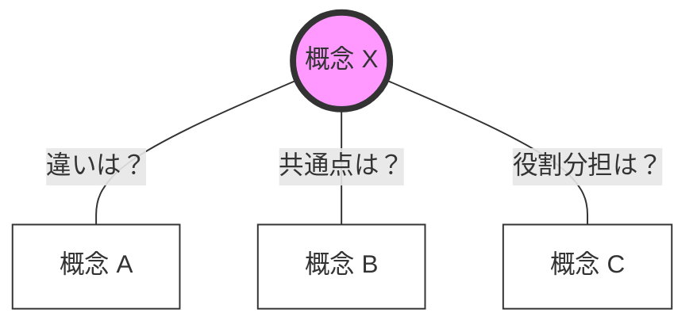
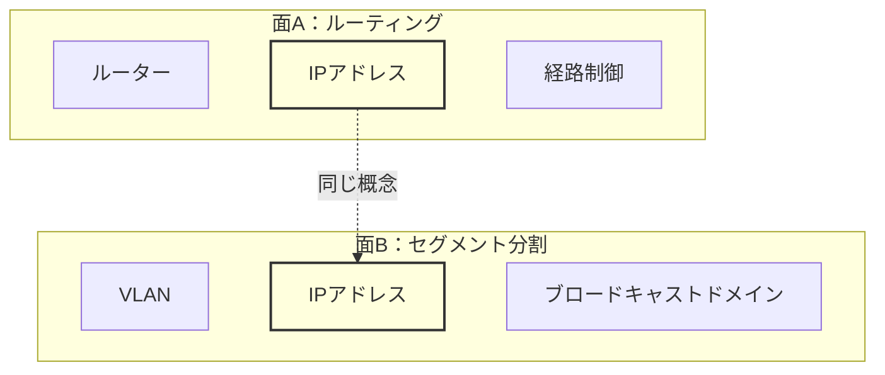
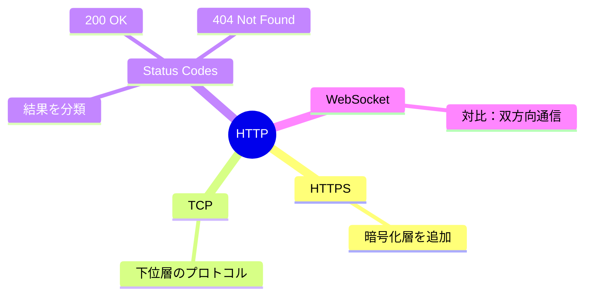
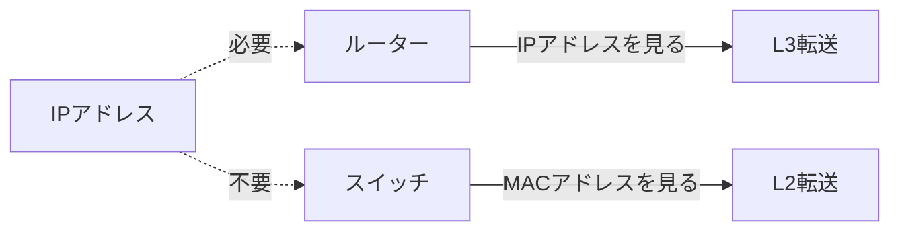

import Quiz from '../../../components/Quiz';

新しい技術や概念を学ぶとき、単語や定義を暗記して終わりにしていないでしょうか。
それは知識を「点」で捉えている状態です。

「点」の知識は孤立しており、記憶から抜け落ちやすく、応用も利きません。

学習の効果を最大化するには、知識と知識を繋ぎ合わせ、**「面」として理解する**ことが重要です。

## 「面」で理解するとは

ある概念Xを理解することは、**「X以外の概念と、Xがどのような関係にあるか」**を理解することと同義です。

Xという単語の定義をただ覚えるのではありません。
「Aとは違う」「Bと似ている」「Cの一部である」という**関係性（リンク）**を多重に張ることで、Xの輪郭が初めて明確になります。

知識は、孤立したデータではなく、関係性のネットワークの中に存在します。

## なぜ「面」だと定着するのか

### 検索性が高まる

脳内での情報の検索ルートが増えます。「X」という単語を忘れても、「Aの逆のやつ」「Bと一緒に使うやつ」という経路から思い出せます。

### 差分で理解できる

「TCP」の信頼性は、「UDP」の非信頼性（速度重視）と比較することで、そのメリットとコストを立体的に把握できます。

### 未知に対応できる

新しい技術が出ても、既存の「面」の中に位置づけることで、「ああ、これは従来の〇〇を置き換えるものだ」と素早く理解できます。

## 面と面の重なりを恐れない

概念Aとその周辺を学び、概念Bとその周辺を学ぶとき、両方の「面」に共通して登場する概念があることがあります。

これは無駄な重複ではありません。むしろ**知識の強化ポイント**です。

上の例では、「IPアドレス」がルーティングの文脈でもセグメント分割の文脈でも登場します。
異なる角度から同じ概念に触れることで、その概念の理解はより深く、より多面的になります。

**学習のコツ**: 「これ、前にも出てきたな」と思ったら、それはチャンスです。前回どの文脈で学んだかを思い出し、今回の文脈との共通点・相違点を考えてみてください。

## 実践：マインドマップによる構造化

学習ノートを取る際は、箇条書きだけでなく、マインドマップや相関図を描くことを推奨します。

中心に「学びたい概念」を置き、周囲に関連語を配置して線を引きます。
重要なのは、その線に**「関係性のラベル」**を貼ることです。

- **VS**（対比）
- **Requires**（依存）
- **Similar**（類似）
- **Part of**（包含）

### 図解例：HTTPを理解する場合

このように配置することで、「HTTP」という概念が周囲との関係性によって支えられていることが可視化されます。

## エクササイズ：ランダム・トライアングル

「面」を作る力を養うためのトレーニングです。

関連しそうな用語をランダムに3つ選び、それらの関係性を強引にでも言語化して繋げてください。

**正解することよりも、関係性を探そうとする思考プロセスが重要です。**

ネットワーク関連の用語で、3つの例題を用意しました。

### 例題 1：基礎的な接続

<Quiz client:visible question="【ルーター / スイッチ / IPアドレス】この3つの用語の関係性を考えてみてください。">

ルーターはIPアドレス（L3）を見て転送先を決め、スイッチはMACアドレス（L2）を見て転送先を決めます。IPアドレスはネットワーク間の通信に必要であり、スイッチだけの同一セグメント内ではMACアドレスだけで通信できます。

</Quiz>

### 例題 2：名前解決と場所

<Quiz client:visible question="【DNS / MACアドレス / URL】この3つの用語の関係性を考えてみてください。">
  URL（ドメイン名）は人間用、IPアドレスはネットワーク層用、MACアドレスはデータリンク層用の住所です。DNSでドメイン→IPを解決した後、実際にフレームを送る際にARPでIP→MACを解決します。
</Quiz>

### 例題 3：セキュリティと通信

<Quiz client:visible question="【HTTPS / ポート443 / 公開鍵暗号】この3つの用語の関係性を考えてみてください。">
  HTTPSはポート443を使用します。通信開始時に公開鍵暗号でセッション鍵を安全に交換し、その後の通信は高速な共通鍵暗号で暗号化します。公開鍵暗号は「鍵交換」のために使われます。
</Quiz>

## まとめ

これらの点を結び、線を引き続けることで、あなたの知識は強固な「面」へと成長します。

まずは、今日学んだ用語と、昨日学んだ用語の間に1本、線を引いてみてください。
